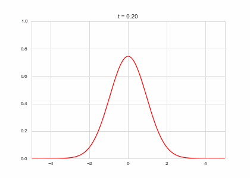
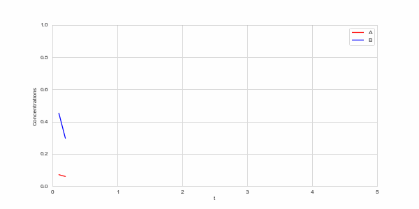
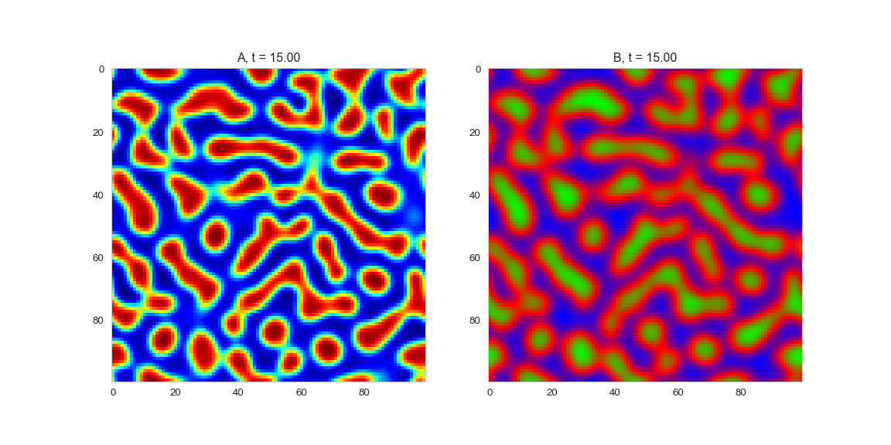

# Reaction-Diffusion Equations

## Diffusion

::: aside
Adapted from [this blog post](http://www.degeneratestate.org/posts/2017/May/05/turing-patterns/).
:::

Last week, we talked about the **diffusion equation**. Here is the exact form:


$$\frac{\partial a(x,t)}{\partial t} = D_{a}\frac{\partial^{2} a(x,t)}{\partial x^{2}}$$


::: notes
Walk through why we have a first derivative for time, and a second derivative for space. It's because if the concentration is increasing steadily in space at a given position, the same amount will enter (from the left) and leave (from the right). We only end up with a changing concentration if the rate of entry and exit are different.
:::

. . .

We approximated this using [the finite-difference method](https://en.wikipedia.org/wiki/Finite_difference_method#Example:_The_heat_equation):

Time derivative (which we had set to zero):

$$
\frac{\partial a(x,t)}{\partial t} \approx \frac{1}{dt}(a_{x,t+1} - a_{x,t})
$$

Spacial part of the derivative (which is usually know as the [Laplacian](https://en.wikipedia.org/wiki/Laplace_operator)):

$$
\frac{\partial^{2} a(x,t)}{\partial x^{2}} \approx \frac{1}{dx^{2}}(a_{x+1,t} + a_{x-1,t} - 2a_{x,t})
$$

. . .

This gives us the finite-difference equation:

$$
a_{x,t+1} = a_{x,t} + dt\left(  \frac{D_{a}}{dx^{2}}(a_{x+1,t} + a_{x-1,t} - 2a_{x,t})  \right)
$$

## Boundary Conditions

- Last week, with our metal rod, we had **boundary conditions** where the temperatures at the ends of the rod were fixed at 0 degrees.

- We needed to say *something* about the boundaries to solve the system of equations.

- Another option is **periodic boundary conditions**. 
  
- These are like imagining the rod is a loop, so the temperature at the end of the rod is the same as the temperature at the beginning of the rod.

## Periodic Boundary Conditions: np.roll

- Want an easy way to compute $a_{x+1}$ for all $x$'s

- Suppose we have n points, and we want to compute $a_{x+1}$ for all $x$=n.

- Problem: $a_{x+1}$ would be off the end of the array!

- Just replace $a_{n+1}$ with $a_{1}$
  
- Can do this easily with `np.roll`. Lets us compute $a_{x+1}$ for all $x$'s.

. . .

```{pyodide-python}
import numpy as np
a = np.arange(10)
a
np.roll(a, -1)
```

## Laplacian with Periodic Boundary Conditions in Python

```{python}
#| echo: True
import numpy as np
def laplacian1D(a, dx):
    return (
        - 2 * a
        + np.roll(a,1,axis=0)
        + np.roll(a,-1,axis=0)
    ) / (dx ** 2)

def laplacian2D(a, dx):
    return (
        - 4 * a
        + np.roll(a,1,axis=0)
        + np.roll(a,-1,axis=0)
        + np.roll(a,+1,axis=1)
        + np.roll(a,-1,axis=1)
    ) / (dx ** 2)
```


```{python}
"""
Some utility functions for blog post on Turing Patterns.
"""

import matplotlib.pyplot as plt
from matplotlib import animation
import numpy as np

class BaseStateSystem:
    """
    Base object for "State System".

    We are going to repeatedly visualise systems which are Markovian:
    the have a "state", the state evolves in discrete steps, and the next
    state only depends on the previous state.

    To make things simple, I'm going to use this class as an interface.
    """
    def __init__(self):
        raise NotImplementedError()

    def initialise(self):
        raise NotImplementedError()

    def initialise_figure(self):
        fig, ax = plt.subplots()
        return fig, ax

    def update(self):
        raise NotImplementedError()

    def draw(self, ax):
        raise NotImplementedError()

    def plot_time_evolution(self, filename, n_steps=30):
        """
        Creates a gif from the time evolution of a basic state syste.
        """
        self.initialise()
        fig, ax = self.initialise_figure()

        def step(t):
            self.update()
            self.draw(ax)

        anim = animation.FuncAnimation(fig, step, frames=np.arange(n_steps), interval=20)
        anim.save(filename=filename, dpi=60, fps=10, writer='imagemagick')
        plt.close()
        
    def plot_evolution_outcome(self, filename, n_steps):
        """
        Evolves and save the outcome of evolving the system for n_steps
        """
        self.initialise()
        fig, ax = self.initialise_figure()
        
        for _ in range(n_steps):
            self.update()

        self.draw(ax)
        fig.savefig(filename)
        plt.close()
```


```{python}


import matplotlib.pyplot as plt
import numpy as np

# I'm using seaborn for it's fantastic default styles
import seaborn as sns
sns.set_style("whitegrid")

%matplotlib inline
%load_ext autoreload
%autoreload 2

```
## Solving and animating

```{python}
#| echo: True
class OneDimensionalDiffusionEquation(BaseStateSystem):
    def __init__(self, D):
        self.D = D
        self.width = 1000
        self.dx = 10 / self.width
        self.dt = 0.9 * (self.dx ** 2) / (2 * D)
        self.steps = int(0.1 / self.dt)

    def initialise(self):
        self.t = 0
        self.X = np.linspace(-5,5,self.width)
        self.a = np.exp(-self.X**2)

    def update(self):
        for _ in range(self.steps):
            self.t += self.dt
            self._update()

    def _update(self):
        La = laplacian1D(self.a, self.dx)
        delta_a = self.dt * (self.D * La)
        self.a += delta_a

    def draw(self, ax):
        ax.clear()
        ax.plot(self.X,self.a, color="r")
        ax.set_ylim(0,1)
        ax.set_xlim(-5,5)
        ax.set_title("t = {:.2f}".format(self.t))

one_d_diffusion = OneDimensionalDiffusionEquation(D=1)

one_d_diffusion.plot_time_evolution("diffusion.gif")
```




## Reaction Terms

- We will have a system with **two** chemical components, $a$ and $b$.

- Suppose $a$ activates genes which produce pigmentation. $b$ inhibits $a$

- Will start with some random small initial concentrations of $a$ and $b$.

- Each will diffuse according to the diffusion equation.

- They will also react with each other, changing the concentration of each.

. . .

For the reaction equations, will use the [FitzHugh–Nagumo equation](https://en.wikipedia.org/wiki/FitzHugh%E2%80%93Nagumo_model)

$R_a(a, b) = a - a^{3} - b + \alpha$

$R_{b}(a, b) = \beta (a - b)$

Where $\alpha$ and $\beta$ are constants.

## Reaction Equation evolution at one point in space

```{python}
#| echo: True
class ReactionEquation(BaseStateSystem):
    def __init__(self, Ra, Rb):
        self.Ra = Ra
        self.Rb = Rb
        self.dt = 0.01
        self.steps = int(0.1 / self.dt)

    def initialise(self):
        self.t = 0
        self.a = 0.1
        self.b = 0.7
        self.Ya = []
        self.Yb = []
        self.X = []

    def update(self):
        for _ in range(self.steps):
            self.t += self.dt
            self._update()

    def _update(self):
        delta_a = self.dt * self.Ra(self.a,self.b)
        delta_b = self.dt * self.Rb(self.a,self.b)

        self.a += delta_a
        self.b += delta_b

    def draw(self, ax):
        ax.clear()

        self.X.append(self.t)
        self.Ya.append(self.a)
        self.Yb.append(self.b)

        ax.plot(self.X,self.Ya, color="r", label="A")
        ax.plot(self.X,self.Yb, color="b", label="B")
        ax.legend()

        ax.set_ylim(0,1)
        ax.set_xlim(0,5)
        ax.set_xlabel("t")
        ax.set_ylabel("Concentrations")

alpha, beta =  0.2, 5

def Ra(a,b): return a - a ** 3 - b + alpha
def Rb(a,b): return (a - b) * beta

one_d_reaction = ReactionEquation(Ra, Rb)
one_d_reaction.plot_time_evolution("reaction.gif", n_steps=50)
```

##



## Full Model

We now have two parts:
-  a diffusion term that "spreads" out concentration 
-  a reaction part the equalises the two concentrations. 
. . .

What happens when we put the two together? Do we get something stable?

##

```{python}
#| echo: True
def random_initialiser(shape):
    return(
        np.random.normal(loc=0, scale=0.05, size=shape),
        np.random.normal(loc=0, scale=0.05, size=shape)
    )

class OneDimensionalRDEquations(BaseStateSystem):
    def __init__(self, Da, Db, Ra, Rb,
                 initialiser=random_initialiser,
                 width=1000, dx=1,
                 dt=0.1, steps=1):

        self.Da = Da
        self.Db = Db
        self.Ra = Ra
        self.Rb = Rb

        self.initialiser = initialiser
        self.width = width
        self.dx = dx
        self.dt = dt
        self.steps = steps

    def initialise(self):
        self.t = 0
        self.a, self.b = self.initialiser(self.width)

    def update(self):
        for _ in range(self.steps):
            self.t += self.dt
            self._update()

    def _update(self):

        # unpack so we don't have to keep writing "self"
        a,b,Da,Db,Ra,Rb,dt,dx = (
            self.a, self.b,
            self.Da, self.Db,
            self.Ra, self.Rb,
            self.dt, self.dx
        )

        La = laplacian1D(a, dx)
        Lb = laplacian1D(b, dx)

        delta_a = dt * (Da * La + Ra(a,b))
        delta_b = dt * (Db * Lb + Rb(a,b))

        self.a += delta_a
        self.b += delta_b

    def draw(self, ax):
        ax.clear()
        ax.plot(self.a, color="r", label="A")
        ax.plot(self.b, color="b", label="B")
        ax.legend()
        ax.set_ylim(-1,1)
        ax.set_title("t = {:.2f}".format(self.t))

Da, Db, alpha, beta = 1, 100, -0.005, 10

def Ra(a,b): return a - a ** 3 - b + alpha
def Rb(a,b): return (a - b) * beta

width = 100
dx = 1
dt = 0.001

OneDimensionalRDEquations(
    Da, Db, Ra, Rb,
    width=width, dx=dx, dt=dt,
    steps=100
).plot_time_evolution("1dRD.gif", n_steps=150)
```

##


## In two dimensions

```{python}
class TwoDimensionalRDEquations(BaseStateSystem):
    def __init__(self, Da, Db, Ra, Rb,
                 initialiser=random_initialiser,
                 width=1000, height=1000,
                 dx=1, dt=0.1, steps=1):

        self.Da = Da
        self.Db = Db
        self.Ra = Ra
        self.Rb = Rb

        self.initialiser = initialiser
        self.width = width
        self.height = height
        self.shape = (width, height)
        self.dx = dx
        self.dt = dt
        self.steps = steps

    def initialise(self):
        self.t = 0
        self.a, self.b = self.initialiser(self.shape)

    def update(self):
        for _ in range(self.steps):
            self.t += self.dt
            self._update()

    def _update(self):

        # unpack so we don't have to keep writing "self"
        a,b,Da,Db,Ra,Rb,dt,dx = (
            self.a, self.b,
            self.Da, self.Db,
            self.Ra, self.Rb,
            self.dt, self.dx
        )

        La = laplacian2D(a, dx)
        Lb = laplacian2D(b, dx)

        delta_a = dt * (Da * La + Ra(a,b))
        delta_b = dt * (Db * Lb + Rb(a,b))

        self.a += delta_a
        self.b += delta_b

    def draw(self, ax):
        ax[0].clear()
        ax[1].clear()

        ax[0].imshow(self.a, cmap='jet')
        ax[1].imshow(self.b, cmap='brg')

        ax[0].grid(visible=False)
        ax[1].grid(visible=False)

        ax[0].set_title("A, t = {:.2f}".format(self.t))
        ax[1].set_title("B, t = {:.2f}".format(self.t))

    def initialise_figure(self):
        fig, ax = plt.subplots(nrows=1, ncols=2, figsize=(12,6))
        return fig, ax

Da, Db, alpha, beta = 1, 100, -0.015, 10

def Ra(a,b): return a - a ** 3 - b + alpha
def Rb(a,b): return (a - b) * beta

width = 100
dx = 1
dt = 0.001

TwoDimensionalRDEquations(
    Da, Db, Ra, Rb,
    width=width, height=width,
    dx=dx, dt=dt, steps=100
).plot_evolution_outcome("2dRD.png", n_steps=150)
```




# Review of Matrix Arithmetic

## Matrix Addition and Subtraction

Review matrix addition and subtraction on your own!

## Matrix Multiplication

For motivation:

$$
2 x-3 y+4 z=5 \text {. }
$$

- Can write as a "product" of the coefficient matrix $[2,-3,4]$ and and the column matrix of unknowns $\left[\begin{array}{l}x \\ y \\ z\end{array}\right]$. 

. . .

Thus, product is:

$$
[2,-3,4]\left[\begin{array}{l}
x \\
y \\
z
\end{array}\right]=[2 x-3 y+4 z]
$$

## Definition of matrix product

$A=\left[a_{i j}\right]$: $m \times p$ matrix 

$B=\left[b_{i j}\right]$: $p \times n$ matrix.

Product of $A$ and $B$ -- $A B$

- is $m \times n$ matrix whose
-  $(i, j)$ th entry is the entry of the product of the $i$ th row of $A$ and the $j$ th column of $B$;

. . .

More specifically, the $(i, j)$ th entry of $A B$ is

$$
a_{i 1} b_{1 j}+a_{i 2} b_{2 j}+\cdots+a_{i p} b_{p j} .
$$

**Reminder**: Matrix Multiplication is not Commutative

- $A B \neq B A$ in general.
  


## Linear Systems as a Matrix Product

We can express a linear system of equations as a matrix product:

$$
\begin{aligned}
x_{1}+x_{2}+x_{3} & =4 \\
2 x_{1}+2 x_{2}+5 x_{3} & =11 \\
4 x_{1}+6 x_{2}+8 x_{3} & =24
\end{aligned}
$$

. . .

$$
\mathbf{x}=\left[\begin{array}{l}
x_{1} \\
x_{2} \\
x_{3}
\end{array}\right], \quad \mathbf{b}=\left[\begin{array}{r}
4 \\
11 \\
24
\end{array}\right], \quad \text { and } A=\left[\begin{array}{lll}
1 & 1 & 1 \\
2 & 2 & 5 \\
4 & 6 & 8
\end{array}\right]
$$

::: notes
Of course, $A$ is just the coefficient matrix of the system and $b$ is the righthand-side vector, which we have seen several times before. But now these take on a new significance. Notice that if we take the first row of $A$ and multiply it by $\mathbf{x}$ we get the left-hand side of the first equation of our system. 
Likewise for the second and third rows. Therefore, we may write in the language of matrices that
:::

. . .

$$
A \mathbf{x}=\left[\begin{array}{lll}
1 & 1 & 1 \\
2 & 2 & 5 \\
4 & 6 & 8
\end{array}\right]\left[\begin{array}{l}
x_{1} \\
x_{2} \\
x_{3}
\end{array}\right]=\left[\begin{array}{r}
4 \\
11 \\
24
\end{array}\right]=\mathbf{b}
$$

::: notes
We can multiply this out and get that $x_1$ multiplies each of the elements in the first column... (show this)
:::

## Matrix Multiplication as a Linear Combination of Column Vectors

Another way of writing this system:

$$
x_{1}\left[\begin{array}{l}
1 \\
2 \\
4
\end{array}\right]+x_{2}\left[\begin{array}{l}
1 \\
2 \\
6
\end{array}\right]+x_{3}\left[\begin{array}{l}
1 \\
5 \\
8
\end{array}\right]=\left[\begin{array}{r}
4 \\
11 \\
24
\end{array}\right] .
$$

. . .

Name the columns of A as $\mathbf{a_1}, \mathbf{a_2}, \mathbf{a_3}$, then we can write the matrix as $A=\left[\mathbf{a}_{1}, \mathbf{a}_{2}, \mathbf{a}_{3}\right]$

. . .

Let $\mathbf{x}=\left(x_{1}, x_{2}, x_{3}\right)$. Then

$$
A \mathbf{x}=x_{1} \mathbf{a}_{1}+x_{2} \mathbf{a}_{2}+x_{3} \mathbf{a}_{3} .
$$

**This is a very important way of thinking about matrix multiplication**

::: notes
What happens if we are trying to get something which can't be made up of *any* combination of the columns of $A$?

What happens if two or more of the columns of $A$ are the same?

What if they are multiples of one another?

What if one column is a linear combination of several others?
:::

## Try it yourself

Try to find the solution for the following system, by trying different values of $x_i$ to use in a sum of the columns of $A$.

$$ A \mathbf{x} = \left[\begin{array}{lll}   1 & 1 & 1 \\   2 & 2 & 5 \\   4 & 6 & 8 \end{array}\right]\left[\begin{array}{l} x_1 \\ x_2 \\ x_3 \end{array}\right]=x_{1} \mathbf{a}_{1}+x_{2} \mathbf{a}_{2}+x_{3} \mathbf{a}_{3} =\left[\begin{array}{l} 6 \\ 21 \\ 38 \end{array}\right] 
$$

::: notes
The answer is 2,1,3
:::

```{pyodide-python}
import sympy as sym
A = sym.Matrix([[1, 1, 1], [2, 2, 5], [4, 6, 8]])
a1 = A[:,0]
a2 = A[:,1]
a3 = A[:,2]
# Fill in your guesses for values of x1, x2, and x3
__*a1 + __*a2+__*a3
```

. . .

Now try changing the right-hand side to a different vector. Can you still find a solution? (You may need to use non-integer values for the $x$'s.)

##

This is a slightly changed system.


$$ A \mathbf{x} = \left[\begin{array}{lll}   1 & 1 & 2 \\   1 & 2 & 2 \\   4 & 6 & 8 \end{array}\right]\left[\begin{array}{l} x_1 \\ x_2 \\ x_3 \end{array}\right]=x_{1} \mathbf{a}_{1}+x_{2} \mathbf{a}_{2}+x_{3} \mathbf{a}_{3} =\left[\begin{array}{l} 11 \\ 12 \\ 46 \end{array}\right] 
$$


::: notes
The answer is 2, 1, 4
:::

```{pyodide-python}
import sympy as sym
A = sym.Matrix([[1, 1, 2], [1, 2, 2], [4, 6, 8]])
a1 = A[:,0]
a2 = A[:,1]
a3 = A[:,2]
# Fill in your guesses for values of x1, x2, and x3
__*a1 + __*a2+__*a3
```

. . .

Are you able to find more than one solution?
Can you find a right-hand-side that *doesn't* have a solution?


## Example: Benzoic acid

Benzoic acid (chemical formula $\mathrm{C}_{7} \mathrm{H}_{6} \mathrm{O}_{2}$ ) oxidizes to carbon dioxide and water.

$$
\mathrm{C}_{7} \mathrm{H}_{6} \mathrm{O}_{2}+\mathrm{O}_{2} \rightarrow \mathrm{CO}_{2}+\mathrm{H}_{2} \mathrm{O} .
$$

Balance this equation. (Make the number of atoms of each element match on the two sides of the equation.)

. . .

Define $(c, o, h)$ as the number of atoms of carbon, oxygen, and hydrogen atoms in the equation. 

. . .

Next let $x_1$, $x_2$, $x_3$, and $x_4$ be the number of molecules of benzoic acid, oxygen, carbon dioxide, and water, respectively.

. . .

Then we have the equation

$$
x_{1}\left[\begin{array}{l}
7 \\
2 \\
6
\end{array}\right]+x_{2}\left[\begin{array}{l}
0 \\
2 \\
0
\end{array}\right]=x_{3}\left[\begin{array}{l}
1 \\
2 \\
0
\end{array}\right]+x_{4}\left[\begin{array}{l}
0 \\
1 \\
2
\end{array}\right] .
$$

##

Rearrange:

$$
x_{1}\left[\begin{array}{l}
7 \\
2 \\
6
\end{array}\right]+x_{2}\left[\begin{array}{l}
0 \\
2 \\
0
\end{array}\right]=x_{3}\left[\begin{array}{l}
1 \\
2 \\
0
\end{array}\right]+x_{4}\left[\begin{array}{l}
0 \\
1 \\
2
\end{array}\right] .
$$

becomes

$$
A \mathbf{x}=\left[\begin{array}{cccc}
7 & 0 & -1 & 0 \\
2 & 2 & -2 & -1 \\
6 & 0 & 0 & -2
\end{array}\right]\left[\begin{array}{l}
x_{1} \\
x_{2} \\
x_{3} \\
x_{4}
\end{array}\right]=\left[\begin{array}{l}
0 \\
0 \\
0
\end{array}\right]
$$

::: notes
This is just like a matrix like we were solving in class last time.
:::

##
We solve with row reduction:

$$
\begin{aligned}
& {\left[\begin{array}{cccc}
7 & 0 & -1 & 0 \\
2 & 2 & -2 & -1 \\
6 & 0 & 0 & -2
\end{array}\right] \xrightarrow[E_{21}\left(-\frac{2}{7}\right)]{E_{31}\left(-\frac{6}{7}\right)}\left[\begin{array}{cccc}
7 & 0 & -1 & 0 \\
0 & 2 & -\frac{12}{7} & -1 \\
0 & 0 & \frac{6}{7} & -2
\end{array}\right] \begin{array}{c}
E_{1}\left(\frac{1}{7}\right) \\
E_{2}\left(\frac{1}{2}\right) \\
E_{3}\left(\frac{7}{6}\right)
\end{array} \left[\begin{array}{cccc}
1 & 0 & -\frac{1}{7} & 0 \\
0 & 1 & -\frac{6}{7} & -\frac{1}{2} \\
0 & 0 & 1 & -\frac{7}{3}
\end{array}\right]} \\
& \begin{array}{l}
\overrightarrow{E_{23}\left(\frac{6}{7}\right)} \\
E_{13}\left(\frac{1}{7}\right)
\end{array}\left[\begin{array}{llll}
1 & 0 & 0 & -\frac{1}{3} \\
0 & 1 & 0 & -\frac{5}{2} \\
0 & 0 & 1 & -\frac{7}{3}
\end{array}\right]
\end{aligned}
$$

. . .

$x_{4}$ is free, others are bound. Now pick smallest $x_4$ where others are all positive integers...

. . .

$$
2 \mathrm{C}_{7} \mathrm{H}_{6} \mathrm{O}_{2}+15 \mathrm{O}_{2} \rightarrow 14 \mathrm{CO}_{2}+6 \mathrm{H}_{2} \mathrm{O}
$$

# Matrix Multiplication as a Function

::: notes
We've been thinking about matrices as defining systems of equations.

Here is another way of thinking about what a matrix does.
:::


Every matrix $A$ is associated with a **function** $T_A$ that takes a vector as input and returns a vector as output.

$$
T_{A}(\mathbf{u})=A \mathbf{u}
$$

. . .

Other names for $T_A$ are "linear transformation" or "linear operator".

# Transformations

## Scaling 


Goal: Make a matrix that will take a vector of coordinates $\mathbf{x}$ and scale each coordinate $x_i$ by a factor of $z_i$.

$$ A x = \left[\begin{array}{ll} a1 & a2 \\ a3 & a4 \end{array}\right] \left[\begin{array}{l} x_1 \\ x_2 \end{array}\right] = \left[\begin{array}{l} z_1 \times x_1 \\ z_2\times  x_2 \end{array}\right] $$

. . .

$$ A = \left[\begin{array}{ll} z_1 & 0 \\ 0 & z_2 \end{array}\right] $$

## Shearing

Shearing: adding a constant shear factor times one coordinate to another coordinate of the point.

Goal: make a matrix which will transform each coordinate $x_i$ into $x_i + \sum_{j \ne i} s_{j} \times x_j$.

$$ A x = \left[\begin{array}{ll} a1 & a2 \\ a3 & a4 \end{array}\right] \left[\begin{array}{l} x_1 \\ x_2 \end{array}\right] = \left[\begin{array}{l} x_1 + s_2 x_2 \\ x_2 + s_1 x_1 \end{array}\right] $$

. . .

$$ A = \left[\begin{array}{ll} 1 & s_2 \\ s_1 & 1 \end{array}\right] $$

## Example

- Let the scaling operator $S$ on points in two dimensions have scale factors of $\frac{3}{2}$ in the $x$-direction and $\frac{1}{2}$ in the $y$-direction.

- Let the shearing operator $H$ on these points have a shear factor of $\frac{1}{2}$ by the $y$-coordinate on the $x$-coordinate.

- Express these operators as matrix operators and graph their action on four unit squares situated diagonally from the origin.

## Solution

- Scaling operator $S$:

. . .

$$
S((x, y))=\left[\begin{array}{c}
\frac{3}{2} x \\
\frac{1}{2} y
\end{array}\right]=\left[\begin{array}{cc}
\frac{3}{2} & 0 \\
0 & \frac{1}{2}
\end{array}\right]\left[\begin{array}{l}
x \\
y
\end{array}\right]=T_{A}((x, y))
$$

. . .


## Verify:


```{pyodide-python}
import sympy as sym
S= sym.Matrix([[3/2, 0], [0, 1/2])
point_1 = sym.Matrix([1, 1])
S*point_1
```


##
- Shearing operator $H$:

$$
H((x, y))=\left[\begin{array}{c}
x+\frac{1}{2} y \\
y
\end{array}\right]=\left[\begin{array}{ll}
1 & \frac{1}{2} \\
0 & 1
\end{array}\right]\left[\begin{array}{l}
x \\
y
\end{array}\right]=T_{B}((x, y))
$$


## Verify


```{pyodide-python}
import sympy as sym
H= sym.Matrix([[1, 1/2], [0, 1])
point_1 = sym.Matrix([1, 1])
H*point_1
```

## Concatenation of operators $S$ and $H$
- The concatenation $S \circ H$ of the scaling operator $S$ and shearing operator $H$ is the action of scaling followed by shearing.

- Function composition corresponds to matrix multiplication

. . .

$$
\begin{aligned}
S \circ H((x, y)) & =T_{A} \circ T_{B}((x, y))=T_{A B}((x, y)) \\
& =\left[\begin{array}{cc}
\frac{3}{2} & 0 \\
0 & \frac{1}{2}
\end{array}\right]\left[\begin{array}{ll}
1 & \frac{1}{2} \\
0 & 1
\end{array}\right]\left[\begin{array}{l}
x \\
y
\end{array}\right]=\left[\begin{array}{cc}
\frac{3}{2} & \frac{3}{4} \\
0 & \frac{1}{2}
\end{array}\right]\left[\begin{array}{l}
x \\
y
\end{array}\right]=T_{C}((x, y)),
\end{aligned}
$$


## Verify


```{pyodide-python} 
import sympy as sym
C= sym.Matrix([[3/2, 3/4], [0, 1/2])
point_1 = sym.Matrix([1, 1])
C*point_1
```
## Rotation

Goal: rotate a point in two dimensions counterclockwise by an angle $\phi$. Suppose the point is initally at an angle $\theta$ from the $x$-axis.


##

$$
\left[\begin{array}{l}
x \\
y
\end{array}\right]
=\left[\begin{array}{l}
r \cos \theta \\
r \sin \theta
\end{array}\right]
$$

We can use trigonometry to find the values of x and y after rotation.

$$
\left[\begin{array}{l}
x^{\prime} \\
y^{\prime}
\end{array}\right] =\left[\begin{array}{l}
r \cos (\theta+\phi) \\
r \sin (\theta+\phi)
\end{array}\right]=\left[\begin{array}{l}
r \cos \theta \cos \phi-r \sin \theta \sin \phi \\
r \sin \theta \cos \phi+r \cos \theta \sin \phi
\end{array}\right]
$$ 

. . .

Using the double-angle rule,

$$
 =\left[\begin{array}{rr}
\cos \theta &-\sin \theta \\
\sin \theta & \cos \theta
\end{array}\right]\left[\begin{array}{l}
r \cos \phi \\
r \sin \phi
\end{array}\right]=\left[\begin{array}{rr}
\cos \theta&-\sin \theta \\
\sin \theta & \cos \theta
\end{array}\right]\left[\begin{array}{l}
x \\
y
\end{array}\right]
$$

. . .

So we define the rotation matrix $R(\theta)$ by

$$
R(\theta)=\left[\begin{array}{rr}
\cos \theta & -\sin \theta \\
\sin \theta & \cos \theta
\end{array}\right]
$$

## Now you try

```{pyodide-python}
import matplotlib.pyplot as plt; import matplotlib.patches as mpatches; import sympy as sym;
fig=plt.figure(); plt.clf()
rectangle = sym.Matrix([[0,0],[0,1],[1,1],[1,0]])
A=sym.Matrix([[1,.2],[.2,.2]])
fig, ax = plt.subplots()
ax.add_patch(mpatches.Polygon((A*rectangle.T).T))
ax.add_patch(mpatches.Polygon((rectangle),fc=(1,0,0,0.25)))
automin, automax = plt.xlim(); plt.xlim(automin-0.5, automax+0.5);automin, automax = plt.ylim(); plt.ylim(automin-0.5, automax+0.5)
plt.show()
```

