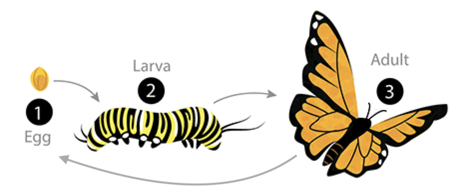
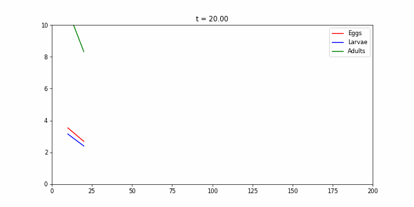
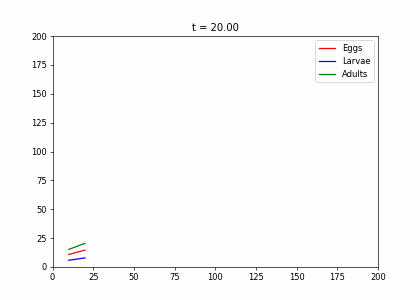

# Discrete Dynamical Systems

## Definitions

**Definition:** A discrete linear dynamical system is a sequence of vectors $\mathbf{x}^{(k)}, k=0,1, \ldots$, called **states**, which is defined by an initial vector $\mathbf{x}^{(0)}$ and by the rule

$$
\mathbf{x}^{(k+1)}=A \mathbf{x}^{(k)}+\mathbf{b}_{k}, \quad k=0,1, \ldots
$$

. . .

- $A$ is a fixed square matrix, called the **transition matrix** of the system
- vectors $\mathbf{b}_{k}, k=0,1, \ldots$ are called the **input vectors** of the system.

- If we don't specify input vectors, assume that $\mathbf{b}_{k}=\mathbf{0}$ for all $k$. Then call the system a **homogeneous dynamical system**.

## Stability

An important question: is the system **stable**? 

Does $\mathbf{x}^{(k)}$ tend towards a constant state $\mathrm{x}$?

. . .

If system is homogeneous, then if a stable state is the initial state, it will equal all subsequent states.

**Definition**:  A vector $\mathbf{x}$ satisfying $\mathbf{x}=A \mathbf{x}$, for a square matrix $A$, is called a **stationary vector** for $A$.

. . .

If $A$ is the transition matrix for a homogeneous discrete dynamical system, we also call such a vector a **stationary state**.

## Example

- Two toothpaste companies compete for customers in a fixed market
- Each customer uses either Brand A or Brand B.
- Buying habits. In each quarter:
  - $30 \%$ of A users will switch to B, while the rest stay with A. 
  - $40 \%$ of B users will switch to A , while the the rest stay with B. 
- This is an example of a **Markov chain model**.

##

Let $a_1$ be the fraction of customers using Brand A at the end of the first quarter, and $b_1$ be the fraction using Brand B. 

Then we have the following system of equations:
$$
\begin{aligned}
a_{1} & =0.7 a_{0}+0.4 b_{0} \\
b_{1} & =0.3 a_{0}+0.6 b_{0}
\end{aligned}
$$

. . .

More generally,


$$
\begin{aligned}
a_{k+1} & =0.7 a_{k}+0.4 b_{k} \\
b_{k+1} & =0.3 a_{k}+0.6 b_{k} .
\end{aligned}
$$

. . .

In matrix form,

$$
\mathbf{x}^{(k)}=\left[\begin{array}{c}
a_{k} \\
b_{k}
\end{array}\right] \text { and } A=\left[\begin{array}{ll}
0.7 & 0.4 \\
0.3 & 0.6
\end{array}\right]
$$

with

$$
\mathbf{x}^{(k+1)}=A \mathbf{x}^{(k)}
$$

##
We can continue into future quarters by multiplying by $A$ again:
$$
\mathbf{x}^{(2)}=A \mathbf{x}^{(1)}=A \cdot\left(A \mathbf{x}^{(0)}\right)=A^{2} \mathbf{x}^{(0)}
$$

. . .

In general,

$$
\mathbf{x}^{(k)}=A \mathbf{x}^{(k-1)}=A^{2} \mathbf{x}^{(k-2)}=\cdots=A^{k} \mathbf{x}^{(0)} .
$$

. . .

This is true of any homogeneous linear dynamical system!


For any positive integer $k$ and discrete dynamical system with transition matrix $A$ and initial state $\mathbf{x}^{(0)}$, the $k$-th state is given by

$$
\mathbf{x}^{(k)}=A^{k} \mathbf{x}^{(0)}
$$

## Distribution vector and stochastic matrix

- $\mathbf{x}^{(k)}$ of the toothpaste example  are column vectors with nonnegative coordinates that sum to 1.
- Such vectors are called **distribution vectors**.
- Also, each of the columns the matrix $A$ is a distribution vector.
- A square matrix $A$ whose columns are distribution vectors is called a **stochastic matrix**. 

## Markov Chain definition

A **Markov chain** is a discrete dynamical system whose initial state $\mathbf{x}^{(0)}$ is a distribution vector and whose transition matrix $A$ is stochastic, i.e., each column of $A$ is a distribution vector.

::: notes
Think this through. 
- Suppose our current state is $\mathbf{e}_{j}$
- The system has selected $j$ th event exclusively.  
- The next state is $\mathbf{p}_{j}=P \mathbf{e}_{j}$, that is, the $j$ th column of $P$. 
- This implies that the entry $p_{i j}$ is the probability that the $i$ th event will occur, given that the $j$ th event has just occurred. 
- Since events are mutually exclusive and some subsequent event must occur, the sum of these probabilities is 1 .
:::

## Checking that our toothpase example is a Markov chain
$$
\mathbf{x}^{(k)}=\left[\begin{array}{c}
a_{k} \\
b_{k}
\end{array}\right] \text { and } A=\left[\begin{array}{ll}
0.7 & 0.4 \\
0.3 & 0.6
\end{array}\right]
$$

::: notes

- The toothpaste example is a Markov chain:
  - The columns of $A$ are distribution vectors.
  - The columns of $A$ sum to 1.
  - The events in the example are *mutually exclusive*.

:::


## Stochastic Matrix Inequality

- We can define the *1-norm* of a vector $\mathbf{x}$ as $\|\mathbf{x}\|_{1}=\sum_{i=1}^{n}\left|x_{i}\right|$.
  - If all the elements of a vector are nonnegative, then $\|\mathbf{x}\|_{1}$ is the sum of the elements.
- Can show: For any stochastic matrix $P$ and compatible vector $\mathbf{x},\|P \mathbf{x}\|_{1} \leq\|\mathbf{x}\|_{1}$, with equality if the coordinates of $\mathbf{x}$ are all nonnegative.
- &rarr; if a state in a Markov chain is a distribution vector (nonnegative entries and sums to 1), then the sum of the coordinates of the next state will also sum to one
- &rarr; all subsequent states in a Markov chain are themselves Markov Chain State distribution vectors.

## Moving into the future

Suppose that initially Brand A has all the customers (i.e., Brand B is just entering the market). What are the market shares 2 quarters later? 20 quarters? 

. . .

- Initial state vector is $\mathbf{x}^{(0)}=(1,0)$.
-  Now do the arithmetic to find $\mathbf{x}^{(2)}$ :
. . .
$$
\begin{aligned}
{\left[\begin{array}{l}
a_{2} \\
b_{2}
\end{array}\right] } & =\mathbf{x}^{(2)}=A^{2} \mathbf{x}^{(0)}=\left[\begin{array}{ll}
0.7 & 0.4 \\
0.3 & 0.6
\end{array}\right]\left(\left[\begin{array}{ll}
0.7 & 0.4 \\
0.3 & 0.6
\end{array}\right]\left[\begin{array}{l}
1 \\
0
\end{array}\right]\right) \\
& =\left[\begin{array}{ll}
0.7 & 0.4 \\
0.3 & 0.6
\end{array}\right]\left[\begin{array}{l}
0.7 \\
0.3
\end{array}\right]=\left[\begin{array}{l}
.61 \\
.39
\end{array}\right] .
\end{aligned}
$$

::: notes
Brand A will have $61 \%$ of the market and Brand B will have $39 \%$ of the market in the second quarter.
:::

## Toothpaste after many quarters

```{pyodide-python}
import sympy as sym
M=sym.Matrix([[0.7,0.4],[0.3,0.6]])
a_0,b_0=sym.symbols('a_0, b_0')
# construct the column vector for the initial state
x_0=_______
# find the state after 1 quarter
______

```

Now:

- find the state after 2 quarters. 
- find the state after 20 quarters. Use matrix exponentiation: A**n
- Get specific numbers if toothpaste A has 100% of the market at the beginning. (Use sym.subs())
- Now what if toothpaste **B** has 100% at the beginning?

::: notes
- Our calculation is reusable! Could go back after and then change the inital state.
- Notice that we also get the same result eventually, no matter where we started
:::


## Example: Structured Population Model

{height=200}

- Every week, 20% of the eggs die, and 60% move to the larva stage.
- Also, 10% of larvae die, 60% become adults
- 20% of adults die. Each adult produces 0.25 eggs.
- Initially we have 10k adults, 8k larvae, 6k eggs. How does the population evolve over time?

. . .

<div style="width: 100%; height: 200px; border: 1px solid black;"></div>

::: notes
Set up $\mathbf{x}^{(k)}=\left(a_{k}, b_{k}, c_{k}\right)$
$\mathbf{x}^{(0)}=(10,8,6)$ at week 0
Note that after first week, we have 20% of the initial eggs (20% died, 60% became larvae...)
Transition matrix is:
$$
A=\left[\begin{array}{ccc}
0.2 & 0 & 0.25 \\
0.6 & 0.3 & 0 \\
0 & 0.6 & 0.8
\end{array}\right]
$$

**What do we think will happen over time? How can we tell?**
:::

## 

```{python}
"""
Some utility functions for blog post on Turing Patterns.
"""

import matplotlib.pyplot as plt
from matplotlib import animation
import numpy as np

class BaseStateSystem:
    """
    Base object for "State System".

    We are going to repeatedly visualise systems which are Markovian:
    the have a "state", the state evolves in discrete steps, and the next
    state only depends on the previous state.

    To make things simple, I'm going to use this class as an interface.
    """
    def __init__(self):
        raise NotImplementedError()

    def initialise(self):
        raise NotImplementedError()

    def initialise_figure(self):
        fig, ax = plt.subplots()
        return fig, ax

    def update(self):
        raise NotImplementedError()

    def draw(self, ax):
        raise NotImplementedError()

    def plot_time_evolution(self, filename, n_steps=30):
        """
        Creates a gif from the time evolution of a basic state syste.
        """
        self.initialise()
        fig, ax = self.initialise_figure()

        def step(t):
            self.update()
            self.draw(ax)

        anim = animation.FuncAnimation(fig, step, frames=np.arange(n_steps), interval=20)
        anim.save(filename=filename, dpi=60, fps=10, writer='imagemagick')
        plt.close()
        
    def plot_evolution_outcome(self, filename, n_steps):
        """
        Evolves and save the outcome of evolving the system for n_steps
        """
        self.initialise()
        fig, ax = self.initialise_figure()
        
        for _ in range(n_steps):
            self.update()

        self.draw(ax)
        fig.savefig(filename)
        plt.close()
```

```{python}
#| echo: True


class InsectEvolution(BaseStateSystem):
    def __init__(self,transition_matrix=np.array([[.2,0,.25],[.6,.3,0],[0,.6,.8]]),max_y=10):
        self.steps = 10;
        self.t=0
        self.transition_matrix = transition_matrix
        self.max_y=max_y

    def initialise(self):
        self.x = np.array([6,8,10])
        self.Ya = []
        self.Yb = []
        self.Yc = []
        self.X = []

    def update(self):
        for _ in range(self.steps):
            self.t += 1
            self._update()

    def _update(self):
        self.x = self.transition_matrix.dot(self.x)

    def draw(self, ax):
        ax.clear()
        self.X.append(self.t)
        self.Ya.append(self.x[0])
        self.Yb.append(self.x[1])
        self.Yc.append([self.x[2]])
        ax.plot(self.X,self.Ya, color="r", label="Eggs")
        ax.plot(self.X,self.Yb, color="b", label="Larvae")
        ax.plot(self.X,self.Yc, color="g", label="Adults")
        ax.legend()

        ax.set_ylim(0,self.max_y)
        ax.set_xlim(0,200)
        ax.set_title("t = {:.2f}".format(self.t))
```

##

```{python}
#| echo: True
t1=np.array([[.2,0,.25],[.6,.3,0],[0,.6,.8]])
dying_insects = InsectEvolution(t1)
dying_insects.plot_time_evolution("insects.gif")
```
{height=150}

. . .

```{python}
#| echo: True
t2=np.array([[.4,0,.45],[.5,.1,0],[0,.6,.8]])
living_insects = InsectEvolution(t2,200)
living_insects.plot_time_evolution("insects2.gif")
```

{height=150}

# Graphs and Directed Graphs


## Graph


A **graph** is a set $V$ of **vertices** (or nodes), together with a set or list  $E$ of unordered pairs with coordinates in $V$, called **edges**.

::: notes
What are some things which can be represented with graphs?
:::

## Digraph


A **directed graph** (or "digraph") has directed edges.

::: notes
What are some things which can be represented with digraphs?
:::

## Walks


A **walk** is a sequence of edges $\left\{v_{0}, v_{1}\right\},\left\{v_{1}, v_{2}\right\}, \ldots,\left\{v_{m-1}, v_{m}\right\}$ that goes from vertex $v_{0}$ to vertex $v_{m}$.

 The length of the walk is $m$.

. . .

 A directed walk is a sequence of *directed* edges.

::: notes
What is an example of what a walk tells us? Work through from one of the examples of graph or digraph that came up.

One example: how many people are in your extended network. "Six degrees of separation"...
:::

## Winning and losing


Suppose this represents wins and losses by different teams. How can we rank the teams?

::: notes
Idea: a team which beats another team is good. Even better if the team they beat had beaten another team...

Idea: count the number of walks of length 1 or 2 originating from each vertex.

Have them do this...

Power of 1 is 5, vertex 2 is 4, vertex 3 is 7, vertex 4 is 4, vertex 5 is 1, and the power of vertex 6 is 0. 
:::

## Power

**Vertex power**: the number of walks of length 1 or 2 originating from a vertex.

. . .

Makes most sense for graphs which don't have any self-loops and at most one edge between nodes. These are called **dominance directed graphs**

. . .

How can we compute the number of walks for a given graph?

## Adjacency matrix

**Adjacency matrix**: A square matrix whose $(i, j)$ th entry is the number of edges going from vertex $i$ to vertex $j$

- Edges in non-directed graphs appear twice (at (i,j) and at (j,i))
- Edges in digraphs appear only once

. . .

What is the adjacency matrix for this graph?

{height=100}

. . .


$$
B=\left[\begin{array}{llllll}
0 & 1 & 0 & 1 & 0 & 1 \\
1 & 0 & 1 & 0 & 0 & 1 \\
0 & 1 & 0 & 0 & 1 & 0 \\
1 & 0 & 0 & 0 & 0 & 1 \\
0 & 0 & 1 & 0 & 0 & 1 \\
1 & 1 & 0 & 1 & 1 & 0
\end{array}\right]
$$

::: notes
We can reconstruct the graph entirely from this matrix! It must have all the information encapsulated in it.
:::


##

What is the adjacency matrix for this graph?


. . .


$$
A=\left[\begin{array}{llllll}
0 & 1 & 0 & 1 & 0 & 0 \\
0 & 0 & 1 & 0 & 0 & 0 \\
1 & 0 & 0 & 1 & 0 & 1 \\
0 & 1 & 0 & 0 & 1 & 0 \\
0 & 0 & 0 & 0 & 0 & 1 \\
0 & 0 & 0 & 0 & 0 & 0
\end{array}\right]
$$


## Computing power from an adjacencty matrix

$$
A=\left[\begin{array}{llllll}
0 & 1 & 0 & 1 & 0 & 0 \\
0 & 0 & 1 & 0 & 0 & 0 \\
1 & 0 & 0 & 1 & 0 & 1 \\
0 & 1 & 0 & 0 & 1 & 0 \\
0 & 0 & 0 & 0 & 0 & 1 \\
0 & 0 & 0 & 0 & 0 & 0
\end{array}\right]
$$

How can we count the walks of length 1 emanating from vertex $i$?

. . .

Answer: Add up the elements of the $i$ th row of $A$.

##

$$
A=\left[\begin{array}{llllll}
0 & 1 & 0 & 1 & 0 & 0 \\
0 & 0 & 1 & 0 & 0 & 0 \\
1 & 0 & 0 & 1 & 0 & 1 \\
0 & 1 & 0 & 0 & 1 & 0 \\
0 & 0 & 0 & 0 & 0 & 1 \\
0 & 0 & 0 & 0 & 0 & 0
\end{array}\right]
$$


What about walks of length **2**? 

. . .

Start by finding number of walks of length 2 from vertex i to vertex j.

. . .

$$
a_{i 1} a_{1 j}+a_{i 2} a_{2 j}+\cdots+a_{i n} a_{n j} .
$$

. . .

This is just the $(i, j)$ th entry of the matrix $A^{2}$. 


::: notes

When is there an edge from $i$ to $k$ and then from $k$ to $j$?

If the adjacency matrix has 1's in both $a_{i,k}$ and $a_{k,j}$.

Can represent this by the product...

So number of paths is the sum over k's...

$$
a_{i 1} a_{1 j}+a_{i 2} a_{2 j}+\cdots+a_{i n} a_{n j} .
$$

This is just the $(i, j)$ th entry of the matrix $A^{2}$. 

:::

## Adjacency matrix and power

Result: The $(i, j)$ th entry of $A^{r}$ gives the number of (directed) walks of length $r$ starting at vertex $i$ and ending at vertex $j$.

. . .

Therefore: power of the $i$ th vertex is the sum of all entries in the $i$ th row of the matrix $A+A^{2}$.

## Vertex power in our teams example

$$
A+A^{2}=\left[\begin{array}{llllll}
0 & 1 & 0 & 1 & 0 & 0 \\
0 & 0 & 1 & 0 & 0 & 0 \\
1 & 0 & 0 & 1 & 0 & 1 \\
0 & 1 & 0 & 0 & 1 & 0 \\
0 & 0 & 0 & 0 & 0 & 1 \\
0 & 0 & 0 & 0 & 0 & 0
\end{array}\right]+\left[\begin{array}{llllll}
0 & 1 & 0 & 1 & 0 & 0 \\
0 & 0 & 1 & 0 & 0 & 0 \\
1 & 0 & 0 & 1 & 0 & 1 \\
0 & 1 & 0 & 0 & 1 & 0 \\
0 & 0 & 0 & 0 & 0 & 1 \\
0 & 0 & 0 & 0 & 0 & 0
\end{array}\right]
 \left[\begin{array}{llllll}
0 & 1 & 0 & 1 & 0 & 0 \\
0 & 0 & 1 & 0 & 0 & 0 \\
1 & 0 & 0 & 1 & 0 & 1 \\
0 & 1 & 0 & 0 & 1 & 0 \\
0 & 0 & 0 & 0 & 0 & 1 \\
0 & 0 & 0 & 0 & 0 & 0
\end{array}\right]
$$

$$=\left[\begin{array}{llllll}
0 & 2 & 1 & 1 & 1 & 0 \\
1 & 0 & 1 & 1 & 0 & 1 \\
1 & 2 & 0 & 2 & 1 & 1 \\
0 & 1 & 1 & 0 & 1 & 1 \\
0 & 0 & 0 & 0 & 0 & 1 \\
0 & 0 & 0 & 0 & 0 & 0
\end{array}\right] .
$$

. . .

The sum of each row gives the vertex power.

::: notes
How can you use multiplication to find the sum of each row?

Can multiply by a column of ones...
:::

## Now you try

Working together,

1. pick a topic (sports? elections?). 
2. Look up data and make a graph or digraph. 
3. Compute the adjacency matrix.
4. Find the vertex powers.

Do your results make sense in context?

Does it make sense?

