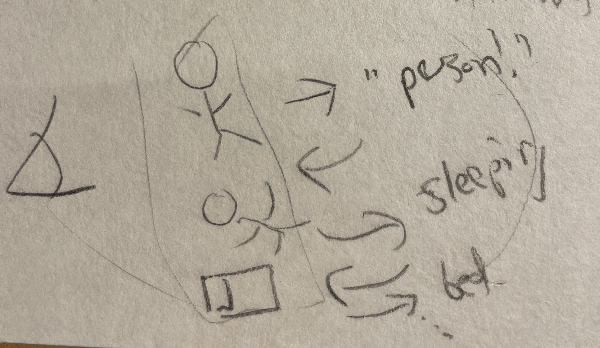

# MCMC

## Idea of MCMC

::: notes
Suppose there's something we want to calculate -- say the average web revenue for pages every day.

Start out simple: suppose we have a revenue amount for each page, per user. How do we calculate the average revenue per page?

We can figure out how many users visit each page, and then multiply that by the revenue per user for that page.

We can do this by calculating the stationary distribution of the Markov chain that describes the transitions between pages.

Or, we can do it by *sampling*. 

Work through the notebook to see how this works in practice.

OK, now make it more complicated.

We have a formula for a given webpage that tells us how much revenue it generates given the user's age, their gender, their location, etc.

How can we find the average revenue per page now?

We need to know the distribution of users and their characteristics. We can't just use the stationary distribution of the Markov chain anymore.

We could try to calculate the distribution of users, but that's hard.


Instead, we can use a Markov Chain Monte Carlo method to sample from the distribution of users. We can then use these samples to estimate the average revenue per page.

To do Gibbs sampling, we will sample from the distribution of each variable given the other variables. This is easier than sampling from the joint distribution of all the variables.

So for instance, we might suppose that a user is male, 25 years old, and on the webpage for the Chicago Cubs. We can specify a distribution of locations for the user's location given this information. Sample from that distribution.

Then, we can say ok, we've got a user who is 25 years old, on the webpage for the Cubs, and in Chicago. What's the probability that the user is male? 

Go through all the variables in turn, sampling from the distribution of each given the others, including for the webpages.

:::

# Restricted Boltzmann Machine


## Intro to the idea of a Restricted Boltzmann Machine

::: notes
You'd like to learn about what sort of objects exist in the world. You have a bunch of data, but you don't know what the objects are. You'd like to learn about the objects and the features that describe them.

One way to do this is to start trying to assign labels to the objects you are seeing. You can start with random labels, and then try to improve them.

Your goal can be that if you imagine objects given the labels, you'll end up with a distribution that looks like the data you have.



Your dreams should look like the real world.

OK, but how do you measure how well your dreams match the real world?

You could calculate the probability of imagining each possible image... but that's intractable.

Instead, you can do a Markov Chain Monte Carlo method called Gibbs sampling. The basic idea of MCMC is that you can sample from a distribution by starting at some point and then moving around in a way that the distribution of your samples will eventually match the distribution you're interested in.

For Gibbs sampling, you start with a random sample, and then you update each variable in turn, **given the other variables**. This may be much easier to compute than needing to know the full transition matrix for every possible pair of states. (We are in high dimensions here, because every node in our network is a variable.)

In the case of the RBM, you update each hidden node given the visible nodes, and then you update each visible node given the hidden nodes. You keep doing this for a while, and then you have a sample from the distribution you're interested in.

Now you compare this sample to your data, and you adjust the weights in your network to make the sample look more like the data.
:::

## Math of the RBM

::: aside
From https://ml-lectures.org/docs/unsupervised_learning/ml_unsupervised-1.html
:::


. . .

States are determined by an **energy function** $E(\mathbf{v}, \mathbf{h})$.
$$
E(\mathbf{v}, \mathbf{h})=-\sum_{i} a_{i} v_{i}-\sum_{j} b_{j} h_{j}-\sum_{i j} v_{i} W_{i j} h_{j} 
$$

. . .

Then the probability distribution is given by the Boltzmann distribution:

$P_{\mathrm{rbm}}(\mathbf{v}, \mathbf{h})=\frac{1}{Z} e^{-E(\mathbf{v}, \mathbf{h})}$ where $Z=\sum_{\mathbf{v}, \mathbf{h}} e^{-E(\mathbf{v}, \mathbf{h})}$

## 
The probability of a visible vector $\mathbf{v}$ is given by marginalizing over the hidden variables:

$$
\begin{equation*}
P_{\mathrm{rbm}}(\mathbf{v})=\sum_{\mathbf{h}} P_{\mathrm{rbm}}(\mathbf{v}, \mathbf{h})=\frac{1}{Z} \sum_{h} e^{-E(\mathbf{v}, \mathbf{h})}
\end{equation*}
$$

Conveniently, this gives each visible unit an **independent** probability of activation:

$$
P_{\mathrm{rbm}}\left(v_{i}=1 | \mathbf{h}\right)=\sigma\left(a_{i}+\sum_{j} W_{i j} h_{j}\right), \quad i=1, \ldots, n_{\mathrm{v}}
$$

## 
The same is true for hidden units, given the visible units:

$$
\begin{equation*}
P_{\mathrm{rbm}}\left(h_{j}=1 | \mathbf{v}\right)=\sigma\left(b_{j}+\sum_{i} v_{i} W_{i j}\right) \quad j=1, \ldots, n_{\mathrm{h}}
\end{equation*}
$$


## Training

Consider a set of binary input data $\mathbf{x}_{k}, k=1, \ldots, M$, drawn from a probability distribution $P_{\text {data }}(\mathbf{x})$. 

Goal: tune the parameters $\{\mathbf{a}, \mathbf{b}, W\}$ such that after training $P_{\mathrm{rbm}}(\mathbf{x}) \approx P_{\mathrm{data}}(\mathbf{x})$.

. . .

To do this, we need to be able to estimate $P_{\mathrm{rbm}}$!

Unfortunately, this is often intractable, because it requires calculating the partition function $Z$.

## Details of the training

We want to maximize the log-likelihood of the data under the model:
$$
L(\mathbf{a}, \mathbf{b}, W)=-\sum_{k=1}^{M} \log P_{\mathrm{rbm}}\left(\mathbf{x}_{k}\right)
$$

. . .

Take derivatives of this with respect to the parameters, and use gradient descent:

$$
\begin{equation*}
\frac{\partial L(\mathbf{a}, \mathbf{b}, W)}{\partial W_{i j}}=-\sum_{k=1}^{M} \frac{\partial \log P_{\mathrm{rbm}}\left(\mathbf{x}_{k}\right)}{\partial W_{i j}}
\end{equation*}
$$

##

The derivative has two terms:
$$
\begin{equation*}
\frac{\partial \log P_{\mathrm{rbm}}(\mathbf{x})}{\partial W_{i j}}=x_{i} P_{\mathrm{rbm}}\left(h_{j}=1 |\mathbf{x}\right)-\sum_{\mathbf{v}} v_{i} P_{\mathrm{rbm}}\left(h_{j}=1 | \mathbf{v}\right) P_{\mathrm{rbm}}(\mathbf{v}) 
\end{equation*}
$$

. . .

Use this to update the weights:

$$
W_{i j} \rightarrow W_{i j}-\eta \frac{\partial L(a, b, W)}{\partial W_{i j}}
$$

Problem: the second term in the derivative is intractable! It has $2^{n_{\mathrm{v}}}$ terms:

$$ 
\sum_{\mathbf{v}} v_{i} P_{\mathrm{rbm}}\left(h_{j}=1 | \mathbf{v}\right) P_{\mathrm{rbm}}(\mathbf{v}) 
$$

Instead, we will use **Gibbs sampling** to estimate $P_{\mathrm{rbm}}(\mathbf{v})$.


## Gibbs sampling to the rescue

::: {.pseudo-code}
Input: Any visible vector $\mathbf{v}(0)$

Output: Visible vector $\mathbf{v}(r)$

for: $n=1 \backslash$ dots $r$

  $\operatorname{sample} \mathbf{h}(n)$ from $P_{\mathrm{rbm}}(\mathbf{h} \mathbf{v}=\mathbf{v}(n-1))$

  sample $\mathbf{v}(n)$ from $P_{\mathrm{rbm}}(\mathbf{v} \mathbf{h}=\mathbf{h}(n))$
  end
:::


## Using an RBM


# LU Factorization

## 
Suppose we want to solve a nonsingular linear system $A x=b$ repeatedly, with different choices of $b$.

. . .

::: notes
E.g. Heat flow problem, where the right-hand side is determined by the heat source term $f(x)$. 
:::

{height=100}

$$
\begin{equation*}
-y_{i-1}+2 y_{i}-y_{i+1}=\frac{h^{2}}{K} f\left(x_{i}\right), i=1,2, \ldots, n 
\end{equation*}
$$

. . .

Perhaps you want to experiment with different functions for the heat source term.

. . .

What do we do? Each time, we create the augmented matrix $\widetilde{A}=[A \mid b]$, then get it into reduced row echelon form.

. . .

Each time change $b$, we have to redo all the work of Gaussian or Gauss-Jordan elimination !

. . .

Especially frustrating because the main part of our work is the same: putting the part of $\widetilde{A}$ corresponding to the coefficient matrix $A$ into reduced row echelon form.

## LU Factorization: Saving that work

Goal: Find a way to record our work on $A$, so that solving a new system involves very little additional work.

::: {.definition}
LU Factorization: Let $A$ be an $n \times n$ matrix. An LU factorization of $A$ is a pair of $n \times n$ matrices $L, U$ such that

1.  $L$ is lower triangular.
2.  $U$ is upper triangular.
3.  $A=L U$.
:::

. . .

Why is this so wonderful? Triangular systems $A \mathbf{x}=\mathbf{b}$ are easy to solve.

Remember: If $A$ is upper triangular, we can solve for the last variable, then the next-to-last variable, etc.

## Solving an upper triangular system
Let's say we have the following system:

$A x = b$ where A is the upper-triangular matrix 
$A = \begin{bmatrix} 2 & 1 & 0 \\ 0 & 1 & -1 \\ 0 & 0 & -1 \end{bmatrix}$, and we want to solve for $b = \begin{bmatrix} 1 \\ 1 \\ -2 \end{bmatrix}$.

. . .

We form the augmented matrix $\widetilde{A} = [A | b] = \begin{bmatrix} 2 & 1 & 0 & | & 1 \\ 0 & 1 & -1 & | & 1 \\ 0 & 0 & -1 & | & -2 \end{bmatrix}$.

. . .

Back substitution:

1. Last equation: $-x_3 = -2$, so $x_3 = 2$. 
2. Substitute this value into the second equation, $x_2 - x_3 = 1$, so $x_2 = 3$. 
3. Finally, we substitute $x_2$ and $x_3$ into the first equation, $2x_1 + x_2 = 1$, so $x_1 = -1$.

## Solving a lower triangular system
If $A$ is lower triangular, we can solve for the first variable, then the second variable, etc.

Let's say we have the following system:

$A y = b$ where A is the lower-triangular matrix
$A = \begin{bmatrix} 1 & 0 & 0 \\ -1 & 1 & 0 \\ 1 & 2 & 1 \end{bmatrix}$, and we want to solve for $b = \begin{bmatrix} 1 \\ 0 \\ 1 \end{bmatrix}$.

. . .

We form the augmented matrix $\widetilde{A} = [A | b] = \begin{bmatrix} 1 & 0 & 0 & | & 1 \\ -1 & 1 & 0 & | & 0 \\ 1 & 2 & 1 & | & 1 \end{bmatrix}$.

. . .

Forward substitution:

1. First equation: $y_1 = 1$.
2. Substitute this value into the second equation, $-y_1 + y_2 = 0$, so $y_2 = 1$.
3. Finally, we substitute $y_1$ and $y_2$ into the third equation, $y_1 + 2y_2 + y_3 = 1$, so $y_3 = -2$.

. . .

This was just as easy as solving the upper triangular system!

## Solving $A x = b$ with LU factorization

Now suppose we want to solve $A x = b$ and we know that $A = L U$. The original system becomes $L U x = b$.

Introduce an intermediate variable $y = U x$. Our system is now $L y = b$. Now perform these steps:

1. **Forward solve**: Solve lower triangular system $L y = b$ for the variable $y$.
2. **Back solve**: Solve upper triangular system $U x = y$ for the variable $x$.
3. This does it! 

. . .

Once we have the matrices $L, U$, the right-hand sides only come when solving the two triangular systems. Easy!

## Example

You are given that

$$
A=\left[\begin{array}{rrr}
2 & 1 & 0 \\
-2 & 0 & -1 \\
2 & 3 & -3
\end{array}\right]=\left[\begin{array}{rrr}
1 & 0 & 0 \\
-1 & 1 & 0 \\
1 & 2 & 1
\end{array}\right]\left[\begin{array}{rrr}
2 & 1 & 0 \\
0 & 1 & -1 \\
0 & 0 & -1
\end{array}\right] .
$$

Solve this system for $\mathbf{b} = \begin{bmatrix} 1 \\ 0 \\ 1 \end{bmatrix}$.

::: notes
Say that y = Ux.
:::

. . .

:::: {.columns}
::: {.column width="45%"}

::: {.fragment}
Forward solve:
$$
\left[\begin{array}{rrr}
1 & 0 & 0 \\
-1 & 1 & 0 \\
1 & 2 & 1
\end{array}\right]\left[\begin{array}{l}
y_{1} \\
y_{2} \\
y_{3}
\end{array}\right]=\left[\begin{array}{l}
1 \\
0 \\
1
\end{array}\right]
$$


$y_{1}=1$, then $y_{2}=0+1 y_{1}=1$, 
then $y_{3}=1-1 y_{1}-2 y_{2}=-2$.

:::
:::

::: {.column width="45%"}

::: {.fragment}

Back solve:

$$
\left[\begin{array}{rrr}
2 & 1 & 0 \\
0 & 1 & -1 \\
0 & 0 & -1
\end{array}\right]\left[\begin{array}{l}
x_{1} \\
x_{2} \\
x_{3}
\end{array}\right]=\left[\begin{array}{r}
1 \\
1 \\
-2
\end{array}\right]
$$


$x_{3}=-2 /(-1)=2$, then $x_{2}=1+x_{3}=3$, then $x_{1}=\left(1-1 x_{2}\right) / 2=-1$.
:::
:::

::::

## When we can do LU factorization

- Not all square matrices have LU factorizations! This one doesn't: $\left[\begin{array}{ll}0 & 1 \\ 1 & 0\end{array}\right]$
- If Gaussian elimination can be performed on the matrix $A$ **without row exchanges**, then the factorization exists
  - (it's really a by-product of Gaussian elimination.)
- If row exchanges are needed, there is still a factorization that will work, but it's a bit more complicated.

## Intuition behind LU factorization

::: notes
When we do Gaussian elimination, we are multiplying $A$ by a series of elementary matrices to get it into upper triangular form.

Call the product of all those elementary matrices $\tilde L$.

So our original system $A x = b$ becomes $\tilde L A x = \tilde L b$.

We recognize that $\tilde L A$ will be an upper triangular matrix, because that's what we get when we do Gaussian elimination. This is our $U$.

But what about the other part? We can multiply both sides by the inverse of $\tilde L$ to get

$$
\begin{aligned}
\tilde{L}^{-1} \tilde{L} A x &= \tilde{L}^{-1} \tilde L b \\
\tilde{L}^{-1} U x &= b
\end{aligned}
$$

Now the challenge is simply to find the inverse of $\tilde L$.

Remember that $\tilde L$ is the product of the elementary matrices that we used when doing Gaussian elimination -- call them $E_1$, $E_2$, etc.

So $\tilde L = E_n E_{n-1} \ldots E_1$.

The inverse of a product of matrices is the product of the inverses in reverse order: $(E_n E_{n-1} \ldots E_1)^{-1} = E_1^{-1} E_2^{-1} \ldots E_n^{-1} $.

Fortunately, the inverse of an elementary matrix is easy to find: it's just the same matrix with the opposite sign on the entry that was used to eliminate. So if we have the matrix which will add twice the first row to the second row, its inverse will be the matrix which will **subtract** twice the first row from the second row.

$$ 
E = \begin{bmatrix} 1 & 0 & 0 \\ 2 & 1 & 0 \\ 0 & 0 & 1 \end{bmatrix} \quad E^{-1} = \begin{bmatrix} 1 & 0 & 0 \\ -2 & 1 & 0 \\ 0 & 0 & 1 \end{bmatrix} 
$$

As it happens, when we follow the steps of Gaussian elimination (with no row swaps), the product of all these inverse matrices is just a lower triangular matrix, with each entry equal to the negative of the multiplier we used in doing the associated elimination step.

This is our $L$!

So all we need to do is keep track of these multipliers as we do Gaussian elimination, and we can use them to find the inverse of $\tilde L$. If we are doing things by hand, we can even write them into the lower part of our matrix as we go, since that part will be zeroed out anyways.
:::

## Example

Here we do Gaussian elimination on the matrix $A = \begin{bmatrix} 2 & 1 & 0 \\ -2 & 0 & -1 \\ 2 & 3 & -3 \end{bmatrix}$:

```{python}
#| echo: false
#| output: asis
import sympy as sym
def mylatex(expr, **kwargs):
    print(sym.latex(expr, mode='inline', **kwargs))
x, y = sym.symbols('x y')
M = sym.Matrix([[2,1,0],[-2,0,-1],[2,3,-3]])
mylatex(M)
print("$\\xrightarrow[E_{31}(-1)]{E_{21}(1)}$")
M = M.elementary_row_op("n->n+km", k=-1,row1=2,row2=0)
M = M.elementary_row_op("n->n+km", k=1,row1=1,row2=0)
mylatex(M)
print('$\\xrightarrow[E_{32}(-2)]{\longrightarrow}$')
M = M.elementary_row_op("n->n+km", k=-2,row1=2,row2=1)
mylatex(M)
```

:::: {.columns}

::: {.column width="45%"}
::: {.fragment}
Let's put those elementary row operations into matrix form. There were three of them:

1. $E_{21}(1)$ : $\begin{bmatrix} 1 & 0 & 0 \\ 1 & 1 & 0 \\ 0 & 0 & 1 \end{bmatrix}$
2. $E_{31}(-1)$: $\begin{bmatrix} 1 & 0 & 0 \\ 0 & 1 & 0 \\ -1 & 0 & 1 \end{bmatrix}$
3. $E_{32}(-2)$: $\begin{bmatrix} 1 & 0 & 0 \\ 0 & 1 & 0 \\ 0 & -2 & 1 \end{bmatrix}$

:::
:::

::: {.column width="45%"}
::: {.fragment}

The **inverses** of these matrices are

1. $\begin{bmatrix} 1 & 0 & 0 \\ -1 & 1 & 0 \\ 0 & 0 & 1 \end{bmatrix}$, $\begin{bmatrix} 1 & 0 & 0 \\ 0 & 1 & 0 \\ 1 & 0 & 1 \end{bmatrix}$, and $\begin{bmatrix} 1 & 0 & 0 \\ 0 & 1 & 0 \\ 0 & 2 & 1 \end{bmatrix}$.

:::
:::
::::

##

The product of all these matrices is
```{python}
#| echo: false
#| output: asis
E1 = sym.eye(3).elementary_row_op("n->n+km", k=-1,row1=2,row2=0)
E2 = sym.eye(3).elementary_row_op("n->n+km", k=1,row1=1,row2=0)
E3 = sym.eye(3).elementary_row_op("n->n+km", k=-2,row1=2,row2=1)
E = E1*E2*E3
```

```{python}
#| echo: false
#| output: asis
print("$$" +"\n" + sym.latex(E1) + sym.latex(E2) + sym.latex(E3) + "=" + sym.latex(E) +"\n"+"$$")
```

This is a lower triangular matrix, and it is the inverse of the matrix we used to do Gaussian elimination.

We can also see that the entries below the diagonal are the negatives of the multipliers we used in the elimination steps.


## Steps to LU factorization

Let $\left[a_{i j}^{(k)}\right]$ be the matrix obtained from $A$ after using the $k$ th pivot to clear out entries below it.

. . .

(The original matrix is $A=\left[a_{i j}^{(0)}\right]$)

. . .

All the row operations we will use include ratios $\left(-a_{i j} / a_{j j}\right)$.

. . .

The row-adding elementary operations are of the form

$E_{i j}\left(-a_{i j}^{(k)} / a_{j j}^{(k)}\right)$ 

. . .

We can give these ratios a name: **multipliers**. 

$m_{i j}=-a_{i j}^{(k)} / a_{j j}^{(k)}$, where $i>j$

. . .

::: {.theorem}
If Gaussian elimination is used without row exchanges on the nonsingular matrix $A$, resulting in the upper triangular matrix $U$, and if $L$ is the unit lower triangular matrix whose entries below the diagonal are the negatives of the multipliers $m_{i j}$, then $A=L U$.
:::

## Storing the multipliers as we go

For efficiency, we can just "store" the multipliers in the lower triangular part of the matrix on the left as we go along, since that will be zero anyways.


$$
\left[\begin{array}{rrr}
(2) & 1 & 0 \\
-2 & 0 & -1 \\
2 & 3 & -3
\end{array}\right] \xrightarrow[E_{31}(-1)]{E_{21}(1)}\left[\begin{array}{rrr}
2 & 1 & 0 \\
-1 & (1) & -1 \\
1 & 2 & -3
\end{array}\right] \xrightarrow[E_{32}(-2)]{\longrightarrow}\left[\begin{array}{rrr}
2 & 1 & 0 \\
-1 & 1 & -1 \\
1 & 2 & -1
\end{array}\right] .
$$

. . .

::: notes
circle the multipliers as we go along
:::

Now we read off the results from the final matrix:

$$
L=\left[\begin{array}{rrr}
1 & 0 & 0 \\
1 & 1 & 0 \\
-1 & 2 & 1
\end{array}\right] \text { and } U=\left[\begin{array}{rrr}
2 & 1 & 0 \\
0 & 1 & -1 \\
0 & 0 & -1
\end{array}\right]
$$


## Superaugmented matrix

Could we just keep track by using the superaugmented matrix, like we did last lecture? What would that look like?

**pause**

::: {.fragment}


```{python}
#| echo: false
#| output: asis
M = sym.Matrix([[2,1,0],[-2,0,-1],[2,3,-3]])
# augment M with a 3x3 identity matrix
M = M.row_join(sym.eye(3))
mylatex(M)
print("$\\xrightarrow[E_{31}(-1)]{E_{21}(1)}$")
M = M.elementary_row_op("n->n+km", k=-1,row1=2,row2=0)
M = M.elementary_row_op("n->n+km", k=1,row1=1,row2=0)
mylatex(M)
print('$\\xrightarrow[E_{32}(-2)]{\longrightarrow}$')
M = M.elementary_row_op("n->n+km", k=-2,row1=2,row2=1)
mylatex(M)
```

::: 

. . .

Our superaugmented matrix does become an upper triangular matrix on the left and a lower triangular matrix on the right. 

Unfortunately, the lower triangular matrix on the right is $\tilde{L}^{-1}$, not $\tilde{L}$.

So we can't just read off $L$ and $U$ from the superaugmented matrix.

## PLU factorization

What if we need row exchanges?

- We could start off by doing all the row-exchanging elementary operations that we need, and store the product of these row-exchanging matrices as a matrix $P$.

- This product is called a **permutation matrix**

- Applying the correct permuatation matrix $P$ to $A$, we get a matrix for which Gaussian elimination will succeed without further row exchanges.

. . .

Now we have a theorem that applies to all nonsingular matrices:

::: {.theorem}
If $A$ is a nonsingular matrix, then there exists a permutation matrix $P$, upper triangular matrix $U$, and unit lower triangular matrix $L$ such that $P A=L U$.
:::

. . .

So, if you've got a nonsingular matrix $A$, you can always find a permutation matrix $P$, an upper triangular matrix $U$, and a unit lower triangular matrix $L$ that satisfy $P A=L U$. Pretty neat, huh?
