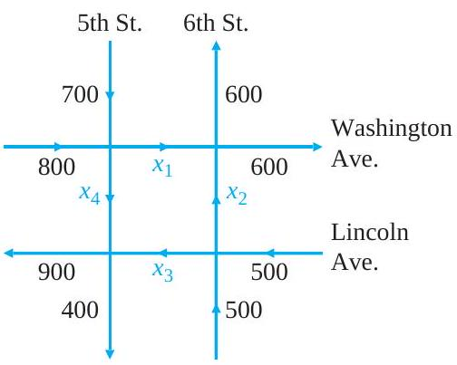
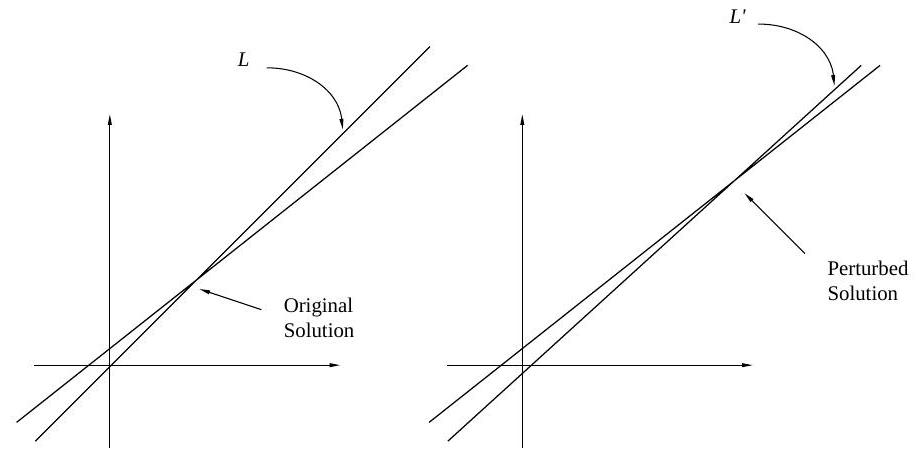

# Outline for today

-   Linear systems: what they are + a few examples
-   Gauss-Jordan elimination (as a general-purpose method)
-   What can go wrong with roundoff
-   A simple fix: (partial) pivoting
-   Ill-conditioning: sometimes the *problem* is the issue
-   Polynomial interpolation as an example

:::: notes
The through-line today is: solving \(Ax=b\) is not just "do algebra." We need algorithms, and algorithms interact with finite precision. I'll keep coming back to feasible/accurate/stable/efficient.
::::

# Linear systems

<!-- @idea: linear_systems_what_and_why | What linear systems are and why we care -->
<!-- @uses: linear_system, linear_systems_core -->
<!-- @introduces: linear_system -->
## Application number one: solving linear systems

- The first big thing we will use linear algebra for is solving *systems of linear equations*.
- Hope to convince you that this is **useful** but not entirely **straightforward**!


## Linear equations

We all know what "linear" means: straight!

. . .

-   A linear equation of one variable is of the form $ax + b = 0$.
    -   Solution: A single point on the number line: $x = -\frac{b}{a}$
-   A linear equation of two variables is of the form $ax + by + c = 0$.
    -   Solution: any pair of values $(x, y)$ that satisfies the equation. These form a straight line in the plane.
-   A linear equation of three variables is of the form $ax + by + cz + d = 0$.
    -   Solution: any triple of values $(x, y, z)$ that satisfies the equation. These form a plane in three-dimensional space.
-   In general, a linear equation of $n$ variables is of the form $a_1 x_1 + a_2 x_2 + \dots + a_n x_n + b = 0$.

## Linear systems

-   Linear system: a collection of linear equations involving the same variables $x_1, x_2, \dots, x_n$.
-   Each equation has its own set of coefficients $a_{ij}$ and its own right-hand side $b_i$. So the 3rd equation might look like $a_{31} x_1 + a_{32} x_2 + \dots + a_{3n} x_n = b_3$.

. . .

When we put them all together, we get a linear system:

$$
\begin{cases}
a_{11} x_1 + a_{12} x_2 +\dots + a_{1n} x_n = b_1 \\
a_{21} x_1 + a_{22} x_2  + \dots + a_{2n} x_n = b_2 \\ 
\vdots\\
a_{m1} x_1 + a_{m2} x_2 + \dots + a_{mn} x_n = b_m,
\end{cases}
$$

## Why do we care about systems of equations?

We use equations to represent constraints (physics, data, budgets, flows, etc.) When there are multiple constraints, we get a system of equations.

. . .

Examples:

::: notes
-   Physics: conservation of energy and momentum
-   Economics: budget constraints
-   Biology: population dynamics
-   Chemistry: stoichiometry
-   Computer science: data structures
-   Engineering: structural analysis
-   Finance: portfolio optimization
-   Medicine: drug interactions
-   Science: experimental design
:::

. . .

Of course, many equations we can think of won't be linear... But many things are!

-   Once you write a model down, it often becomes \(Ax=b\)
-   Then the question is: can we solve it **reliably**?

# Examples of linear systems (we aren't going to solve them yet!)

<!-- @idea: examples_of_linear_systems | Railroad, traffic flow, polynomial interpolation -->
<!-- @uses: linear_system, linear_systems_core -->
## Example 1: railroad cars

A chemical manufacturer wants to lease a fleet of 24 railroad tank cars with a combined carrying capacity of 520,000 gallons.

-   Tank cars with three different carrying capacities are available:
    -   8,000 gallons
    -   16,000 gallons
    -   24,000 gallons.
-   How many of each type of tank car should be leased?

. . .

Will we have a single solution?

::: notes


Can write this as $x \times 8+y \times 16 + z \times 24=520$ and also $x+y+z=24$. We won't have a single solution... Two equations, three unknowns.


:::


## Example 2: traffic flow. 

::: columns
::: column


-   Numbers = \# of vehicles/hr that enter and leave on that street.
-   $x_{1}, x_{2}, x_{3}$, and $x_{4}$: flow of traffic between the four intersections.
:::

::: column
-   Number of vehicles entering each intersection should always equal the number leaving. E.g.:
    -   1,500 vehicles enter the intersection of 5th Street and Washington Avenue each hour
    -   $x_{1}+x_{4}$ vehicles leave this intersection
    -   $\rightarrow$ $x_{1}+x_{4}=1,500$
-   Find the traffic flow at each of the other three intersections.
-   What is the \# of vehicles that travel from Washington Avenue to Lincoln Avenue on 5th Street?
:::
:::

::: notes
$x_1+x_2=1200$, and $x_2+x_3=1000$, and $x_3+x_4=1300$.
:::

## Example: US population

-   The U.S. population was approximately 75 million in 1900, 150 million in 1950, and 275 million in 2000.
-   Find a quadratic equation whose graph passes through the points $(0,75)$, $(50,150)$, $(100,275)$

. . .

Wait, what? How is this a **linear** system?

. . .

There are three years that our graph needs to pass through: 1900, 1950, and 2000. We can write these as $t_1 = 0$, $t_2 = 50$, and $t_3 = 100$.

We can write the population as $y_1 = 75$, $y_2 = 150$, and $y_3 = 275$.

. . .

We are asked to find a *quadratic equation*, which means it's of the form $y = ax^2 + bx + c$. We need to find the values of $a$, $b$, and $c$ so that the equation passes through our three points.

For the first point, we have $a t_1^2 + b t_1 + c = y_1$. Since $t_1$=0, this becomes $a 0^2 + b 0 + c = 75$.

## 

If we do this for the other two points, we get the  system:

$$
\begin{cases}
a t_1^2 + b t_1 + c = y_1 \\
a t_2^2 + b t_2 + c = y_2 \\
a t_3^2 + b t_3 + c = y_3
\end{cases}
$$

. . .

Is this linear?

::: notes

Well, it depends on what we mean by "linear". Here, we are trying to find the values of $a$, $b$, and $c$. Is this system of equations linear in $a$, $b$, and $c$?

:::

. . .

Yes, it is linear in $a$, $b$, and $c$, because none of them is raised to a power other than 1.

##

The terms that are squared are just coefficients. We can even calculate them: $t_2^2 = 2500$, for instance. Then we can rewrite the system as:

$$
\begin{cases}
0 a + b 0 + c = 75 \\
2500 a + 50 b + c = 150 \\
10000 a + 100 b + c = 275
\end{cases}
$$

. . .

We see that we now have a standard system of linear equations.

# Solving linear systems -- bring in the linear algebra!

<!-- @idea: from_equations_to_augmented_matrix | From equations to matrix form and augmented matrix -->
<!-- @uses: augmented_matrix, elimination_and_rref, linear_system, linear_systems_core -->
## Why not just solve by hand?

-   We want procedures that work for many variables, not just \(2\times2\) or \(3\times3\)
-   We care about accuracy, but also stability: do small errors get amplified?
-   We care about efficiency and reusability (especially when solving \(Ax=b\) for lots of different \(b\)'s)

## Goals for algorithms

An algorithm should be:

-   feasible
-   accurate
    -   stable
-   efficient
    -   reusable computations

## Example: very simple linear system

We'll get started with an example that is easy enough to solve by hand. We'll pay attention to what we do, and why.

\begin{gather*}
2 x-y=1 \\
4x+4y=20 
\end{gather*}

::: notes
We might subtract two times the first row from the second. The second row is $4x+4y=20$.

$4x-2(2x)+4y+(2y)=20-2$
$0x+6y=18$
$y=3$

Then we plug this back into the first equation to get $2x-3=1$, so $x=2$.

So the solution is $x=2$ and $y=3$.
:::

## Augmented matrix

It was a little hard to keep track of the variables just there.

(Not really! It shouldn't have been! But it's late when I'm writing this, and my brain doesn't work so well, I need something easier...)

. . .

<!-- @introduces: augmented_matrix -->
Make an *augmented matrix* to represent the problem.

Rules for an augmented matrix:
- The numbers in the first column are the coefficients of the first variable, for each equation.
- The numbers in the second column are the coefficients of the second variable, for each equation. And so on.
- The numbers in the last column are the right-hand sides of the equations.

##

Remember, our two equations were:

\begin{gather*}
2 x-y=1 \\
4x+4y=20 
\end{gather*}

. . .

So as an augmented matrix, they become:

$$
\begin{aligned}
& x \quad y=r . h . s . \\
& {\left[\begin{array}{rrr}
2 & -1 & 1 \\
4 & 4 & 20
\end{array}\right]}
\end{aligned}
$$

. . .

Our goal: manipulate the augmented matrix to solve the problem.

<!-- @idea: elementary_operations_and_rref | Row operations and reduced row echelon form -->
<!-- @uses: augmented_matrix, elimination_and_rref, elementary_row_operations, linear_system, reduced_row_echelon_form -->
## What things can we do while we are solving the problem?

We are going to change around the numbers in our matrix *without changing the solution*.

. . .

What does that mean? It means that we will manipulate the matrix so it represents *different* systems of equations that have the **same solution**.

. . .

For example, these two systems have the same solution:

::: columns
:::: column

\begin{gather*}
2 x-y=1 \\
4x+4y=20
\end{gather*}

::::
:::: column
\begin{gather*}
4x+4y=20 \\
2 x-y=1
\end{gather*}
::::
:::

. . .

We have simply swapped the order of the equations. They still have the same solution.

How does this change the matrix? It swaps the first and second rows.

$$\begin{aligned}
& x \quad y=r . h . s . \\
& {\left[\begin{array}{rrr}
4 & 4 & 20 \\
2 & -1 & 1
\end{array}\right]}
\end{aligned}
$$

. . .

Swapping the rows of the matrix is equivalent to swapping the order of the equations, and **it does not change the solution**.


## Multiplying a row by a constant

We can also multiply one of our equations by a constant. For example, if we multiply the second equation by 2, we get:

\begin{gather*}
2 x-y=1 \\
8x+8y=40
\end{gather*}

. . .

This has the same solution as the original system.

. . .

How does this change the matrix? It multiplies the second row by 2.

$$\begin{aligned}
& x \quad y=r . h . s . \\
& {\left[\begin{array}{rrr}
2 & -1 & 1 \\
8 & 8 & 40
\end{array}\right]}
\end{aligned}
$$

## Adding a multiple of one row to another

We did this when we were solving the problem by hand. We subtracted two times the first row from the second row.

How does this change the matrix? It adds -2 times the first row to the second row.

$$\begin{aligned}
& x \quad y=r . h . s . \\
& {\left[\begin{array}{rrr}
2 & -1 & 1 \\
0 & 6 & 18
\end{array}\right]}
\end{aligned}
$$

<!-- @introduces: elementary_row_operations -->
## Elementary Matrix Operations

When we do these on augmented matrices, the solutions are unchanged...

1.  $E_{i j}$ : **Swap**: Switch the $i$th and $j$ th rows of the matrix.
2.  $E_{i}(c)$ : **Scale**: Multiply the $i$th row by the nonzero constant $c$.
3.  $E_{i j}(d)$ : **Add**: Add $d$ times the $j$th row to the $i$th row.

## Our strategy

We are going to use a sequence of elementary row operations to transform our augmented matrix into a form where we will be able to read off the solution.

. . .

This form is called **reduced row echelon form**.

<!-- @introduces: reduced_row_echelon_form -->
## Reduced row echelon form

Here is an example of an augmented matrix in reduced row echelon form:

$$
\begin{aligned}
& x \quad y=r . h . s . \\
& {\left[\begin{array}{rrr}
1 & 4 & 2 \\
0 & 1 & 3
\end{array}\right]}
\end{aligned}
$$

. . .

It corresponds to the following system of equations:

\begin{gather*}
x + 4y = 2 \\
y = 3
\end{gather*}

. . .

See how easy that is to solve? We can just read from the bottom up: $y=3$, and then $x + 4(3) = 2$, so $x = 2 - 12 = -10$.

. . .

Any time we can get an augmented matrix into reduced row echelon form, it will be this easy to solve.


## Rules for Reduced Row Echelon Form

Every matrix can be reduced by a sequence of elementary row operations to one and only one reduced row echelon form:

-   Nonzero rows of $R$ precede the zero rows.
-   Column numbers of the leading entries of the nonzero rows, say rows $1,2, \ldots, r$, form an increasing sequence of numbers $c_{1}<c_{2}<\cdots<c_{r}$.
-   Each leading entry is a 1.
-   Each leading entry has only zeros above it.

. . .

We just need to know which row operations to do, and in what order. Then we can solve any linear system!

# An algorithm for getting an augmented matrix into reduced row echelon form

<!-- @idea: gauss_jordan_algorithm | Gauss–Jordan elimination algorithm -->
<!-- @uses: augmented_matrix, elimination_and_rref, elementary_row_operations, gauss_jordan_elimination, pivot, pivoting, reduced_row_echelon_form -->
<!-- @introduces: gauss_jordan_elimination -->
## Gauss-Jordan elimination


1.  Swap rows to get non-zero number in row 1, column 1
2.  Get a **1** in the row 1, column 1.
3.  Make all other entries in column 1 **0**.
4.  Swap rows to get non-zero number in row 2, column 2. Make this entry **1**. Make all other entries in column 2 **0**.
5.  Repeat step 4 for row 3, column 3. Continue moving along the main diagonal until you reach the last row, or until the number is zero.

. . .

<!-- @introduces: pivoting -->
<!-- @introduces: pivot -->
Vocabulary: process of getting a 1 in a location, and then making all other entries zeros in that column, is **pivoting**.

The number that is made a 1 is called the pivot element, and the row that contains the pivot element is called the **pivot row**.

## G-J Elimination for our toy system

$$
\left[\begin{array}{rrr}
4 & 4 & 20 \\
2 & -1 & 1
\end{array}\right] \overrightarrow{E_{1}(\frac{1}{4}}\left[\begin{array}{lll}
1 & 1 & 5 \\
2 & -1 & 1
\end{array}\right] \overrightarrow{E_{12}(-2)}\left[\begin{array}{lll}
1 & 1 & 5 \\
0 & -3 & -9
\end{array}\right]
$$


and then...

. . .


$$
\left[\begin{array}{rrr}
1 & 1 & 5 \\
0 & -3 & -9
\end{array}\right] \overrightarrow{E_{2}(-1 / 3)}\left[\begin{array}{lll}
1 & 1 & 5 \\
0 & 1 & 3
\end{array}\right] \overrightarrow{E_{12}(-1)}\left[\begin{array}{lll}
1 & 0 & 2 \\
0 & 1 & 3
\end{array}\right] .
$$

. . .

Writing this back as a linear system, we have:

$$
\begin{aligned}
2 x-y &= 1 \\
4 x+4 y &= 20
\end{aligned}
\Longrightarrow
\begin{aligned}
1 \cdot x+0 \cdot y &= 2 \\
0 \cdot x+1 \cdot y &= 3
\end{aligned}
\Longrightarrow
\begin{aligned}
x &= 2 \\
y &= 3
\end{aligned}
$$

## Now you try: birds in a tree

There are 2 trees in a garden (tree "A" and "B") and in both trees are some birds.

The birds of tree A say to the birds of tree B that if one of you comes to our tree, then our population will be double yours.

Then the birds of tree B tell the birds of tree A that if one of you comes here, then our population will be equal to yours.

How many birds in each tree?

(Solve by making an augmented matrix and doing G-J elimination.)

::: notes
The answer is 7 birds in tree A and 5 birds in tree B.
:::


::: aside
https://www.mathsisfun.com/puzzles/birds-in-trees.html
:::


## Example: Mining

::: aside
Meyer Ch 1.5
:::

A mine produces *silica*, *iron*, and *gold*

Needs **Money** (in \$\$), **operating time** (in hours), and **labor** (in person-hours).

-   1 pound of silica needs: \$.0055, . 0011 hours of operating time, and .0093 hours of labor.

-   1 pound of iron needs: \$.095, . 01 operating hours, and .025 labor hours.

-   1 pound of gold needs: \$ 960, 112 operating hours, and 560 labor hours.

## Mining example: from story \(\rightarrow\) linear system

Suppose that during 600 hours of operation, exactly \$ 5000 and 3000 labor-hours are used.

How much silica ($x$), iron ($y$), and gold ($z$) were produced?

. . .

Set up the linear system whose solution will yield the values for $x, y$, and $z$.

. . .

$$
\begin{aligned}
.0055 x + .095 y + 960 z &=  5000 \quad \text{(dollars)}\\
.0011 x + .01 y + 112 z &= 600 \quad \text{(operating hours)}\\
.0093 x + .025 y + 560 z &= 3000\quad \text{(labor hours)}
\end{aligned}
$$

. . .

Make the *augmented matrix*:

$$
\left[\begin{array}{@{}ccc|c@{}}
.0055 & .095 & 960 & 5000 \\
 .0011 & .01  & 112 & 600 \\
 .0093 & .025 & 560 & 3000
\end{array}\right]
$$

::: notes
Draw the line on the augmented matrix.
:::

##

We can solve this using Gauss-Jordan elimination.

```{python}
from sympy.matrices import Matrix, eye, zeros, ones, diag, GramSchmidt
from sympy.core.numbers import Number
from sympy import print_latex, latex,N
def round_expr(expr, num_digits):
    return expr.xreplace({n : round(n, num_digits) for n in expr.atoms(Number)})
```

```{python}
# Do the Gauss-Jordan elimination
M=Matrix([[.0055,.095,960,5000],[.0011,.01,112,600],[.0093,.025,560,3000]])
round_level = 2;
M2=N(M.elementary_row_op('n->n+km', row=1,row2=0, k=-(M[1,0]/M[0,0])),round_level)
M3=N(M2.elementary_row_op('n->n+km', row=2,row2=0, k=-(M2[2,0]/M2[0,0])),round_level)
M4=N(M3.elementary_row_op('n->n+km', row=2,row2=1, k=-(M3[2,1]/M3[1,1])),round_level)
```

```{python}
from IPython.display import Markdown
def pp(x):
  print("$"+latex(x)+"$")
def ppd(x): 
  print("$$"+latex(x)+"$$")
def mm(x):
  Markdown(latex(x))
```

<!-- @idea: rounding_mining_and_goals | Rounding in elimination, mining example, algorithm goals -->
<!-- @uses: augmented_matrix, elimination_and_rref, gauss_jordan_elimination, linear_system, reduced_row_echelon_form -->
## Getting into row echelon form, rounding after 3 digits

$$`{python} Markdown(latex(M))` \overrightarrow{E_{12}(\frac{-1}{5})} `{python} Markdown(latex(M2))`$$

$$\overrightarrow{E_{13}(\frac{93}{55})} `{python} Markdown(latex(M3))`$$

$$\overrightarrow{E_{23}(\frac{-14}{.9})} `{python} Markdown(latex(M4))`$$

## Mining example: solve (and then compare to exact)

```{python}
soln=M4[0:3,0:3].solve(rhs=M4[:,3])
```

This has solutions $`{python} Markdown(latex(soln))`$.

. . .

How do these compare to the exact solutions? These are

```{python}
M[0:3,0:3].solve(rhs=M[:,3])
```

## Doing it again, rounding after 15 digits

```{python}
# Do the Gauss-Jordan elimination
M=Matrix([[.0055,.095,960,5000],[.0011,.01,112,600],[.0093,.025,560,3000]])
round_level = 15;
ml = latex(M)
M2=N(M.elementary_row_op('n->n+km', row=1,row2=0, k=-(M[1,0]/M[0,0])),round_level)
M3=N(M2.elementary_row_op('n->n+km', row=2,row2=0, k=-(M2[2,0]/M2[0,0])),round_level)
M4=N(M3.elementary_row_op('n->n+km', row=2,row2=1, k=-(M3[2,1]/M3[1,1])),round_level)
```

$`{python} Markdown(latex(M))` \rightarrow `{python} Markdown(latex(M2))`$

$\rightarrow `{python} Markdown(latex(M3))` \rightarrow `{python} Markdown(latex(M4))`$

```{python}
soln2=M4[0:3,0:3].solve(rhs=M4[:,3])
```

This has solutions $`{python} Markdown(latex(soln2))`$.

Reminder, the exact solution was:
```{python}
M[0:3,0:3].solve(rhs=M[:,3])
```

## Takeaway (mining example)

-   Gauss--Jordan gives the correct answer in **exact arithmetic**.
-   In floating-point arithmetic, intermediate rounding can change the computed result.
-   Next: we make "accuracy vs stability" concrete with roundoff examples and pivoting.

# Comparing the G-J algorithm with our goals

## Reminder of goals

An algorithm should be:

::: nonincremental
-   feasible
-   accurate
    -   stable
-   efficient
    -   reusable computations
:::

:::: notes
-   **Feasible?** Yes for small-to-moderate problems, but Gauss--Jordan is \(O(n^3)\) time and \(O(n^2)\) storage, so it does not scale well to very large \(n\).

-   **Efficient?** Not especially. Compared to Gaussian elimination/LU + back substitution, Gauss--Jordan does more arithmetic (it eliminates both above and below pivots), so it is slower and typically accumulates more roundoff.

-   **Accurate/stable?** Not automatically. Without pivoting, elimination can be very unstable (tiny pivots \(\rightarrow\) huge multipliers \(\rightarrow\) large roundoff amplification). Pivoting (at least partial pivoting) helps a lot, but even then Gauss--Jordan is usually not the preferred numerically stable workhorse compared to LU with pivoting.

-   **Reusable computations?** In practice, we typically factor \(A\\approx LU\) once (with pivoting) and reuse it for multiple right-hand sides, rather than rerunning Gauss--Jordan from scratch each time.
::::

# Roundoff errors

<!-- @idea: roundoff_and_partial_pivoting | Roundoff errors and partial pivoting -->
<!-- @uses: elimination_and_rref, gauss_jordan_elimination, linear_system, pivot, pivoting -->
## Roundoff errors with G-J elimination

Try this on your calculator. What do you get?

$$
\left(\left(\frac{2}{3}+100\right)-100\right)-\frac{2}{3}
$$

. . .

Should this be \(0\)?

::: notes
On my calculator, I get 3.33e-32. That's a small number, but not zero!

What is happening is that 2/3 = 0.666666...., and your calculator represents this as a very long string but eventually puts in a 7.

Then when it adds the 100, it has to drop a few of those digits in its representation. They are then gone! When we subtract the 100, we don't get them back again.
:::

## Roundoff example: tiny \(\epsilon\) and loss of significance

-   Let $\epsilon$ be a number so small that our calculator yields $1+\epsilon=1$.

-   With this calculator, $1+1 / \epsilon=(\epsilon+1) / \epsilon=1 / \epsilon$

-   Want to solve the linear system

-   \begin{align*}
    \epsilon x_{1}+x_{2} & =1\\
    x_{1}-x_{2} & =0 .
    \end{align*}


## Roundoff errors with G-J elimination {.scrollable}

With our calculator,

::: notes
In the second step, we are replacing $-1+\frac{1}{\epsilon}$ with just $\frac{1}{\epsilon}$. It's a case where we are adding together numbers of very different scale.
:::

$$
    \left[\begin{array}{rrr}
    \epsilon & 1 & 1 \\
    1 & -1 & 0
    \end{array}\right] \overrightarrow{E_{21}\left(-\frac{1}{\epsilon}\right)}\left[\begin{array}{ccc}
    \epsilon & 1 & 1 \\
    0 & \frac{1}{\epsilon} & -\frac{1}{\epsilon}
    \end{array}\right] \overrightarrow{E_{2}(\epsilon)}\left[\begin{array}{ccc}
    \epsilon & 1 & 1 \\
    0 & 1 & 1
    \end{array}\right] \\ \overrightarrow{E_{12}(-1)}\left[\begin{array}{ccc}
    \epsilon & 0 & 0 \\
    0 & 1 & 1
    \end{array}\right]  \overrightarrow{E_{1}\left(\frac{1}{\epsilon}\right)}\left[\begin{array}{lll}
    1 & 0 & 0 \\
    0 & 1 & 1
    \end{array}\right] .
$$

. . .

Calculated solution: $x_{1}=0, x_{2}=1$

Correct answer should be

$$ x_{1}=x_{2}=\frac{1}{1+\epsilon}=0.999999099999990 \ldots$$

## Sensitivity to small changes

Problem arose because we took a computational step where we added two numbers of very different scale, essentially losing the smaller number.

Led to a big changes in output!

There is no general cure for these difficulties...

Want to be *aware* of them, know when we are doing computations that might be susceptible.

## Partial pivoting

We can improve performance of G-J by introducing a new step into the algorithm:

1.  Find the entry in the left column [with the largest absolute value]{style="color:red;"}. This entry is called the pivot. Perform row interchange (if necessary), so that *the pivot* is in the first row.

2.  Use a row operation to get a 1 as the entry in the first row and first column.

3.  Use row operations to make all other entries as zeros in column one.

4.  Interchange rows if necessary to obtain a nonzero number [with the largest absolute value]{style="color:red;"} in the second row, second column. Use a row operation to make this entry 1. Use row operations to make all other entries as zeros in column two.

5.  Repeat step 4 for row 3, column 3. Continue moving along the main diagonal until you reach the last row, or until the number is zero.

::: notes
Full pivoting is where we also move the columns around to get the largest element to the front.

" A square matrix 𝐴 has an 𝐿𝑈 factorization (without pivoting) if, and only if, no zero is encountered in the pivot position when computing an 𝐿𝑈 factorization of 𝐴. However, when does computations using floating point numbers a pivot that is nearly zero can lead to dramatic rounding errors. The simple workaround is to always permute the rows of the matrix such that the largest nonzero entry in a column is chosen as the pivot entry. This ensures that a nearly zero is never chosen. Complete pivoting goes even further by using row and column permutations to select the largest entry in the entire matrix as the pivot entry." from [here](https://math.stackexchange.com/questions/1535376/complete-pivoting-vs-partial-pivoting-in-gauss-elimination)

It's very rare to find yourself in a situation where you need complete pivoting, and sometimes it can be quite computationally expensive.
:::

## Using partial pivoting in our example

::: notes
work this one out by hand
:::

<!-- @idea: ill_conditioning | Ill-conditioned systems and sensitivity -->
<!-- @uses: ill_conditioning, linear_system, linear_systems_core -->
<!-- @introduces: ill_conditioning -->
# Ill-conditioned linear systems

## Ill-conditioned linear systems

::: notes
Sometimes it's not the procedure that introduces the susceptibility to small changes, but the actual problem itself. Then, small differences in the inputs lead to big differences in the *exact solutions*.
:::

::: r-fit-text
A system of linear equations is said to be **ill-conditioned** when some small perturbation in the system (in the $b$s) can produce relatively large changes in the exact solution (in the $x$'s). Otherwise, the system is said to be **well-conditioned**.
:::

## Ill-conditioned linear systems

::: aside
Meyer Ch 1.6
:::

::: columns
::: {.column width="49%"}
Consider 
$$
\begin{aligned}
& .835 x+.667 y=.168, \\
& .333 x+.266 y=.067,
\end{aligned}
$$

Exact solution:

$$
x=1 \quad \text { and } \quad y=-1 .
$$
:::

::: {.column width="49%"}
::: fragment
But if we change just one digit...

$$
\begin{aligned}
& .835 x+.667 y=.168, \\
& .333 x+.266 y=.06\color{red}{6},
\end{aligned}
$$

Now exact solution:

$$
\hat{x}=-666 \quad \text { and } \quad \hat{y}=834
$$
:::
:::
:::

::: notes
What's going on here? One thing to notice is that the lines corresponding to solutions for each equation have very similar slopes: `r .667/.835` vs `r .266/.33`.
:::

## Measurement error \(\rightarrow\) big changes in the exact solution

What if $b_1$ and $b_2$ are the results of an experiment, need to be read off a dial? Suppose:

-   dial can be read to tolerance of $\pm .001$,
-   values for $b_{1}$ and $b_{2}$ are read as .168 and .067, respectively. Then the exact solution is

::: fragment

$$
(x, y)=(1,-1) 
$$

:::

-   But due to uncertainty, we have

::: fragment

$$
.167 \leq b_{1} \leq .169 \quad \text { and } \quad .066 \leq b_{2} \leq .068
$$

:::

## What range of solutions could we see?

::: {r-fit-text}
| $b_1$ | $b_2$ | $x$  | $y$   |
|-------|-------|------|-------|
| .168  | .067  | 1    | -1    |
| .167  | .068  | 934  | -1169 |
| .169  | .066  | -932 | 1169  |

: Possible readings {.striped .hover}
:::

## Geometrical interpretation

If two straight lines are almost parallel and if one of the lines is moved only slightly, then the point of intersection is drastically altered.



The point of intersection is the solution of the associated $2 \times 2$ linear system, so this is also drastically altered.

## Takeaway: conditioning is about the *problem*

-   Often in real life, coefficients are empirically obtained
-   Will be off from "true" values by small amounts
-   For ill-conditioned systems, this means that solutions can be very far off from true solutions
-   We'll cover techniques for quantifying conditioning, later in quarter
-   For now, can just try making small changes to some coefficients. Big changes in result? Ill-conditioned system!

## Bridge to the next example: interpolation can create ill-conditioned systems

-   When we fit high-degree polynomials from data, we often build matrices (e.g. Vandermonde matrices) that can be numerically nasty.
-   Next: polynomial interpolation as a concrete "looks reasonable, behaves badly" example.

# Example: Polynomial interpolation

<!-- @idea: polynomial_interpolation_example | Polynomial interpolation as ill-conditioned example -->
<!-- @uses: elimination_and_rref, gauss_jordan_elimination, ill_conditioning, linear_system, linear_systems_core, pivoting -->
## Polynomial interpolation

::: aside
https://colab.research.google.com/github/quantecon/lecture-julia.notebooks/blob/main/tools_and_techniques/iterative_methods_sparsity.ipynb#scrollTo=9aa1791b
:::

Suppose we'd like to find a polynomial that can interpolate a given function.

Take points 𝑥0,…𝑥𝑁 and values 𝑦0,…𝑦𝑁

Simple way: finding the coefficients \$ c_1, \ldots c_n \$ where

$$
P(x) = \sum_{i=0}^N c_i x^i
$$

. . .

This is a system of equations:

$$
\begin{array}
    cy_0 = c_0 + c_1 x_0 + \ldots c_N x_0^N\\
    \,\ldots\\
    \,y_N = c_0 + c_1 x_N + \ldots c_N x_N^N
\end{array}
$$

## Polynomial interpolation

Or, stacking, $c = \begin{bmatrix} c_0 & \ldots & c_N\end{bmatrix}$, $y = \begin{bmatrix} y_0 & \ldots & y_N\end{bmatrix}$ , and

$$
A = \begin{bmatrix} 1 & x_0 & x_0^2 & \ldots &x_0^N\\
                    \vdots & \vdots & \vdots & \vdots & \vdots \\
                    1 & x_N & x_N^2 & \ldots & x_N^N
    \end{bmatrix}
$$ 

Let's try solving this for a simple function, $y=exp(x)$.

## Polynomial interpolation

$$
x*y
$$


```{python}
import numpy as np
import matplotlib.pyplot as plt

# We are introducing a small error into b. Does it have a big impact on the x's we find?
def approx(n_points,jiggle=0):
  x = np.linspace(1,12,num=n_points)
  #xshuff = x+np.random.normal(size=n_points,scale=jiggle)
  y = np.exp(x)+np.exp(x/4)*np.random.normal(size=n_points,scale=jiggle)
  # Get matrix of exponents of x values => A
  n = len(x)
  A = np.zeros([n,n])
  for i in range(n):
    A[::,i] = np.power(x.T,i)
  b = y

  # Solve Ax=b linear eq. system to get 
  s = np.linalg.solve(A, b)
  # where x denotes coeffs of polynomial in reverse order
  # Flip polynomial coeffs
  s = np.flip(s,axis=0)
  # Print polynomial coeffs
  return s, x, y, A
s, x, y, A = approx(4)
# Evaluate polynomial at X axis and plot result
```

We'll start with picking 4 interpolating points: $\vec x = `{python} Markdown(latex(x.T))`$. Then we have our matrix A:

```{python}
np.set_printoptions(suppress=True)

```

$$A = \begin{bmatrix} 1 & x_0 & x_0^2 & \ldots &x_0^N\\
                    \vdots & \vdots & \vdots & \vdots & \vdots \\
                    1 & x_N & x_N^2 & \ldots & x_N^N
    \end{bmatrix} = `{python} Markdown(latex(Matrix(A)))` $$

Our $y$ values are $\vec y = `{python} Markdown(latex(y))`$. We could solve this using Gauss-Jordan elimination, or here the solving algorithm built into Numpy.

```{python}
def make_plots(s, x, y, A):
  x_axis = np.linspace(np.min(x), np.max(x), num=5000)
  y_axis = np.polyval(s, x_axis)
  y_pred = np.polyval(s,x)
  plt.clf();
  plt.plot(x_axis, y_axis);
  plt.title("n = " + str(len(x)));
  plt.plot(x,y,'ro');
  plt.plot(x_axis,np.exp(x_axis));
  plt.show();
  
def error_norm(s,x,y,A):
    y_pred = np.polyval(s,x)
    return(np.linalg.norm(y_pred-np.exp(x),np.inf))
```

## Results for n=4 and n=10 points

::: columns
::: column
```{python}
_ = plt.figure(figsize=(6,6));
make_plots(*approx(4,jiggle=1000));
```
:::

::: column
::: fragment
```{python}
_ = plt.figure(figsize=(6,6));
make_plots(*approx(15,jiggle=1000));
```
:::
:::
:::

## Max error for different values of n

```{python}
my_error = []
for i in range(1,21):
  my_error.append(error_norm(*approx(i)))
```

```{python}
plt.clf()
plt.plot(my_error)
plt.xlabel("Number of interpolating points")
plt.ylabel("Maximum absolute error")
plt.show()
```

## The problem: linear dependency

```{python}
import matplotlib.pyplot as plt
import numpy as np

x = np.arange(0, 1.1, 0.1)
plt.plot(x, x, marker='o', linestyle='-', color='black', label='n=1')

colors = plt.cm.rainbow(np.linspace(0, 1, 6))

for i in range(1, 7):
  plt.plot(x, x**i, marker='o', linestyle='-', color=colors[i-1], label=f'n={i+1}')

plt.title("x^n for n=1 to 7")
plt.legend()
plt.show()
```

::: notes
As n gets higher, $x^n$ gets closer to $x^{n+1}$ (at least in the range $(0,1)$). This means that a solution of $a_n x^n + a_{n+1} x^{n+1}$ will be very similar to e.g. $a_{n+1} x^n + a_{n} x^{n+1}$
:::

## Wrap-up

-   Gauss-Jordan elimination is a good *idea* (systematic row operations), but not always the best computational tool
-   Roundoff can turn "should be zero" into "is not zero"
-   Pivoting is a cheap way to make elimination behave much better
-   Ill-conditioning is different: sometimes the system itself is sensitive

:::: notes
I want to separate two ideas: (1) instability is about the procedure we use; (2) ill-conditioning is about the math problem. Both show up in practice, and we need to recognize which one we're seeing.
::::