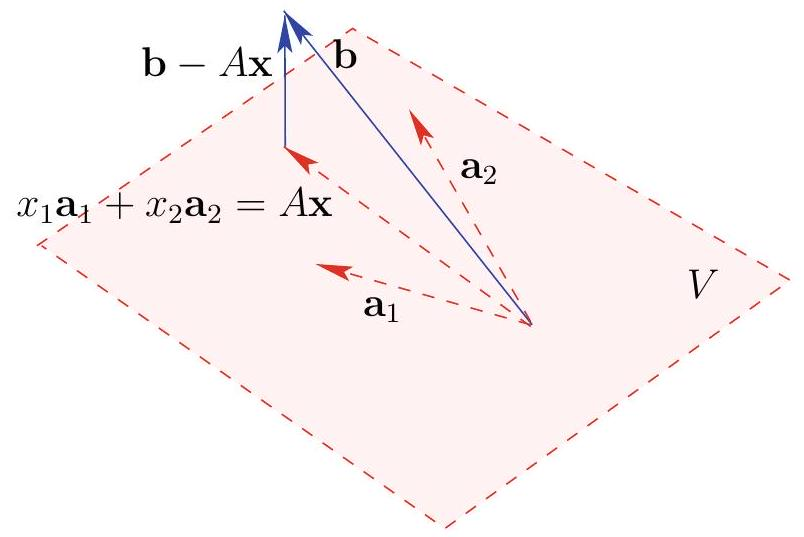
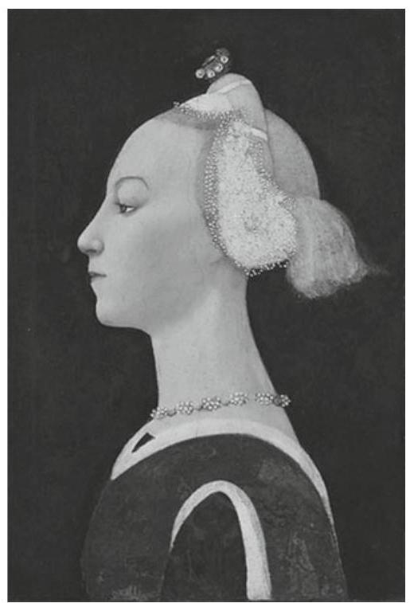
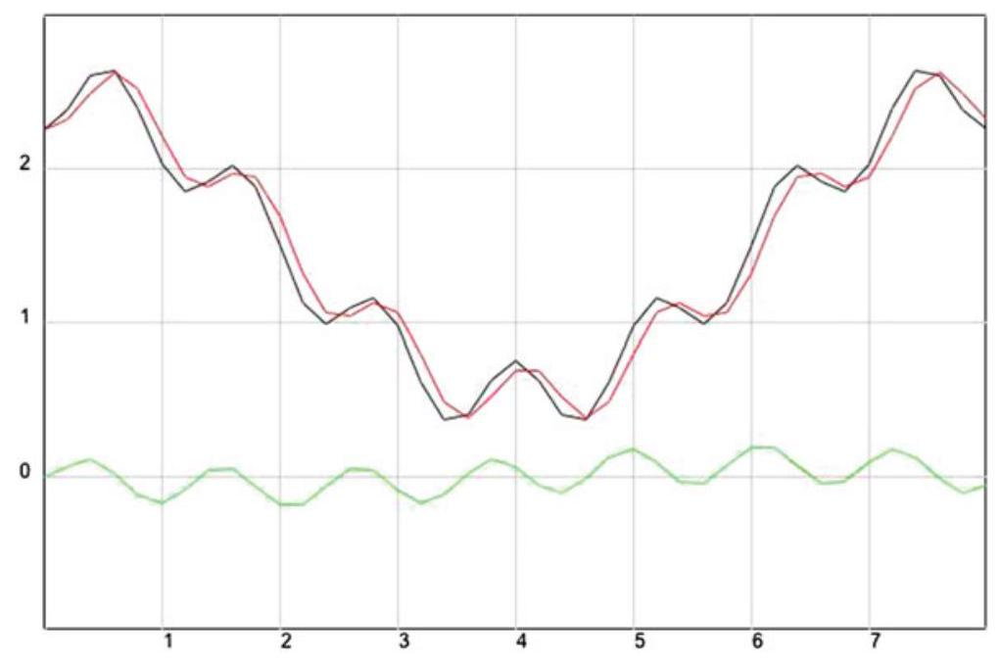
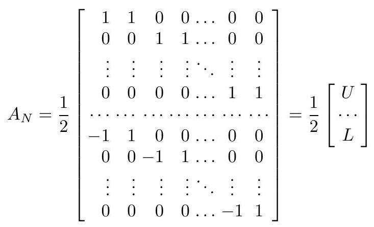
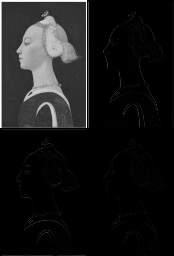
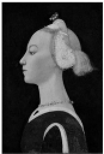
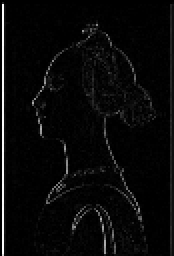
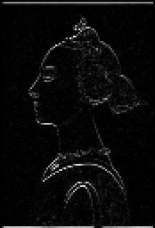
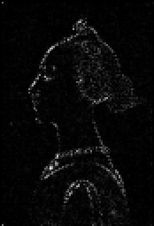
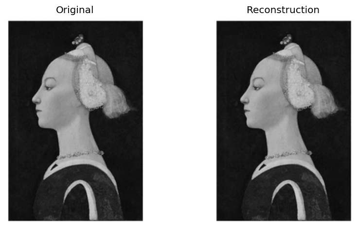

# More Least Squares

<!-- @idea: normal_equations_multiple_predictors | Normal equations for multiple predictors -->
<!-- @uses: least_squares, least_squares_and_projection, normal_equations, projection -->
Extending the normal equations to multiple predictors; geometry and a worked example.

## Normal equations for multiple predictors

When we have multiple predictors, $\mathbf{A}$ is a matrix

. . .

Each column corresponds to a predictor variable.

. . .

 $\mathbf{x}$ is a column vector of the coefficients we are trying to find, one per predictor.

. . .

What do the normal equations tell us? We can break them apart into one equation corresponding to each column of $\mathbf{A}$.

. . .

$$
\begin{aligned}
\mathbf{A}^T \mathbf{A} \mathbf{x} &=\mathbf{A}^T \mathbf{b} \\
\text{becomes} \\
\mathbf{a}_i \cdot \mathbf{A} \mathbf{x} &=\mathbf{a}_i \cdot \mathbf{b} \text{ for every } i \\
\mathbf{a}_i \cdot (\mathbf{b}-\mathbf{A}\mathbf{x})&=0 \text{ for every } i
\end{aligned}
$$

. . .

We need to find $\mathbf{x}$ such that the residuals are orthogonal to every column of $\mathbf{A}$.

. . .

## Figure



## Example

We have two predictors $a_1$ and $a_2$ and a response variable $b$. We have the following data:

| $x_1$ | $x_2$ | $y$ |
|-------|-------|-----|
| 2    | 1     | 0   |
| 1     | 1     | 0   |
| 2     | 1     | 2   |

. . .

We are hoping to find a linear relationship of the form $\beta_1 x_1 + \beta_2 x_2 = y$ for some values of $\beta_1$ and $\beta_2$.

. . .

This would bring us the following system of equations:

$$
\begin{aligned}
2 \beta_{1}+\beta_{2} & =0 \\
\beta_{1}+\beta_{2} & =0 \\
2 \beta_{1}+\beta_{2} & =2 .
\end{aligned}
$$

. . .

Obviously inconsistent! ($2 \beta_{1}+\beta_{2}$ cannot equal both 0 and 2.)

. . .

Find the least squares solution using the normal equations:

. . .

## Matrix form

Change variable names: the $\beta$s are now $\mathbf{x}$, the predictor columns are $\mathbf{A}$, and the $y$s are now $\mathbf{b}$.

$$
\mathbf{A}=\left[\begin{array}{ll}
2 & 1 \\
1 & 1 \\
2 & 1
\end{array}\right], \text { and } \mathbf{b}=\left[\begin{array}{l}
0 \\
0 \\
2
\end{array}\right]
$$

. . .

Residuals are $\mathbf{b}-\mathbf{A} \mathbf{x}$.

Normal equations are $\mathbf{A}^T \mathbf{A} \mathbf{x}=\mathbf{A}^T \mathbf{b}$.

. . .

## Solve via $\mathbf{A}^T\mathbf{A}$

$$
\mathbf{A}^T \mathbf{A}=\left[\begin{array}{lll}
2 & 1 & 2 \\
1 & 1 & 1
\end{array}\right]\left[\begin{array}{ll}
2 & 1 \\
1 & 1 \\
2 & 1
\end{array}\right]=\left[\begin{array}{ll}
9 & 5 \\
5 & 3
\end{array}\right]
$$

with inverse
$$
\left(\mathbf{A}^T \mathbf{A}\right)^{-1}=\left[\begin{array}{ll}
9 & 5 \\
5 & 3
\end{array}\right]^{-1}=\frac{1}{2}\left[\begin{array}{rr}
3 & -5 \\
-5 & 9
\end{array}\right]
$$

. . .

$$
\mathbf{A}^T \mathbf{b}=\left[\begin{array}{lll}
2 & 1 & 2 \\
1 & 1 & 1
\end{array}\right]\left[\begin{array}{l}
0 \\
0 \\
2
\end{array}\right]=\left[\begin{array}{l}
4 \\
2
\end{array}\right]
$$


## Least Squares Solution

$$
\mathbf{x}=\left(\mathbf{A}^T \mathbf{A}\right)^{-1} \mathbf{A}^T \mathbf{b}=\frac{1}{2}\left[\begin{array}{rr}
3 & -5 \\
-5 & 9
\end{array}\right]\left[\begin{array}{l}
4 \\
2
\end{array}\right]=\left[\begin{array}{r}
1 \\
-1
\end{array}\right]
$$

. . .

Back in our original variables, this means the best fit estimate for $\beta_1$ is 1 and the best $\beta_2$ is -1.

. . .

## Skills

- Write the normal equations $\mathbf{A}^T \mathbf{A} \mathbf{x} = \mathbf{A}^T \mathbf{b}$ for a given design matrix $\mathbf{A}$ and response $\mathbf{b}$.
- Interpret the equations as “residuals orthogonal to every column of $\mathbf{A}$.”
- Find the least-squares solution by computing $\mathbf{A}^T \mathbf{A}$, its inverse, and $\mathbf{A}^T \mathbf{b}$ (when invertible).

# Orthogonal and Orthonormal Sets

<!-- @idea: orthogonal_and_orthonormal_sets | Orthogonal/orthonormal sets, orthogonal matrices -->
<!-- @uses: orthogonal_and_qr, orthogonal_set, orthonormal_set -->
<!-- @introduces: orthogonal_set -->
<!-- @introduces: orthonormal_set -->
##

::: definition
The set of vectors $\mathbf{v}_{1}, \mathbf{v}_{2}, \ldots, \mathbf{v}_{n}$ is an **orthogonal set** if $\mathbf{v}_{i} \cdot \mathbf{v}_{j}=0$ whenever $i \neq j$. 

If, in addition, each vector has unit length, i.e., $\mathbf{v}_{i} \cdot \mathbf{v}_{i}=1$, then the set of vectors is  **orthonormal** .

:::

## Orthogonal Coordinates Theorem

::: theorem

If $\mathbf{v}_{1}, \mathbf{v}_{2}, \ldots, \mathbf{v}_{n}$ are nonzero and orthogonal, and 

$\mathbf{v} \in \operatorname{span}\left\{\mathbf{v}_{1}, \mathbf{v}_{2}, \ldots, \mathbf{v}_{n}\right\}$,
 
$\mathbf{v}$ can be expressed uniquely (up to order) as a linear combination of $\mathbf{v}_{1}, \mathbf{v}_{2}, \ldots, \mathbf{v}_{n}$, namely

$$
\mathbf{v}=\frac{\mathbf{v}_{1} \cdot \mathbf{v}}{\mathbf{v}_{1} \cdot \mathbf{v}_{1}} \mathbf{v}_{1}+\frac{\mathbf{v}_{2} \cdot \mathbf{v}}{\mathbf{v}_{2} \cdot \mathbf{v}_{2}} \mathbf{v}_{2}+\cdots+\frac{\mathbf{v}_{n} \cdot \mathbf{v}}{\mathbf{v}_{n} \cdot \mathbf{v}_{n}} \mathbf{v}_{n}
$$

:::

## Proof

Since $\mathbf{v} \in \operatorname{span}\left\{\mathbf{v}_{1}, \mathbf{v}_{2}, \ldots, \mathbf{v}_{n}\right\}$, 

we can write  $\mathbf{v}$ as a linear combination of the $\mathbf{v}_{i}$ 's:

$$
\mathbf{v}=c_{1} \mathbf{v}_{1}+c_{2} \mathbf{v}_{2}+\cdots+c_{n} \mathbf{v}_{n}
$$

. . .

Now take the inner product of both sides with $\mathbf{v}_{k}$:

. . .

Since $\mathbf{v}_{k} \cdot \mathbf{v}_{j}=0$ if $j \neq k$,

$$
\begin{aligned}
\mathbf{v}_{k} \cdot \mathbf{v} & =\mathbf{v}_{k} \cdot\left(c_{1} \mathbf{v}_{1}+c_{2} \mathbf{v}_{2}+\ldots \cdots+c_{n} \mathbf{v}_{n}\right) \\
& =c_{1} \mathbf{v}_{k} \cdot \mathbf{v}_{1}+c_{2} \mathbf{v}_{k} \cdot \mathbf{v}_{2}+\cdots+c_{n} \mathbf{v}_{k} \cdot \mathbf{v}_{n}=c_{k} \mathbf{v}_{k} \cdot \mathbf{v}_{k}
\end{aligned}
$$

. . .

Since $\mathbf{v}_{k} \neq 0$,  $\left\|\mathbf{v}_{k}\right\|^{2}=\mathbf{v}_{k} \cdot \mathbf{v}_{k} \neq 0$ so we can divide:

$$
c_{k}=\frac{\mathbf{v}_{k} \cdot \mathbf{v}}{\mathbf{v}_{k} \cdot \mathbf{v}_{k}}
$$

. . .

Any linear combination of an orthogonal set of nonzero vectors is the sum of its projections in the direction of each vector in the set.


<!-- @introduces: orthogonal_matrix -->
<!-- @introduces: unitary_matrix -->
## Orthogonal matrix (definition)

::: definition
A square real matrix $Q$ is called **orthogonal** if $Q^{T}=Q^{-1}$.

 A square matrix $U$ is called **unitary** if $U^{*}=U^{-1}$.
:::

## Example

Show that the matrix
 $R(\theta)=\left[\begin{array}{rr}\cos \theta & -\sin \theta \\ \sin \theta & \cos \theta\end{array}\right]$ is orthogonal.

 . . .

$$
\begin{aligned}
R(\theta)^{T} R(\theta) & =\left(\left[\begin{array}{cc}
\cos \theta & -\sin \theta \\
\sin \theta & \cos \theta
\end{array}\right]\right)^{T}\left[\begin{array}{cc}
\cos \theta & -\sin \theta \\
\sin \theta & \cos \theta
\end{array}\right] \\
& =\left[\begin{array}{cc}
\cos \theta \sin \theta \\
-\sin \theta \cos \theta
\end{array}\right]\left[\begin{array}{cc}
\cos \theta-\sin \theta \\
\sin \theta & \cos \theta
\end{array}\right] \\
& =\left[\begin{array}{cc}
\cos ^{2} \theta+\sin ^{2} \theta & \cos \theta \sin \theta-\sin \theta \cos \theta \\
-\cos \theta \sin \theta+\sin \theta \cos \theta & \sin ^{2} \theta+\cos ^{2} \theta
\end{array}\right]=\left[\begin{array}{ll}
1 & 0 \\
0 & 1
\end{array}\right],
\end{aligned}
$$


## Orthogonal matrix from orthonormal columns

Suppose $\mathbf{u}_{1}, \mathbf{u}_{2}, \ldots, \mathbf{u}_{n}$ is an orthonormal basis of $\mathbb{R}^{n}$

. . .

Make these the column vectors of $\mathbf{A}$: $\mathbf{A}=\left[\mathbf{u}_{1}, \mathbf{u}_{2}, \ldots, \mathbf{u}_{n}\right]$

. . .

Because the $\mathbf{u}_{i}$ are orthonormal, $\mathbf{u}_{i}^{T} \mathbf{u}_{j}=\delta_{i j}$

. . .

Use this to calculate $A^{T} A$.

- Its $(i,j)$-th entry is $\mathbf{u}_i^T \mathbf{u}_j$.
- So $A^T A = [\delta_{ij}] = I$.
- Therefore $A^T = A^{-1}$.

. . .

## Rigidity of orthogonal (and unitary) matrices

Suppose we have two vectors $\mathbf{x}$ and $\mathbf{y}$ in $\mathbb{R}^n$, with an angle $\phi$ between them.

. . .

What happens if we apply the rotation matrix $R(\theta)$ to both vectors? (Show by drawing.)

$$
R(\theta) = \left[\begin{array}{cc}
\cos \theta & -\sin \theta \\
\sin \theta & \cos \theta
\end{array}\right]
$$

. . .

The length of each vector stays the same, and the angle between them also remains the same.

. . .

The rotation matrix **preserves vector lengths and angles between vectors**.

$$
R(\theta)\mathbf{x}\cdot R(\theta)\mathbf{y}=\mathbf{x} \cdot \mathbf{y}
$$

## Rigidity of orthogonal (and unitary) matrices (continued)

This is true in *general* for orthogonal matrices. If $Q$ is orthogonal, then

$$
Q \mathbf{x} \cdot Q \mathbf{y}=(Q \mathbf{x})^{T} Q \mathbf{y}=\mathbf{x}^{T} Q^{T} Q \mathbf{y}=\mathbf{x}^{T} \mathbf{y}=\mathbf{x} \cdot \mathbf{y}
$$

also,

$$
\|Q \mathbf{x}\|^{2}=Q \mathbf{x} \cdot Q \mathbf{x}=(Q \mathbf{x})^{T} Q \mathbf{x}=\mathbf{x}^{T} Q^{T} Q \mathbf{x}=\mathbf{x}^{T} \mathbf{x}=\|\mathbf{x}\|^{2}
$$

. . .

## Skills

- State the definitions of orthogonal set, orthonormal set, and orthogonal matrix.
- Use the orthogonal coordinates formula to write a vector as a linear combination of orthogonal basis vectors.
- Explain why orthogonal matrices preserve dot products and lengths.

# Finding orthogonal bases

<!-- @idea: gram_schmidt_and_orthonormal_basis | Gram–Schmidt and orthonormal bases -->
<!-- @uses: gram_schmidt, orthogonal_and_qr, orthonormal_set -->
<!-- @introduces: gram_schmidt -->
## Gram-Schmidt Algorithm

Let $\mathbf{w}_{1}, \mathbf{w}_{2}, \ldots, \mathbf{w}_{n}$ be linearly independent vectors in a standard space. 

. . .

Define vectors $\mathbf{v}_{1}, \mathbf{v}_{2}, \ldots, \mathbf{v}_{n}$ **recursively**:

Take each $\mathbf{w}_{k}$ and subtract off the projection of $\mathbf{w}_{k}$ onto each of the previous vectors $\mathbf{v}_{1}, \mathbf{v}_{2}, \ldots, \mathbf{v}_{k-1}$

. . .

$$
\mathbf{v}_{k}=\mathbf{w}_{k}-\frac{\mathbf{v}_{1} \cdot \mathbf{w}_{k}}{\mathbf{v}_{1} \cdot \mathbf{v}_{1}} \mathbf{v}_{1}-\frac{\mathbf{v}_{2} \cdot \mathbf{w}_{k}}{\mathbf{v}_{2} \cdot \mathbf{v}_{2}} \mathbf{v}_{2}-\cdots-\frac{\mathbf{v}_{k-1} \cdot \mathbf{w}_{k}}{\mathbf{v}_{k-1} \cdot \mathbf{v}_{k-1}} \mathbf{v}_{k-1}, \quad k=1, \ldots, n
$$

. . .

## Gram–Schmidt: key facts

$$
\mathbf{v}_{k}=\mathbf{w}_{k}-\frac{\mathbf{v}_{1} \cdot \mathbf{w}_{k}}{\mathbf{v}_{1} \cdot \mathbf{v}_{1}} \mathbf{v}_{1}-\frac{\mathbf{v}_{2} \cdot \mathbf{w}_{k}}{\mathbf{v}_{2} \cdot \mathbf{v}_{2}} \mathbf{v}_{2}-\cdots-\frac{\mathbf{v}_{k-1} \cdot \mathbf{w}_{k}}{\mathbf{v}_{k-1} \cdot \mathbf{v}_{k-1}} \mathbf{v}_{k-1}, \quad k=1, \ldots, n
$$

. . .

Then:

- The vectors $\mathbf{v}_{1}, \mathbf{v}_{2}, \ldots, \mathbf{v}_{k}$ form an orthogonal set.
- For each $k=1, \ldots, n$, $\operatorname{span}\left\{\mathbf{w}_{1}, \ldots, \mathbf{w}_{k}\right\}=\operatorname{span}\left\{\mathbf{v}_{1}, \ldots, \mathbf{v}_{k}\right\}$.

. . .

$$
\operatorname{span}\left\{\mathbf{w}_{1}, \mathbf{w}_{2}, \ldots, \mathbf{w}_{k}\right\}=\operatorname{span}\left\{\mathbf{v}_{1}, \mathbf{v}_{2}, \ldots, \mathbf{v}_{k}\right\}
$$

## Example

Let $V=\mathcal{C}(A)$ with the standard inner product and compute an orthonormal basis of $V$, where

$$
A=\left[\begin{array}{rrrr}
1 & 2 & 0 & -1 \\
1 & -1 & 3 & 2 \\
1 & -1 & 3 & 2 \\
-1 & 1 & -3 & 1
\end{array}\right]
$$

. . .

::: notes
We need to check that the columns of $A$ are linearly independent. We can do that by checking the rank of $A$. 

- One way to do this is to row reduce $A$ to see if we get a row of zeros. If we do, then the rank is less than 4 and the columns are linearly dependent. If we don't, then the rank is 4 and the columns are linearly independent. 
- Another way is to compute the determinant of $A^{T}A$. If the determinant is nonzero, then the columns are linearly independent. If the determinant is zero, then the columns are linearly dependent.

. . .

But we can see right away that it's not full rank, since we have a repeated row!
:::

RREF of $A$ is:

$$
R=\left[\begin{array}{rrrr}
1 & 0 & 2 & 0 \\
0 & 1 & -1 & 0 \\
0 & 0 & 0 & 1 \\
0 & 0 & 0 & 0
\end{array}\right]
$$

. . .

The independent columns are columns 1, 2, and 4.

. . .

So let these be our $\mathbf{w}_{1}, \mathbf{w}_{2}, \mathbf{w}_{3}$.

. . .

## Gram–Schmidt steps

Step 1: $\mathbf{v}_{1}=\mathbf{w}_{1}=(1,1,1,-1)$

. . .

Step 2: $\mathbf{v}_{2}=\mathbf{w}_{2}-\frac{\mathbf{v}_{1} \cdot \mathbf{w}_{2}}{\mathbf{v}_{1} \cdot \mathbf{v}_{1}} \mathbf{v}_{1}$

. . .

$=(2,-1,-1,1)-\frac{-1}{4}(1,1,1,-1)=\frac{1}{4}(9,-3,-3,3)$

. . .

Step 3: $\mathbf{v}_{3}=\mathbf{w}_{3}-\frac{\mathbf{v}_{1} \cdot \mathbf{w}_{3}}{\mathbf{v}_{1} \cdot \mathbf{v}_{1}} \mathbf{v}_{1}-\frac{\mathbf{v}_{2} \cdot \mathbf{w}_{3}}{\mathbf{v}_{2} \cdot \mathbf{v}_{2}} \mathbf{v}_{2}$

. . .

$=(-1,2,2,1)-\frac{2}{4}(1,1,1,-1)-\frac{-18}{108}(9,-3,-3,3)=(0,1,1,2)$

## Finding orthonormal basis

Now we need to normalize these vectors to get an orthonormal basis.

. . .

$\mathbf{u}_{1}=\frac{1}{\|\mathbf{v}_{1}\|} \mathbf{v}_{1}=\frac{1}{2}(1,1,1,-1)$

. . .

$\mathbf{u}_{2}=\frac{1}{\|\mathbf{v}_{2}\|} \mathbf{v}_{2}=\frac{1}{\sqrt{108}}(9,-3,-3,3)$

. . .

(Continue similarly for $\mathbf{u}_3$, etc.)

. . .

## Skills

- Run the Gram–Schmidt algorithm on a set of linearly independent vectors to get an orthogonal set.
- Normalize to obtain an orthonormal basis.
- Identify which columns of a matrix are linearly independent (e.g. via RREF) before applying Gram–Schmidt.

<!-- @idea: qr_factorization_and_least_squares | QR factorization and least squares -->
<!-- @uses: least_squares, orthogonal_and_qr, qr_factorization -->
<!-- @introduces: qr_factorization -->
# QR Factorization

Every full-column-rank matrix factors as $A=QR$; use it to solve linear systems and least squares more stably.

::: theorem
If $A$ is an $m \times n$ full-column-rank matrix, then $A=Q R$, where the columns of the $m \times n$ matrix $Q$ are orthonormal vectors and the $n \times n$ matrix $R$ is upper triangular with nonzero diagonal entries.
:::

. . .

## Why we care

- Solve linear systems $A\mathbf{x}=\mathbf{b}$ via $R\mathbf{x}=Q^T\mathbf{b}$ (often more stable than Gauss–Jordan).
- Solve least squares $\mathbf{A}\mathbf{x}\approx\mathbf{b}$ using QR (same idea; we’ll see how).

. . .

::: notes
From $Q^T A \mathbf{x}=Q^T Q R \mathbf{x}=I R \mathbf{x}=R \mathbf{x}=Q^T \mathbf{b}$ we get $R\mathbf{x}=Q^T\mathbf{b}$.
:::

## How to find $Q$ and $R$

1. Start with the columns of $A$, $A=\left[\mathbf{w}_{1}, \mathbf{w}_{2}, \mathbf{w}_{3}\right]$. (Assume they are linearly independent.)
2. Do Gram–Schmidt on the columns of $A$:

. . .

$$
\begin{aligned}
& \mathbf{v}_{1}=\mathbf{w}_{1} \\
& \mathbf{v}_{2}=\mathbf{w}_{2}-\frac{\mathbf{v}_{1} \cdot \mathbf{w}_{2}}{\mathbf{v}_{1} \cdot \mathbf{v}_{1}} \mathbf{v}_{1} \\
& \mathbf{v}_{3}=\mathbf{w}_{3}-\frac{\mathbf{v}_{1} \cdot \mathbf{w}_{3}}{\mathbf{v}_{1} \cdot \mathbf{v}_{1}} \mathbf{v}_{1}-\frac{\mathbf{v}_{2} \cdot \mathbf{w}_{3}}{\mathbf{v}_{2} \cdot \mathbf{v}_{2}} \mathbf{v}_{2} .
\end{aligned}
$$

. . .

3. Solve these equations for $\mathbf{w}_{1}, \mathbf{w}_{2}, \mathbf{w}_{3}$:

. . .

$$
\begin{aligned}
& \mathbf{w}_{1}=\mathbf{v}_{1} \\
& \mathbf{w}_{2}=\frac{\mathbf{v}_{1} \cdot \mathbf{w}_{2}}{\mathbf{v}_{1} \cdot \mathbf{v}_{1}} \mathbf{v}_{1}+\mathbf{v}_{2} \\
& \mathbf{w}_{3}=\frac{\mathbf{v}_{1} \cdot \mathbf{w}_{3}}{\mathbf{v}_{1} \cdot \mathbf{v}_{1}} \mathbf{v}_{1}+\frac{\mathbf{v}_{2} \cdot \mathbf{w}_{3}}{\mathbf{v}_{2} \cdot \mathbf{v}_{2}} \mathbf{v}_{2}+\mathbf{v}_{3} .
\end{aligned}
$$

. . .

## Same relations, matrix form

$$
\begin{aligned}
& \mathbf{w}_{1}=\mathbf{v}_{1} \\
& \mathbf{w}_{2}=\frac{\mathbf{v}_{1} \cdot \mathbf{w}_{2}}{\mathbf{v}_{1} \cdot \mathbf{v}_{1}} \mathbf{v}_{1}+\mathbf{v}_{2} \\
& \mathbf{w}_{3}=\frac{\mathbf{v}_{1} \cdot \mathbf{w}_{3}}{\mathbf{v}_{1} \cdot \mathbf{v}_{1}} \mathbf{v}_{1}+\frac{\mathbf{v}_{2} \cdot \mathbf{w}_{3}}{\mathbf{v}_{2} \cdot \mathbf{v}_{2}} \mathbf{v}_{2}+\mathbf{v}_{3} .
\end{aligned}
$$

In matrix form, these become:

. . .

$$
A=\left[\mathbf{w}_{1}, \mathbf{w}_{2}, \mathbf{w}_{3}\right]=\left[\mathbf{v}_{1}, \mathbf{v}_{2}, \mathbf{v}_{3}\right]\left[\begin{array}{ccc}
1 & \frac{\mathbf{v}_{1} \cdot \mathbf{w}_{2}}{\mathbf{v}_{1} \cdot \mathbf{v}_{1}} & \frac{\mathbf{v}_{1} \cdot \mathbf{w}_{3}}{\mathbf{v}_{1} \cdot \mathbf{v}_{1}} \\
0 & 1 & \frac{\mathbf{v}_{2} \cdot \mathbf{w}_{3}}{\mathbf{v}_{2} \cdot \mathbf{v}_{2}} \\
0 & 0 & 1
\end{array}\right]
$$

::: notes
We are almost there! We have an upper triangular matrix and we have an *orthogonal* matrix; it's just not normalized yet.
:::

## Normalizing $Q$

We can normalize the columns of $Q$ by dividing each column by its length.

. . .

Set $\mathbf{q}_{j}=\mathbf{v}_{j} /\left\|\mathbf{v}_{j}\right\|$.

::: notes

Start with $\mathbf{v}_{j}=\mathbf{q}_{j}\left\|\mathbf{v}_{j}\right\|$

Then 
$$
\left[\mathbf{v}_{1}, \mathbf{v}_{2}, \mathbf{v}_{3}\right]=\left[\mathbf{q}_{1}, \mathbf{q}_{2}, \mathbf{q}_{3}\right]\left[\begin{array}{ccc}
\left\|\mathbf{v}_{1}\right\| & 0 & 0 \\
0 & \left\|\mathbf{v}_{2}\right\| & 0 \\
0 & 0 & \left\|\mathbf{v}_{3}\right\|
\end{array}\right]
$$
:::

. . .

$$
\begin{aligned}
A & =\left[\mathbf{q}_{1}, \mathbf{q}_{2}, \mathbf{q}_{3}\right]\left[\begin{array}{ccc}
\left\|\mathbf{v}_{1}\right\| & 0 & 0 \\
0 & \left\|\mathbf{v}_{2}\right\| & 0 \\
0 & 0 & \left\|\mathbf{v}_{3}\right\|
\end{array}\right]\left[\begin{array}{ccc}
1 & \frac{\mathbf{v}_{1} \cdot \mathbf{w}_{2}}{\mathbf{v}_{1} \cdot \mathbf{v}_{1}} & \frac{\mathbf{v}_{1} \cdot \mathbf{w}_{3}}{\mathbf{v}_{1} \cdot \mathbf{v}_{1}} \\
0 & 1 & \frac{\mathbf{v}_{2} \cdot \mathbf{w}_{3}}{\mathbf{v}_{2}, \mathbf{v}_{2}} \\
0 & 0 & 1
\end{array}\right] 
\end{aligned}
$$

. . .

$$
\begin{aligned}
& =\left[\mathbf{q}_{1}, \mathbf{q}_{2}, \mathbf{q}_{3}\right]\left[\begin{array}{ccc}
\left\|\mathbf{v}_{1}\right\| & \frac{\mathbf{v}_{1} \cdot \mathbf{w}_{2}}{\left\|\mathbf{v}_{1}\right\|} & \frac{\mathbf{v}_{1} \cdot \mathbf{w}_{3}}{\left\|\mathbf{v}_{1}\right\|} \\
0 & \left\|\mathbf{v}_{2}\right\| & \frac{\mathbf{v}_{2} \cdot \mathbf{w}_{3}}{\left\|\mathbf{v}_{2}\right\|} \\
0 & 0 & \left\|\mathbf{v}_{3}\right\|
\end{array}\right] .
\end{aligned}
$$

## Final form

$$
\begin{aligned}
A & =\left[\mathbf{q}_{1}, \mathbf{q}_{2}, \mathbf{q}_{3}\right]\left[\begin{array}{ccc}
\left\|\mathbf{v}_{1}\right\| & \frac{\mathbf{v}_{1} \cdot \mathbf{w}_{2}}{\left\|\mathbf{v}_{1}\right\|} & \frac{\mathbf{v}_{1} \cdot \mathbf{w}_{3}}{\left\|\mathbf{v}_{1}\right\|} \\
0 & \left\|\mathbf{v}_{2}\right\| & \frac{\mathbf{v}_{2} \cdot \mathbf{w}_{3}}{\left\|\mathbf{v}_{2}\right\|} \\
0 & 0 & \left\|\mathbf{v}_{3}\right\|
\end{array}\right] \\[10pt]
&= \left[\mathbf{q}_{1}, \mathbf{q}_{2}, \mathbf{q}_{3}\right]\left[\begin{array}{ccc}
\left\|\mathbf{v}_{1}\right\| & \mathbf{q}_{1} \cdot \mathbf{w}_{2} & \mathbf{q}_{1} \cdot \mathbf{w}_{3} \\
0 & \left\|\mathbf{v}_{2}\right\| & \mathbf{q}_{2} \cdot \mathbf{w}_{3} \\
0 & 0 & \left\|\mathbf{v}_{3}\right\|
\end{array}\right]
\end{aligned}
$$

## Example

Find the QR factorization of the matrix

$$
A=\left[\begin{array}{rrr}
1 & 2 & -1 \\
1 & -1 & 2 \\
1 & -1 & 2 \\
-1 & 1 & 1
\end{array}\right]
$$

. . .

We already found the Gram–Schmidt orthogonalization of this matrix.

. . .

## Gram–Schmidt for this $A$

$$
\begin{aligned}
\mathbf{v}_{1} & =\mathbf{w}_{1}=(1,1,1,-1), \\
\mathbf{v}_{2} & =\mathbf{w}_{2}-\frac{\mathbf{v}_{1} \cdot \mathbf{w}_{2}}{\mathbf{v}_{1} \cdot \mathbf{v}_{1}} \mathbf{v}_{1} \\
& =(2,-1,-1,1)-\frac{-1}{4}(1,1,1,-1)=\frac{1}{4}(9,-3,-3,3), \\
\mathbf{v}_{3} & =\mathbf{w}_{3}-\frac{\mathbf{v}_{1} \cdot \mathbf{w}_{3}}{\mathbf{v}_{1} \cdot \mathbf{v}_{1}} \mathbf{v}_{1}-\frac{\mathbf{v}_{2} \cdot \mathbf{w}_{3}}{\mathbf{v}_{2} \cdot \mathbf{v}_{2}} \mathbf{v}_{2} \\
& =(-1,2,2,1)-\frac{2}{4}(1,1,1,-1)-\frac{-18}{108}(9,-3,-3,3) \\
& =\frac{1}{4}(-4,8,8,4)-\frac{1}{4}(2,2,2,-2)+\frac{1}{4}(6,-2,-2,2)=(0,1,1,2) .
\end{aligned}
$$

. . .

$$
\begin{aligned}
& \mathbf{u}_{1}=\frac{\mathbf{v}_{1}}{\left\|\mathbf{v}_{1}\right\|}=\frac{1}{2}(1,1,1,-1), \\
& \mathbf{u}_{2}=\frac{\mathbf{v}_{2}}{\left\|\mathbf{v}_{2}\right\|}=\frac{1}{\sqrt{108}}(9,-3,-3,3)=\frac{1}{2 \sqrt{3}}(3,-1,-1,1), \\
& \mathbf{u}_{3}=\frac{\mathbf{v}_{3}}{\left\|\mathbf{v}_{3}\right\|}=\frac{1}{\sqrt{6}}(0,1,1,2) .
\end{aligned}
$$

. . .

The $\mathbf{u}$ vectors we calculated before are the $\mathbf{q}$ vectors in the QR factorization.

##

$$
\begin{gathered}
\left\|\mathbf{v}_{1}\right\|=\|(1,1,1,-1)\|=2 \text { and } \mathbf{q}_{1}=\frac{1}{2}(1,1,1,-1) \\
\left\|\mathbf{v}_{2}\right\|=\left\|\frac{1}{4}(9,-3,-3,3)\right\|=\frac{3}{2} \sqrt{3} \text { and } \mathbf{q}_{2}=\frac{1}{2 \sqrt{3}}(3,-1,-1,1) \\
\left\|\mathbf{v}_{3}\right\|=\|(0,1,1,2)\|=\sqrt{6} \text { and } \mathbf{q}_{3}=\frac{1}{\sqrt{6}}(0,1,1,2)
\end{gathered}
$$

. . .

$$
\begin{aligned}
\left\langle\mathbf{q}_{1}, \mathbf{w}_{2}\right\rangle & =\frac{1}{2}(1,1,1,-1) \cdot(2,-1,-1,1)=-\frac{1}{2} \\
\left\langle\mathbf{q}_{1}, \mathbf{w}_{3}\right\rangle & =\frac{1}{2}(1,1,1,-1) \cdot(-1,2,2,1)=1 \\
\left\langle\mathbf{q}_{2}, \mathbf{w}_{3}\right\rangle & =\frac{1}{2 \sqrt{3}}(3,-1,-1,1) \cdot(-1,2,2,1)=-\sqrt{3} .
\end{aligned}
$$

. . .

$$
A=\left[\begin{array}{rrr}
1 / 2 & 3 /(2 \sqrt{3}) & 0 \\
1 / 2 & -1 /(2 \sqrt{3}) & 1 / \sqrt{6} \\
1 / 2 & -1 /(2 \sqrt{3}) & 1 / \sqrt{6} \\
-1 / 2 & 1 /(2 \sqrt{3}) & 2 / \sqrt{6}
\end{array}\right]\left[\begin{array}{rrr}
2 & -1 / 2 & 1 \\
0 & \frac{3}{2} \sqrt{3} & -\sqrt{3} \\
0 & 0 & \sqrt{6}
\end{array}\right]=Q R
$$

## Solving a linear system with QR

We would like to solve the system $A \mathbf{x}=\mathbf{b}$.

. . .

$Q R \mathbf{x}=\mathbf{b}$.

. . .

Multiply both sides by $Q^{T}$:

Since $Q$ is orthogonal, $Q^{T} Q=I$ and $Q^{T} Q R \mathbf{x}=R \mathbf{x}=Q^{T} \mathbf{b}$.

. . .

Suppose we have $\mathbf{b}=(1,1,1,1)$. Then we are trying to solve

$$\left[\begin{array}{rrr}
2 & -1 / 2 & 1 \\
0 & \frac{3}{2} \sqrt{3} & -\sqrt{3} \\
0 & 0 & \sqrt{6}
\end{array}\right]\mathbf{x}=\left[\begin{array}{rrr}
1 / 2 & 3 /(2 \sqrt{3}) & 0 \\
1 / 2 & -1 /(2 \sqrt{3}) & 1 / \sqrt{6} \\
1 / 2 & -1 /(2 \sqrt{3}) & 1 / \sqrt{6} \\
-1 / 2 & 1 /(2 \sqrt{3}) & 2 / \sqrt{6}
\end{array}\right]^T \left[\begin{array}{rrr}1 \\ 1 \\ 1 \\ 1 \end{array}\right]
$$


##

```{python}
#| echo: true
#| output: asis
import sympy as sp
Q = sp.Matrix([[1/2, 3/(2*sp.sqrt(3)), 0], [1/2, -1/(2*sp.sqrt(3)), 1/sp.sqrt(6)], [1/2, -1/(2*sp.sqrt(3)), 1/sp.sqrt(6)], [-1/2, 1/(2*sp.sqrt(3)), 2/sp.sqrt(6)]])
R = sp.Matrix([[2, -1/2, 1], [0, 3*sp.sqrt(3)/2, -sp.sqrt(3)], [0, 0, sp.sqrt(6)]])
b = sp.Matrix([1, 1, 1, 1])
print('$$\n Q^T b ='+sp.latex(Q.T*b)+'\n$$')
print('$$\n '+sp.latex(R)+' \mathbf{x} ='+sp.latex(Q.T*b)+'\n$$')
```

. . .

Find 
$$
\mathbf{x}=\left[\begin{array}{l}
1 / 3 \\
2 / 3 \\
2 / 3
\end{array}\right]
$$

. . .

## Check

$$
\mathbf{r}=\mathbf{b}-A \mathbf{x}=\left[\begin{array}{l}
1 \\
1 \\
1 \\
1
\end{array}\right]-\left[\begin{array}{rrr}
1 & 2 & -1 \\
1 & -1 & 2 \\
1 & -1 & 2 \\
-1 & 1 & 1
\end{array}\right]\left[\begin{array}{l}
1 / 3 \\
2 / 3 \\
2 / 3
\end{array}\right]=\left[\begin{array}{l}
0 \\
0 \\
0 \\
0
\end{array}\right] .
$$

## Least Squares with QR factorization

What if we have a system that's not consistent?

. . .

::: notes
Solve a related problem, just by multiplying both sides of the equation by $A^{T}$ to get the Normal equations:
$$
A^{T} A \mathbf{x}=R^{T} Q^{T} Q R \mathbf{x}=R^{T} I R \mathbf{x}=R^{T} R \mathbf{x}=A^{T} \mathbf{b}=R^{T} Q^{T} \mathbf{b} .
$$

Notice that we can invert $R$ because its diagonal entries are nonzero. So we can cancel it out to find


$$
\begin{aligned}
R^{T} R \mathbf{x}&=R^{T} Q^{T} \mathbf{b} \\
 R \mathbf{x}&= Q^{T} \mathbf{b}
\end{aligned}
$$

This is just what we solved above!
:::

. . .

The QR factorization can be used to solve the least squares problem $A \mathbf{x} \approx \mathbf{b}$.

. . .

## Skills

- State the QR factorization theorem and the shapes of $Q$ and $R$.
- Find the QR factorization of a matrix using Gram–Schmidt (orthogonalize columns, then normalize to get $Q$; compute $R$ from the coefficients).
- Solve $A\mathbf{x}=\mathbf{b}$ using $R\mathbf{x}=Q^T\mathbf{b}$ when $A=QR$.
- Use QR to solve least squares: same equation $R\mathbf{x}=Q^T\mathbf{b}$ gives the least-squares solution.

# Haar Wavelet Transform

A simple wavelet: average/difference filters and nearly orthogonal matrices; application to images.

<!-- @idea: haar_wavelet_and_compression | Haar wavelet and image compression -->
<!-- @uses: orthonormal_set, qr_factorization -->
## Image compression idea



::: notes
How can we represent this image in a way that captures the most important features?

Simple way is pixel by pixel... but that's a lot of data!

We note that the high frequency information is pretty sparse, the low frequency information more dense. So maybe separate these out and use different techniques for each.
:::

## Haar wavelet transform

In 1D, N data points $\left\{x_{k}\right\}_{k=1}^{N}$

. . .

Can average terms:

$$
y_{k}=\frac{1}{2}\left(x_{k}+x_{k-1}\right), \quad k \in \mathbb{Z} 
$$

::: notes
This is the average of two adjacent points.

We end up with as many points as we started with, but now they are "averaged" points, so we've lost information.

Can't recover the original data from this, but we can get a sense of the "low frequency" information.
:::

. . .

At the same time, we can apply a difference filter ("unsmoothing"):

$$
z_{k}=\frac{1}{2}\left(x_{k}-x_{k-1}\right), \quad k=1, \ldots, N 
$$

::: notes
Now we can fully recover the original data, because
$y_{k}+z_{k}=x_{k}, k=1, \ldots, N$

:::

. . .

Idea: take our data, apply both filters to it and keep the results.

## Example

$g(t)=\frac{3}{2}+\cos \left(\frac{\pi}{4} t\right)-\frac{1}{4} \cos \left(\frac{7 \pi}{4} t\right), 0 \leq t \leq 8$

. . .

Sample at $t_{k}=k / 5, k=0,1, \ldots, 40$ 

. . .



::: notes
But now we have twice as much data as we started with! We can just drop every other point "downsample", and still be able to fully recover the original data.
:::

##

$$
\begin{array}{rlll}
\frac{1}{2}\left(x_{1}+x_{2}\right)=y_{2} & \frac{1}{2}\left(x_{3}+x_{4}\right)=y_{4} & \frac{1}{2}\left(x_{5}+x_{6}\right)=y_{6} \\
\frac{1}{2}\left(-x_{1}+x_{2}\right)=z_{2} & \frac{1}{2}\left(-x_{3}+x_{4}\right)=z_{4} & \frac{1}{2}\left(-x_{5}+x_{6}\right)=z_{6}
\end{array}
$$

. . .

$$
A_{6} \mathbf{x} \equiv \frac{1}{2}\left[\begin{array}{rrrrrr}
1 & 1 & 0 & 0 & 0 & 0 \\
0 & 0 & 1 & 1 & 0 & 0 \\
0 & 0 & 0 & 0 & 1 & 1 \\
-1 & 1 & 0 & 0 & 0 & 0 \\
0 & 0 & -1 & 1 & 0 & 0 \\
0 & 0 & 0 & 0 & -1 & 1
\end{array}\right]\left[\begin{array}{l}
x_{1} \\
x_{2} \\
x_{3} \\
x_{4} \\
x_{5} \\
x_{6}
\end{array}\right]=\left[\begin{array}{l}
y_{2} \\
y_{4} \\
y_{6} \\
z_{2} \\
z_{4} \\
z_{6}
\end{array}\right]
$$


## Almost orthogonal

$$
\begin{aligned}
A_{6} A_{6}^{T} &=\frac{1}{4}\left[\begin{array}{rrrrrr}
1 & 1 & 0 & 0 & 0 & 0 \\
0 & 0 & 1 & 1 & 0 & 0 \\
0 & 0 & 0 & 0 & 1 & 1 \\
-1 & 1 & 0 & 0 & 0 & 0 \\
0 & 0 & -1 & 1 & 0 & 0 \\
0 & 0 & 0 & 0 & -1 & 1
\end{array}\right]\left[\begin{array}{cccccc}
1 & 0 & 0 & -1 & 0 & 0 \\
1 & 0 & 0 & 1 & 0 & 0 \\
0 & 1 & 0 & 0 & -1 & 0 \\
0 & 1 & 0 & 0 & 1 & 0 \\
0 & 0 & 1 & 0 & 0 & -1 \\
0 & 0 & 1 & 0 & 0 & 1
\end{array}\right] \\[10pt]
&=\frac{1}{2}\left[\begin{array}{llllll}
1 & 0 & 0 & 0 & 0 & 0 \\
0 & 1 & 0 & 0 & 0 & 0 \\
0 & 0 & 1 & 0 & 0 & 0 \\
0 & 0 & 0 & 1 & 0 & 0 \\
0 & 0 & 0 & 0 & 1 & 0 \\
0 & 0 & 0 & 0 & 0 & 1
\end{array}\right]=\frac{1}{2} I_{6}
\end{aligned}
$$

##

In general,

$A_{N} A_{N}^{T}=\frac{1}{2} I_{N}$



. . .

These matrices are **nearly** orthogonal. 


## Haar Wavelet Transform Matrix
Can make them orthogonal by dividing by $\sqrt{2}$:

$$
y_{k}=\frac{\sqrt{2}}{2}\left(x_{k}+x_{k-1}\right), \quad k \in \mathbb{Z}
$$

and

$$
z_{k}=\frac{\sqrt{2}}{2}\left(x_{k}-x_{k-1}\right), \quad k \in \mathbb{Z} 
$$

. . .

$$
W_{N}=\frac{\sqrt{2}}{2}\left[\begin{array}{ccccccc}
1 & 1 & 0 & 0 & \ldots & 0 & 0  \\
0 & 0 & 1 & 1 & \ldots & 0 & 0 \\
\vdots & \vdots & \vdots & \vdots & \ddots & \vdots & \vdots \\
0 & 0 & 0 & 0 & \ldots & 1 & 1 \\
\ldots & \ldots & \ldots & \ldots & \ldots & \ldots \\
-1 & 1 & 0 & 0 & \ldots & 0 & 0 \\
0 & 0 & -1 & 1 & \ldots & 0 & 0 \\
\vdots & \vdots & \vdots & \vdots & \ddots & \vdots & \vdots \\
0 & 0 & 0 & 0 & \ldots & -1 & 1
\end{array}\right]=\frac{\sqrt{2}}{2}\left[\begin{array}{c}
U \\
\ldots \\
L
\end{array}\right]
$$

## Moving to 2D

For a 2D image represented pixel-by-pixel in the matrix $\mathbf{A}$, we can apply the 1D transform to each row and then to each column: $W_{m} A W_{n}^{T}$

. . .

Result ends up in block form:

$$
W_{m} A W_{n}^{T}=2\left[\begin{array}{ll}
B & V  \\
H & D
\end{array}\right]
$$

. . .

##

```{python}
#| label: haar-2d-figures
#| echo: false
#| output: false
import numpy as np
import matplotlib.pyplot as plt
from PIL import Image
from pathlib import Path

def haar_matrix(n):
    """Orthogonal Haar matrix W_N (scale factor sqrt(2)/2)."""
    w = np.zeros((n, n))
    c = 1 / np.sqrt(2)
    for i in range(n // 2):
        w[i, 2*i] = c
        w[i, 2*i + 1] = c
    for i in range(n // 2):
        w[n//2 + i, 2*i] = -c
        w[n//2 + i, 2*i + 1] = c
    return w

img_dir = Path("images")
img = np.array(Image.open(img_dir / "day_10_fig2.jpg"))
if img.ndim == 3:
    A = np.mean(img, axis=2)
else:
    A = img
# Resize full image preserving aspect ratio (max side 256, both dimensions even for Haar)
if A.max() <= 1:
    A = (A * 255).clip(0, 255)
h_orig, w_orig = A.shape[0], A.shape[1]
max_side = 256
scale = max_side / max(h_orig, w_orig)
new_w = max(2, int(round(w_orig * scale)) - (int(round(w_orig * scale)) % 2))
new_h = max(2, int(round(h_orig * scale)) - (int(round(h_orig * scale)) % 2))
A = np.array(Image.fromarray(A.astype(np.uint8)).resize((new_w, new_h), Image.Resampling.LANCZOS)).astype(np.float64)
m, n = A.shape[0], A.shape[1]

Wm = haar_matrix(m)
Wn = haar_matrix(n)
T = Wm @ A @ Wn.T   # W_m A W_n^T

# Blocks: T = 2 [B V; H D]
half_m, half_n = m // 2, n // 2
B = T[0:half_m, 0:half_n] / 2
V = T[0:half_m, half_n:] / 2
H = T[half_m:, 0:half_n] / 2
D = T[half_m:, half_n:] / 2

def save_uint8(arr, path, rescale=True):
    if rescale:
        lo, hi = np.nanmin(arr), np.nanmax(arr)
        if hi > lo:
            arr = (arr - lo) / (hi - lo)
        else:
            arr = np.zeros_like(arr)
    arr = np.clip(arr, 0, 1)
    Image.fromarray((255 * arr).astype(np.uint8)).save(path)

# 1. Original: use existing day_10_fig2.jpg (no save)
# 2. After transform: show full T (normalize for visibility)
T_display = np.abs(T)
T_display = T_display / (np.nanmax(T_display) + 1e-8)
Image.fromarray((255 * np.clip(T_display, 0, 1)).astype(np.uint8)).save(img_dir / "day_10_haar_transform.png")

# 3. Enlarged blur: B upscaled to original size
B_rescaled = (B - np.nanmin(B)) / (np.nanmax(B) - np.nanmin(B) + 1e-8)
B_enlarged = np.kron(B_rescaled, np.ones((2, 2)))
Image.fromarray((255 * np.clip(B_enlarged, 0, 1)).astype(np.uint8)).save(img_dir / "day_10_haar_blur.png")

# 4–6. Edge panels V, H, D (absolute value, normalized, upsampled to match blur size)
for name, block in [("V", V), ("H", H), ("D", D)]:
    block_abs = np.abs(block)
    block_n = block_abs / (np.nanmax(block_abs) + 1e-8)
    block_large = np.kron(block_n, np.ones((2, 2)))  # 128->256 so full image displays
    Image.fromarray((255 * np.clip(block_large, 0, 1)).astype(np.uint8)).save(img_dir / f"day_10_haar_edge_{name}.png")

# Inverse transform: reassemble T from blocks, then A_recon = W_m^T T W_n
T_reassembled = 2 * np.block([[B, V], [H, D]])
A_recon = Wm.T @ T_reassembled @ Wn

# Side-by-side: original (resized) and reconstruction
fig, axes = plt.subplots(1, 2, figsize=(8, 4))
axes[0].imshow(A, cmap="gray")
axes[0].set_title("Original")
axes[0].axis("off")
axes[1].imshow(A_recon, cmap="gray")
axes[1].set_title("Reconstruction")
axes[1].axis("off")
plt.tight_layout()
plt.savefig(img_dir / "day_10_haar_reconstruction.png", dpi=120, bbox_inches="tight")
plt.close()
```

##

::: {#fig-lady layout-ncol=3}
{width=150}

{width=150}

:::

##

::: {#fig-lady layout-ncol=2}

{width=150}

{width=150}

{width=150}

{width=150}

Effects of Haar wavelet transform on an image.
:::

. . .

$B$ represents the blurred image of $A$, while $V$, $H$ and $D$ represent edges along vertical, horizontal and diagonal directions.

. . .

## Reconstructing the original

**What we have:** The four blocks from the forward transform — the blur $B$ (top-left), vertical edges $V$ (top-right), horizontal edges $H$ (bottom-left), and diagonal edges $D$ (bottom-right). Each block is half the height and half the width of the original image.

**What we want:** The original image $A$ (same size as before the transform).

```
1. Put the four blocks back into one matrix T in the same layout they came from:
   - Top-left of T    = 2*B    (blur)
   - Top-right of T  = 2*V    (vertical edges)
   - Bottom-left of T = 2*H    (horizontal edges)
   - Bottom-right of T = 2*D   (diagonal edges)
   The factor 2 matches the forward formula W_m A W_n^T = 2[B V; H D].

2. Undo the transform. The forward step was "apply W to rows, then W to columns."
   The inverse is: apply W^T to rows of T, then W^T to columns.
   So:  A = W_m^T * T * W_n
   (Same Haar matrices W_m, W_n as before; orthogonality gives W^T = W^{-1}.)
```

##

{width=500}

. . .

##


## Skills

- Describe the 1D Haar transform: average and difference filters; recovery of the original signal.
- Recognize that the Haar matrices satisfy $A_N A_N^T = \frac{1}{2}I_N$ (nearly orthogonal); scaling by $\sqrt{2}$ gives an orthogonal $W_N$.
- For 2D images, apply the 1D transform by rows then columns: $W_m A W_n^T$; interpret the blocks $B$, $V$, $H$, $D$.
