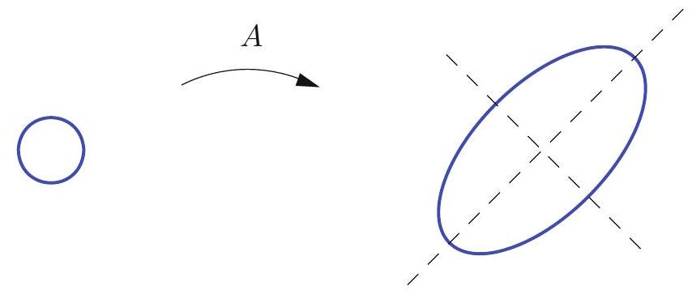
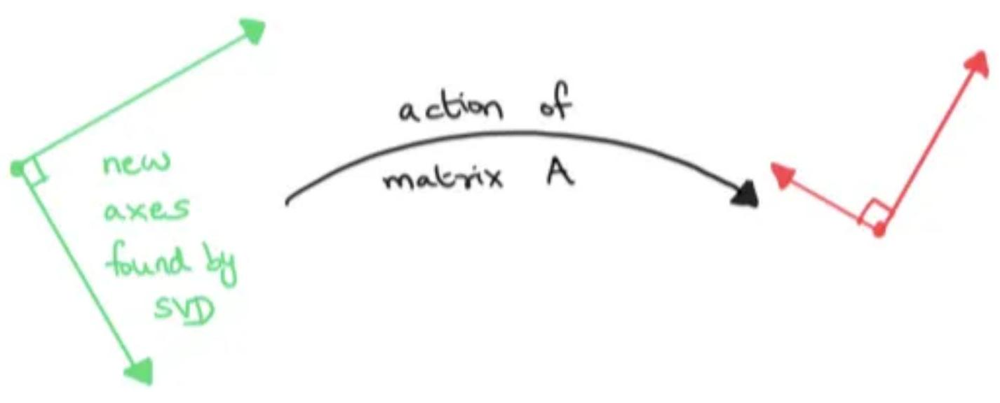
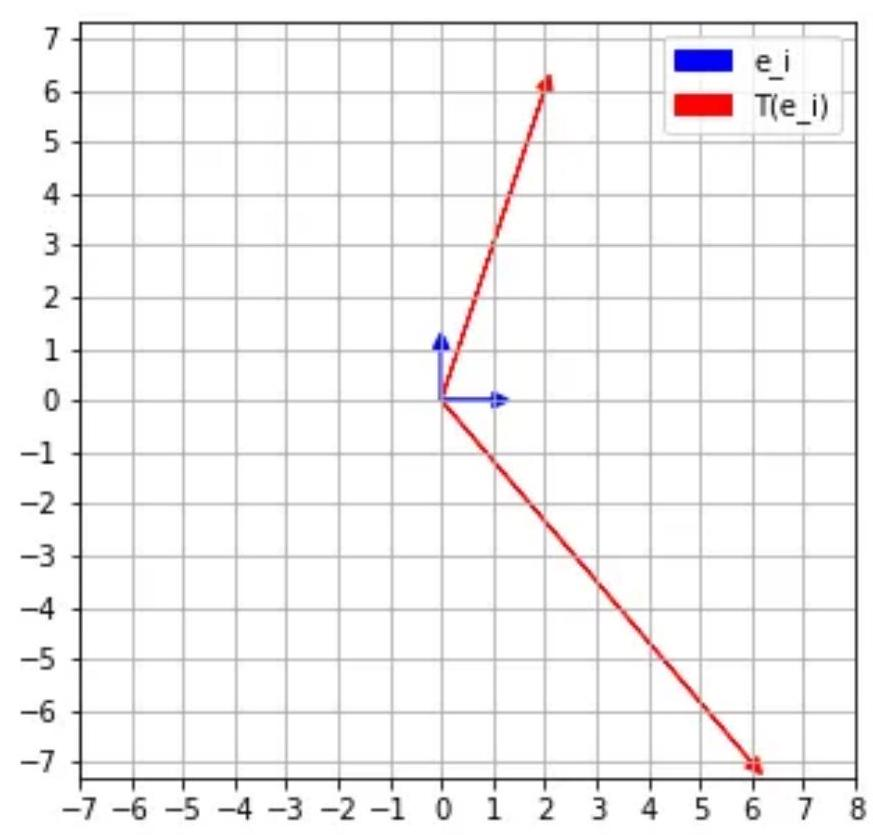
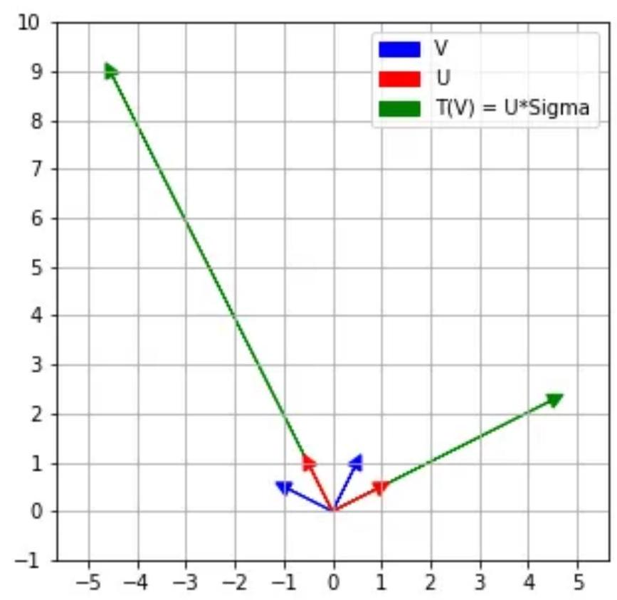

# Eigenvalues of Symmetric Matrices

<!-- @idea: symmetric_matrices_spectral_theorem | Positive definite, spectral theorem for symmetric matrices -->
<!-- @uses: diagonalization, eigenvalue, eigenvector, eigenvalue_eigenvector, orthogonal_set -->
Real eigenvalues, orthogonal eigenvectors, and positive definiteness.

## Positive Definite Matrices

::: definition
A matrix $A$ is called **positive definite** if $x^{T} A x>0$ for all nonzero vectors $x$.
:::

. . .

::: theorem
A symmetric matrix $K=K^{T}$ is positive definite if and only if all of its eigenvalues are strictly positive.
:::

. . .

Proof: Use the positive definiteness of the matrix to show that the eigenvalues are positive:


If $\mathbf{x}=\mathbf{v} \neq \mathbf{0}$ is an eigenvector with (necessarily real) eigenvalue $\lambda$, then

$$
0<\mathbf{v}^{T} K \mathbf{v}=\mathbf{v}^{T}(\lambda \mathbf{v})=\lambda \mathbf{v}^{T} \mathbf{v}=\lambda\|\mathbf{v}\|^{2}
$$

So $\lambda>0$

##

Conversely, suppose $K$ has all positive eigenvalues.

 Let $\mathbf{u}_{1}, \ldots, \mathbf{u}_{n}$ be the orthonormal eigenvector basis with $K \mathbf{u}_{j}=\lambda_{j} \mathbf{u}_{j}$ with $\lambda_{j}>0$.

$$
\mathbf{x}=c_{1} \mathbf{u}_{1}+\cdots+c_{n} \mathbf{u}_{n}, \quad \text { we obtain } \quad K \mathbf{x}=c_{1} \lambda_{1} \mathbf{u}_{1}+\cdots+c_{n} \lambda_{n} \mathbf{u}_{n}
$$

. . .

Therefore, 

$$
\mathbf{x}^{T} K \mathbf{x}=\left(c_{1} \mathbf{u}_{1}^{T}+\cdots+c_{n} \mathbf{u}_{n}^{T}\right)\left(c_{1} \lambda_{1} \mathbf{u}_{1}+\cdots+c_{n} \lambda_{n} \mathbf{u}_{n}\right)=\lambda_{1} c_{1}^{2}+\cdots+\lambda_{n} c_{n}^{2}>0
$$


##

::: theorem

Let $A=A^{T}$ be a real symmetric $n \times n$ matrix. Then

(a) All the eigenvalues of $A$ are real.

. . .

(b) Eigenvectors corresponding to distinct eigenvalues are orthogonal.

(b2) If an eigenvalue $\lambda$ has algebraic multiplicity $m$, then its eigenspace has dimension $m$. In particular, there exist $m$ orthonormal eigenvectors corresponding to $\lambda$.

(c) There is an orthonormal basis of $\mathbb{R}^{n}$ consisting of $n$ eigenvectors of $A$. In particular, all real symmetric matrices are non-defective and real diagonalizable.

:::

## Example

$$
A=\left(\begin{array}{ll}3 & 1 \\ 1 & 3\end{array}\right)
$$

. . .

We compute the determinant in the characteristic equation

$$
\operatorname{det}(A-\lambda \mathrm{I})=\operatorname{det}\left(\begin{array}{cc}
3-\lambda & 1 \\
1 & 3-\lambda
\end{array}\right)=(3-\lambda)^{2}-1=\lambda^{2}-6 \lambda+8
$$

. . .

$$
\lambda^{2}-6 \lambda+8=(\lambda-4)(\lambda-2)=0
$$

. . .

Eigenvectors: 

For the first eigenvalue, the eigenvector equation is

$$
(A-4 \mathrm{I}) \mathbf{v}=\left(\begin{array}{rr}
-1 & 1 \\
1 & -1
\end{array}\right)\binom{x}{y}=\binom{0}{0}, \quad \text { or } \quad \begin{array}{r}
-x+y=0 \\
x-y=0
\end{array}
$$

##

General solution:
$$
x=y=a, \quad \text { so } \quad \mathbf{v}=\binom{a}{a}=a\binom{1}{1}
$$

. . .

$$
\lambda_{1}=4, \quad \mathbf{v}_{1}=\binom{1}{1}, \quad \lambda_{2}=2, \quad \mathbf{v}_{2}=\binom{-1}{1}
$$

. . .

The eigenvectors are orthogonal: $\mathbf{v}_{1} \cdot \mathbf{v}_{2}=0$

## Proof of part (a)

Let $A=A^{T}$ be a real symmetric $n \times n$ matrix. Then

(a) All the eigenvalues of $A$ are real.

. . .

Suppose $\lambda$ is a complex eigenvalue with complex eigenvector $\mathbf{v} \in \mathbb{C}^{n}$. 


$$
(A \mathbf{v}) \cdot \mathbf{v}=(\lambda \mathbf{v}) \cdot \mathbf{v}=\lambda\|\mathbf{v}\|^{2}
$$

. . .

Now, if $A$ is real and symmetric,

$$
(A \mathbf{v}) \cdot \mathbf{w}=\left(\mathbf{v}^T A^T \right)\mathbf{w} = \mathbf{v} \cdot(A \mathbf{w}) \quad \text { for all } \quad \mathbf{v}, \mathbf{w} \in \mathbb{C}^{n}
$$


Therefore

$$
(A \mathbf{v}) \cdot \mathbf{v}=\mathbf{v} \cdot(A \mathbf{v})=\mathbf{v} \cdot(\lambda \mathbf{v})=\mathbf{v}^{T} \overline{\lambda \mathbf{v}}=\bar{\lambda}\|\mathbf{v}\|^{2}
$$

::: notes
(We didn't talk about this, but for complex vectors, we have $\mathbf{v} \cdot \mathbf{w}=\mathbf{w} \cdot \mathbf{v}^{*}$)
:::
. . .

$\Rightarrow$,  $\lambda\|\mathbf{v}\|^{2}=\bar{\lambda}\|\mathbf{v}\|^{2}$ $\Rightarrow$ $\lambda=\bar{\lambda}$, so $\lambda$ is real.

## Proof of part (b)

Part b: Eigenvectors corresponding to distinct eigenvalues are orthogonal.


Suppose $A \mathbf{v}=\lambda \mathbf{v}, A \mathbf{w}=\mu \mathbf{w}$, where $\lambda \neq \mu$ are distinct real eigenvalues. 

. . .

$\lambda \mathbf{v} \cdot \mathbf{w}=(A \mathbf{v}) \cdot \mathbf{w}=\mathbf{v} \cdot(A \mathbf{w})=\mathbf{v} \cdot(\mu \mathbf{w})=\mu \mathbf{v} \cdot \mathbf{w}, \quad$ and hence $\quad(\lambda-\mu) \mathbf{v} \cdot \mathbf{w}=0$.

. . .

Since $\lambda \neq \mu$, this implies that $\mathbf{v} \cdot \mathbf{w}=0$, so the eigenvectors $\mathbf{v}, \mathbf{w}$ are orthogonal.


## Proof of part (c)

Part c: There is an orthonormal basis of $\mathbb{R}^{n}$ consisting of $n$ eigenvectors of $A$. 

. . .

If the eigenvalues are distinct, then the eigenvectors are automaticallyorthogonal by part (b).

. . .

If the eigenvalues are repeated, the eigenvectors may not initially be orthogonal. But we can use the Gram-Schmidt process to orthogonalize them. We will end up with a set of orthogonal eigenvectors.

## Skills

- State the spectral theorem for symmetric matrices
- Prove that symmetric matrices have real eigenvalues
- Show eigenvectors for distinct eigenvalues are orthogonal
- Check if a symmetric matrix is positive definite via its eigenvalues

# Diagonalization of Symmetric Matrices

The spectral theorem, quadratic forms, and orthogonal diagonalization.

<!-- @idea: diagonalizing_quadratic_forms | Quadratic forms and orthogonal diagonalization -->
<!-- @uses: diagonalization, eigenvalue, eigenvector, eigenvalue_eigenvector -->
## Diagonalizability of Symmetric Matrices: the Spectral Theorem

- Every real, symmetric matrix admits an eigenvector basis, and hence is diagonalizable.
- Moreover, since we can choose eigenvectors that form an orthonormal basis, the diagonalizing matrix takes a particularly simple form.
- Recall that an $n \times n$ matrix $Q$ is orthogonal if and only if its columns form an orthonormal basis of $\mathbb{R}^{n}$.

. . .

Writing our diagonalization from the previous lecture, specifically for the case of a real symmetric matrix $A$:

. . .

::: theorem
If $A=A^{T}$ is a real symmetric $n \times n$ matrix, then there exists an orthogonal matrix $Q$ and a real diagonal matrix $\Lambda$ such that

$$
A=Q \Lambda Q^{-1}=Q \Lambda Q^{T}
$$

The eigenvalues of $A$ appear on the diagonal of $\Lambda$, while the columns of $Q$ are the corresponding orthonormal eigenvectors.
:::

## One example of a useful symmetric matrix: Quadratic Forms

::: definition
A **quadratic form** is a homogeneous polynomial of degree 2 in $n$ variables $x_{1}, \ldots, x_{n}$. For example, in $x, y, z$: $Q(x, y, z)=a x^{2}+b y^{2}+c z^{2}+2 d x y+2 e y z+2 f z x$.
:::

. . .

Every quadratic form can be written in matrix form as $Q(\mathbf{x})=\mathbf{x}^{T} A \mathbf{x}$.

##

Example: 

$$
Q(x, y, z)=x^{2}+2 y^{2}+z^{2}+2 x y+y z+3 x z .
$$

. . .

$$
\begin{aligned}
x(x+2 y+3 z)+y(2 y+z)+z^{2} & =\left[\begin{array}{lll}
x & y & z
\end{array}\right]\left[\begin{array}{c}
x+2 y+3 z \\
2 y+z \\
z
\end{array}\right] \\
& =\left[\begin{array}{lll}
x & y & z
\end{array}\right]\left[\begin{array}{lll}
1 & 2 & 3 \\
0 & 2 & 1 \\
0 & 0 & 1
\end{array}\right]\left[\begin{array}{c}
x \\
y \\
z
\end{array}\right]=\mathbf{x}^{T} A \mathbf{x},
\end{aligned}
$$

Now, if we have a quadratic form $Q(\mathbf{x})=\mathbf{x}^{T} A \mathbf{x}$, we always write this in terms of an equivalent symmetric matrix $B$ as $Q(\mathbf{x})=\mathbf{x}^{T} B \mathbf{x}$ where $B=\frac{1}{2}(A+A^{T})$.

(See Exercise 2.4.34 in your textbook.)

##

So in this case, we can write $Q(\mathbf{x})=\mathbf{x}^{T} B \mathbf{x}$ where 

$$
B=\frac{1}{2}\left[\begin{array}{lll}
2 & 2 & 3 \\
2 & 4 & 1 \\
3 & 1 & 2
\end{array}\right]
$$

Check:

```{python}
#| echo: true
import sympy as sp
B = sp.Matrix([[2,2,3],[2,4,1],[3,1,2]])/2
x = sp.Matrix(sp.symbols(['x','y','z']))
(x.T*B*x).expand()
```

Yes, this is the same as the original quadratic form.

## Diagonalizing Quadratic Forms

Symmetric matrices are diagonalizable $\Rightarrow$ we can always find a basis in which the quadratic form takes a particularly simple form. Just diagonalize:

. . .

$Q(\mathbf{x})=\mathbf{x}^{T} B \mathbf{x}=x^{T} P D P^{T} x$ where $P$ is the matrix of eigenvectors of $B$ and $D$ is the diagonal matrix of eigenvalues of $B$. 

. . .

Then if we define new variables $\mathbf{y}=P^{T} \mathbf{x}$, we have $Q(\mathbf{x})=\mathbf{y}^{T} D \mathbf{y}$

. . .

which just becomes a sum of squares:

$$
q(\mathbf{x})=\lambda_{1} y_{1}^{2}+\cdots+\lambda_{n} y_{n}^{2}
$$


##

Example: 

Suppose we have the quadratic form $3x^2+2xy+3y^2$. We can write this in matrix form as $Q(\mathbf{x})=\mathbf{x}^{T} B \mathbf{x}$ where $\mathbf{x}=\binom{x_1}{x_2}$ and

$$
B=\frac{1}{2}\left[\begin{array}{ll}
3 & 1 \\
1 & 3
\end{array}\right]
$$

. . .

We diagonalize $B$:

$$
\left(\begin{array}{ll}
3 & 1 \\
1 & 3
\end{array}\right)=A=P D P^{T}=\left(\begin{array}{cc}
\frac{1}{\sqrt{2}} & -\frac{1}{\sqrt{2}} \\
\frac{1}{\sqrt{2}} & \frac{1}{\sqrt{2}}
\end{array}\right)\left(\begin{array}{ll}
4 & 0 \\
0 & 2
\end{array}\right)\left(\begin{array}{cc}
\frac{1}{\sqrt{2}} & \frac{1}{\sqrt{2}} \\
-\frac{1}{\sqrt{2}} & \frac{1}{\sqrt{2}}
\end{array}\right)
$$

. . .

Now, if we define $\mathbf{y}=P^{T} \mathbf{x}=\frac{1}{\sqrt{2}}\binom{x_1+x_2}{-x_1+x_2}$, we have $Q(\mathbf{x})=\mathbf{y}^{T} D \mathbf{y}$, or

$$
q(\mathbf{x})=3 x_{1}^{2}+2 x_{1} x_{2}+3 x_{2}^{2}=4 y_{1}^{2}+2 y_{2}^{2}
$$

##

The numbers aren't always clean, though!

```{python}
#| echo: true
Q,Lambda = B.diagonalize()
Q
```

```{python}
Lambda
```

Yuck!

##

We can visualize the previous example as a *rotation* of the axes (a change of basis) to a new coordinate system where the quadratic form is just a sum of squares.

```{python}
#| echo: true
#| name: rotation
import numpy as np
import matplotlib.pyplot as plt
x = np.linspace(-2,2,100)
y = np.linspace(-2,2,100)
X,Y = np.meshgrid(x,y)
Z = 3*X**2+2*X*Y+3*Y**2
plt.contour(X,Y,Z,levels=[1,2,3,4,5,6,7,8,9,10])
plt.xlabel('x1')
plt.ylabel('x2')
plt.axis('equal')
# plot the vector P.T times (1,0) and (0,1)
P = np.array([[1/np.sqrt(2),1/np.sqrt(2)],[-1/np.sqrt(2),1/np.sqrt(2)]])
v1 = P.T @ np.array([1,0])
v2 = P.T @ np.array([0,1])
plt.quiver(0,0,v1[0],v1[1],angles='xy',scale_units='xy',scale=1,color='r')
plt.quiver(0,0,v2[0],v2[1],angles='xy',scale_units='xy',scale=1,color='r')
# label the two quivers ("x1=1, x2=0" and "x1=0, x2=1")
plt.text(v1[0],v1[1],'y(x1=1,x2=0)',fontsize=12)
plt.text(v2[0],v2[1],'y(x1=0,x2=1)',fontsize=12)
plt.show()
```

##

Now make the same plot but in y coordinates:

```{python}
#| echo: true
#| name: rotation2
#| depends: rotation
x = np.linspace(-2,2,100)
y = np.linspace(-2,2,100)
X,Y = np.meshgrid(x,y)
Z = 4*X**2+2*Y**2
plt.contour(X,Y,Z,levels=[1,2,3,4,5,6,7,8,9,10])
plt.xlabel('y1')
plt.ylabel('y2')
plt.axis('equal')
v1 = P.T @ np.array([1,0])
v2 = P.T @ np.array([0,1])
plt.quiver(0,0,1,0,angles='xy',scale_units='xy',scale=1,color='r')
plt.quiver(0,0,0,1,angles='xy',scale_units='xy',scale=1,color='r')
# label the two quivers ("x1=1, x2=0" and "x1=0, x2=1")
plt.show()
```

##

In general, we can think of the diagonalization as a *rotation* of the axes followed by a *scaling* of the axes.

We often visualize this by plotting the effects of the transformations on the unit circle.





## Skills

- State the spectral theorem in the form $A=Q\Lambda Q^T$
- Write a quadratic form as $\mathbf{x}^T B \mathbf{x}$ with symmetric $B$
- Diagonalize a quadratic form to a sum of squares
- Interpret the diagonalization geometrically as a rotation of axes


# Coupled Springs

<!-- @idea: coupled_springs_diagonalization | Coupled springs, diagonalization -->
<!-- @uses: diagonalization, eigenvalue, eigenvector, eigenvalue_eigenvector -->
## Example: Coupled Springs (Physics)

Two identical masses $m$ connected by springs: wall—$k$—mass 1—$k_c$—mass 2—$k$—wall. Let $x_1$, $x_2$ be displacements from equilibrium.

```{python}
#| echo: false
#| label: fig-coupled-springs
#| fig-cap: "Coupled springs: two masses, three springs."
import matplotlib.pyplot as plt
import numpy as np
fig, ax = plt.subplots(1, 1, figsize=(8, 2))
ax.set_xlim(-0.5, 3.5)
ax.set_ylim(-0.8, 0.8)
ax.set_aspect('equal')
ax.axis('off')

def draw_spring(ax, x0, x1, y=0, n=5):
    dx = (x1 - x0) / (2 * n)
    xs, ys = [x0], [y]
    for i in range(2 * n - 1):
        xs.append(x0 + (i + 1) * dx)
        ys.append(y + 0.12 * (1 if i % 2 == 0 else -1))
    xs.append(x1)
    ys.append(y)
    ax.plot(xs, ys, 'k', lw=1.5)

# walls
ax.fill_between([-0.4, 0], -0.5, 0.5, color='gray', ec='k')
ax.fill_between([3, 3.4], -0.5, 0.5, color='gray', ec='k')
# springs (between wall and mass edges: mass 1 at 1±0.25, mass 2 at 2±0.25)
draw_spring(ax, 0, 0.75, 0)
draw_spring(ax, 1.25, 1.75, 0)
draw_spring(ax, 2.25, 3, 0)
# masses
for x, lbl in [(1, r'$m$'), (2, r'$m$')]:
    circle = plt.Circle((x, 0), 0.25, fc='w', ec='k', lw=2)
    ax.add_patch(circle)
    ax.text(x, 0, lbl, ha='center', va='center', fontsize=11)
# vertical reference line (2x taller) and displacement arrow above each mass
for x, xlbl in [(1, r'$x_1$'), (2, r'$x_2$')]:
    ax.plot([x, x], [0.25, 0.55], 'k', lw=1.5)  # vertical reference line
    ax.annotate('', xy=(x + 0.35, 0.4), xytext=(x, 0.4),
                arrowprops=dict(arrowstyle='->', color='k', lw=1.5))
    ax.text(x + 0.35, 0.4, xlbl, va='center', fontsize=11)
# spring labels at bottom (same height as former m labels)
ax.text(0.35, -0.4, r'$k$', fontsize=12, ha='center', va='center')
ax.text(1.5, -0.4, r'$k_c$', fontsize=12, ha='center', va='center')
ax.text(2.65, -0.4, r'$k$', fontsize=12, ha='center', va='center')
plt.tight_layout()
plt.show()
```

. . .

We can define $\mathbf{x}=\begin{bmatrix} x_1 \\ x_2 \end{bmatrix}$ to be the vector of displacements. 


## 

Let's take a moment to think intuitively about what will happen here if we pull one one of the masses.

. . .

It's complicated, right? Moving one mass will change its own potential energy *but also the potential energy of the other mass.*

. . .

But we can use diagonalization to help us find a new set of coordinates that will make the problem simpler.


## Coupled Springs via Newton’s Law

We begin with Newton’s second law for the two masses. Each spring provides a force proportional to how far it's stretched, and acceleration is proportional to force.

The middle spring stretches by $(x_2-x_1)$, so the force on mass 1 from the middle spring is $k_c(x_2-x_1)$.

. . .

$$
m \ddot{x}_1 = -k x_1 + k_c (x_2-x_1) =  -(k+k_c)x_1 + k_c x_2,
$$

. . .

$$
m \ddot{x}_2 = -k x_2 + k_c (x_1-x_2) =  -(k+k_c)x_2 + k_c x_1.
$$

. . .

We see the relationship between the two masses in the fact that $x_1$ and $x_2$ appear in each equation.

## Matrix Form


Remember, we defined $\mathbf{x}=\begin{bmatrix} x_1 \\ x_2 \end{bmatrix}$ to be the vector of displacements.

. . .

Then if we define $K =
\begin{bmatrix}
k+k_c & -k_c \\
-k_c & k+k_c
\end{bmatrix}.
$,

the system can be written compactly as

$$
m \ddot{\mathbf{x}} = -K \mathbf{x}
$$

. . .

Because $K$ is not diagonal, each acceleration depends on both $x_1$ and $x_2$.
This is what makes the system coupled.


## Diagonalizing the System

Suppose we diagonalize $K$:

$$
K = P D P^T,
$$

where $P$ is orthogonal with columns that are the normalized eigenvectors of $K$, and

$$
D =
\begin{bmatrix}
\lambda_1 & 0 \\
0 & \lambda_2
\end{bmatrix}.
$$

. . .

As it happens, for our system, we get

$$
P = \frac{1}{\sqrt{2}}\begin{bmatrix} 1 & -1 \\ 1 & 1 \end{bmatrix}
$$

with eigenvectors $\lambda_1=k+2k_c$ and $\lambda_2=k$.


## Using the diagonalized form to define new coordinates

We want to use this to make the behavior of the system more understandable. 

. . .


Remember, Newton's Law was

$$
m \ddot{\mathbf{x}} = -K \mathbf{x}
$$

. . .

Define new coordinates

$$
\mathbf{y} = P^T \mathbf{x}
$$

. . .

Each coordinate $y_i$ is the projection of the positions $\mathbf{x}$ onto the eigenvector $\mathbf{v}_i$.
. . .

##

$$
\mathbf{y} = P^T \mathbf{x} = \frac{1}{\sqrt{2}}\begin{bmatrix} 1 & -1 \\ 1 & 1 \end{bmatrix}\begin{bmatrix} x_1 \\ x_2 \end{bmatrix} 
$$


We can multiply to see what these new coordinates correspond to. $y_1$ is the product of the first column of $P$ with $\mathbf{x}$:

$$
y_1 =  \frac{1}{\sqrt{2}}(x_1-x_2)
$$


This represents the relative displacement between the masses.

. . .

$y_2$ is the product of the second column of $P$ with $\mathbf{x}$:

$$
y_2 =  \frac{1}{\sqrt{2}}(x_1+x_2)
$$

This represents the *center-of-mass* position.

. . .

The eigenvectors describe special patterns of motion (called normal modes), and the evolution of the variables $y_1, y_2$ measure how strongly the system is moving in each of those patterns.

##

Let's express the laws of motion in these new coordinates.

$$
\mathbf{y} = P^T \mathbf{x}.
$$

. . .

Differentiating twice gives

$$
\ddot{\mathbf{y}} = P^T \ddot{\mathbf{x}}.
$$

. . .

Multiplying by $m$ and applying Newton’s law, $m \ddot{\mathbf{x}} = -K \mathbf{x}$, gives:

$$
m \ddot{\mathbf{y}}
= m P^T \ddot{\mathbf{x}}
= - P^T K \mathbf{x}.
$$

. . .

Using $K = P D P^T$:

$$
m \ddot{\mathbf{y}}
= - P^T (P D P^T) \mathbf{x}
= - D P^T \mathbf{x}
= - D \mathbf{y}.
$$

---

## Decoupled Equations

$$
m \ddot{\mathbf{y}} = - D \mathbf{y}.
$$

. . .

Because $D$ is diagonal, this represents two separate equations -- each coordinate only interacts with itself!

. . .

$$
m \ddot{y}_1 + \lambda_1 y_1 = m \ddot{y}_1 0,
$$

. . .

$$
m \ddot{y}_2 + \lambda_2 y_2 = 0.
$$

. . .

These are two independent harmonic oscillators!

## Motion in the Center-of-Mass Mode


$$
m \ddot{y}_2 + \lambda_2 y_2 = 0; 
$$

$$
y_2 =  \frac{1}{\sqrt{2}}(x_1+x_2)
$$


The center of mass of the system, which is proportional to $y_2$, will oscillate back and forth with frequency $\sqrt{\lambda_2/m} = \sqrt{k/m}$. This is one of the patterns of motion, defined by one of the eigenvectors of $K$.


## Motion in the Relative Displacement Mode


$$
m \ddot{y}_1 + \lambda_1 y_1 = m \ddot{y}_1 0,
$$

$$
y_1 =  \frac{1}{\sqrt{2}}(x_1-x_2)
$$

At the same time, the distance between the two masses, which is proportional to $y_1$, will stretch and compress with frequency $\sqrt{\lambda_1/m}=\sqrt{(k+2k_c)/m}$.


## Interpretation


Diagonalizing $K$ finds patterns of motion which evolve independently.


The eigenvectors describe the shapes of motion in which the system naturally prefers to oscillate, and the eigenvalues determine the squared frequencies of these motions.

$$
\omega_i = \sqrt{\frac{\lambda_i}{m}}.
$$

Thus linear algebra reveals the natural motions of the physical system.


# The SVD

Singular values, the SVD theorem, and geometric interpretation for general $m\times n$ matrices.

<!-- @idea: singular_values_and_svd_theorem | Singular values, SVD theorem, geometry -->
<!-- @uses: eigenvalue, eigenvector, singular_value, singular_value_decomposition, svd, svd_core -->
<!-- @introduces: singular_value -->
## Singular Values

We've talked a lot about eigenvalues and eigenvectors, but these only make any sense for square matrices. What can we do for a general $m \times n$ matrix $A$?

. . .

It turns out we can learn a lot from the matrix $A^{T} A$ (or $A A^{T}$), which is always square and symmetric.

. . .

::: definition
The **singular values** $\sigma_{1}, \ldots, \sigma_{r}$ of an $m \times n$ matrix $A$ are the positive square roots, $\sigma_{i}=\sqrt{\lambda_{i}}>0$, of the nonzero eigenvalues of the associated "Gram matrix" $K=A^{T} A$. 

. . .

The corresponding eigenvectors of $K$ are known as the **singular vectors** of $A$.
:::

. . .

<!-- @introduces: right_singular_vector -->
<!-- @introduces: left_singular_vector -->
All of the eigenvalues of $K$ are real and nonnegative -- but some may be zero.

. . .

If $K=A^{T} A$ has repeated eigenvalues, the singular values of $A$ are repeated with the same multiplicities.

. . .

The number $r$ of singular values is equal to the rank of the matrices $A$ and $K$.

## Example

Let $A=\left(\begin{array}{ll}3 & 5 \\ 4 & 0\end{array}\right)$. 

$$
K=A^{T} A=\left(\begin{array}{ll}
3 & 4 \\
5 & 0
\end{array}\right)\left(\begin{array}{ll}
3 & 5 \\
4 & 0
\end{array}\right)=\left(\begin{array}{ll}
25 & 15 \\
15 & 25
\end{array}\right)
$$

. . .

This has eigenvalues $\lambda_{1}=40, \lambda_{2}=10$, and corresponding eigenvectors $\mathbf{v}_{1}=\binom{1}{1}, \mathbf{v}_{2}=\binom{1}{-1}$. 

. . .

Therefore, the singular values of $A$ are $\sigma_{1}=\sqrt{40}=2 \sqrt{10}, \sigma_{2}=\sqrt{10}$.

::: pause
:::

::: notes
Are the singular values here equal to the eigenvalues of $A$? No!

The eigenvalues of A  are $\lambda_{1}=\frac{1}{2}(3+\sqrt{89}) \simeq 6.2170$ and $\lambda_{2}=\frac{1}{2}(3-\sqrt{89}) \simeq-3.2170$, nor are the singular vectors eigenvectors of $A$.
:::

## Singular Values of a Symmetric Matrix

::: notes
If $A$ is a symmetric matrix, then $K = A^{T} A= A^2$.

So if $\mathbf{v}$ is an eigenvector of $A$ with eigenvalue $\lambda$, then $A \mathbf{v}=\lambda \mathbf{v}$, and $K \mathbf{v}=A^{T} A \mathbf{v}=A \lambda \mathbf{v}=\lambda^{2} \mathbf{v}$.

. . .

Therefore the eigenvalues of $K$ are the squares of the eigenvalues of $A$.

. . .

Thus the singular values of $A$, which are the square roots of the non-zero eigenvalues of $K$, are the absolute values of the eigenvalues of $A$.

:::

<!-- @introduces: singular_value_decomposition -->
## Singular Value Decomposition

::: theorem
Let $A$ be an $m \times n$ real matrix. Then there exist an $m \times m$ orthogonal matrix $U$, an $n \times n$ orthogonal matrix $V$, and an $m \times n$ diagonal matrix $\Sigma$ with diagonal entries $\sigma_{1} \geq \sigma_{2} \geq \cdots \geq \sigma_{p} \geq 0$, with $p=\min \{m, n\}$, such that $U^{T} A V=\Sigma$. Moreover, the numbers $\sigma_{1}, \sigma_{2}, \ldots, \sigma_{p}$ are uniquely determined by $A$.
:::

##

Proof:

::: notes
- Assume $m \geq n$ (the case $m<n$ is similar).
- Let $B=A^{T} A$ and let $\lambda_{1} \geq \lambda_{2} \geq \cdots \geq \lambda_{n}$ be the eigenvalues of $B$.
- Find the basis of eigenvectors of $B$: $B \mathbf{v}_{k}=\sigma_{k}^{2} \mathbf{v}_{k}, k=1,2, \ldots, n$
- Let $V=\left[\mathbf{v}_{1}, \mathbf{v}_{2}, \ldots, \mathbf{v}_{n}\right]$. Then $V$ is an orthogonal $n \times n$ matrix.
-  We may assume for some index $r$ that $\sigma_{r+1}, \sigma_{r+2}, \ldots, \sigma_{n}$ are zero, while $\sigma_{r} \neq 0$.
-  Next set $\mathbf{u}_{j}=\frac{1}{\sigma_{j}} A \mathbf{v}_{j}, j=1,2, \ldots, r$. 
-  In other words, $\mathbf{u}_{j}$ is the vector that you get when you transform $\mathbf{v}_{j}$ by $A$ and then normalize it by the singular value $\sigma_{j}$.
-  These are orthonormal vectors in $\mathbb{R}^{m}$ since

$$
\mathbf{u}_{j}^{T} \mathbf{u}_{k}=\frac{1}{\sigma_{j} \sigma_{k}} \mathbf{v}_{j}^{T} A^{T} A \mathbf{v}_{k}=\frac{1}{\sigma_{j} \sigma_{k}} \mathbf{v}_{j}^{T} B \mathbf{v}_{k}=\frac{\sigma_{k}^{2}}{\sigma_{j} \sigma_{k}} \mathbf{v}_{j}^{T} \mathbf{v}_{k}= \begin{cases}0, & \text { if } j \neq k \\ 1, & \text { if } j=k\end{cases}
$$

- Now expand this set to an orthonormal basis $\mathbf{u}_{1}, \mathbf{u}_{2}, \ldots, \mathbf{u}_{m}$ of $\mathbb{R}^{m}$. This is possible by Theorem 4.7 in Section 4.3. Set $U=\left[\mathbf{u}_{1}, \mathbf{u}_{2}, \ldots, \mathbf{u}_{m}\right]$. This matrix is orthogonal. We calculate that if $k>r$, then $\mathbf{u}_{j}^{T} A \mathbf{v}_{k}=0$ since $A \mathbf{v}_{k}=\mathbf{0}$, and if $k<r$, then

$$
\mathbf{u}_{j}^{T} A \mathbf{v}_{k}=\sigma_{k} \mathbf{u}_{j}^{T} \mathbf{u}_{k}=\left\{\begin{array}{l}
0, \text { if } j \neq k, \\
\sigma_{k}, \text { if } j=k
\end{array}\right.
$$


$U^{T} A V=\left[\mathbf{u}_{j}^{T} A \mathbf{v}_{k}\right]=\Sigma$, which is the desired SVD.

And because $U$ and $V$ are orthonormal, their inverses are their transposes, so $A=U \Sigma V^{T}$.

:::

## Geometric interpretation of the SVD
(following closely this [blog post](https://towardsdatascience.com/svd-a-geometric-view-point-cfc0c689bdc0))

Goal: to understand the SVD as finding perpendicular axes that remain perpendicular after a transformation.




##

Take a very simple matrix:

$$
A=\left(\begin{array}{cc}
6 & 2 \\
-7 & 6
\end{array}\right)
$$


. . .

Represents a linear map $\mathrm{T}: \mathrm{R}^{2} \rightarrow \mathbf{R}^{2}$ with respect to the standard basis $e_{1}=(1,0)$ and $e_{2}=(0,1)$. 

. . .

Sends the usual basis elements $e_{1} \rightsquigarrow(6,-7)$ and $e_{2} \rightsquigarrow(2,6)$. 


##

We can see what T does to any vector:

$$
\begin{aligned}
T(2,3) & =T(2,0)+T(0,3)=T\left(2 e_{1}\right)+T\left(3 e_{2}\right) \\
& =2 T\left(e_{1}\right)+3 T\left(e_{2}\right)=2(6,-7)+3(2,6) \\
& =(18,4)
\end{aligned}
$$

##
The usual basis elements are no longer perpendicular after the transformation:



##

Given a linear map T:Rm $\rightarrow R^{n}$ (which is represented by a $n \times m$ matrix $A$ with respect to the standard basis),

- can we find an orthonormal basis $\left\{v_{-} 1, v_{-} 2, \ldots, v_{-} m\right\}$ of $R^{m}$ such that 
- $\left\{T\left(v_{-} 1\right), T\left(v_{-} 2\right), \ldots\right.$ $\left.\mathrm{T}\left(\mathrm{v}_{-} \mathrm{m}\right)\right\}$ are still mutually perpendicular to each other?

##

This is what the SVD does!

Let the SVD of $A$ be $A=U \Sigma V^{T}$

. . .



##

How are $U$ and $V$ related?

::: notes

What we want to do is see what happens to two vectors that are orthogonal to each other -- specifically, two of the columns of V.

Right-multiplying the equation $\mathrm{A}=\mathrm{U} \Sigma \mathrm{V}^{\mathrm{T}}$ by $\mathrm{V}$, gives

$\mathrm{AV}=\left(U \Sigma V^{T}\right) \mathrm{V}=U \Sigma\left(V^{I} \mathrm{~V}\right)=\mathrm{U} \Sigma$

Also, since $\Sigma$ is an $\mathrm{n} \times \mathrm{m}$ matrix with non-zero entries only along the diagonal entries ( $\Sigma \mathrm{i}, \mathrm{i})$ if at all, the columns of $\mathrm{U} \Sigma$ are just the first $\mathrm{m}$ columns of $U$ scaled by the respective diagonal entries of $\Sigma$

Thus $T(\mathbf{v}_i)=(\Sigma_{i,i})\mathbf{u}_i$ and they are mutually perpendicular to each other. Since $\mathbf{u}_i$ are unit vectors, the length of $T(\mathbf{v}_i)$ is precisely the diagonal entry $\Sigma_{i,i}$.

:::

## Skills

- Define singular values from $A^T A$ and state the SVD theorem
- Compute singular values for a given matrix
- Explain the SVD geometrically: orthogonal input axes map to orthogonal output axes