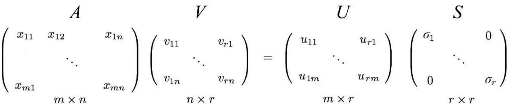
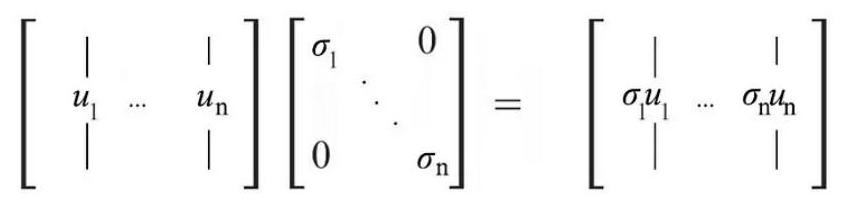
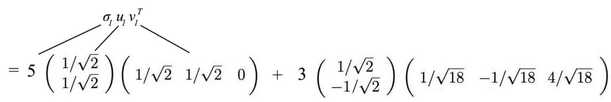
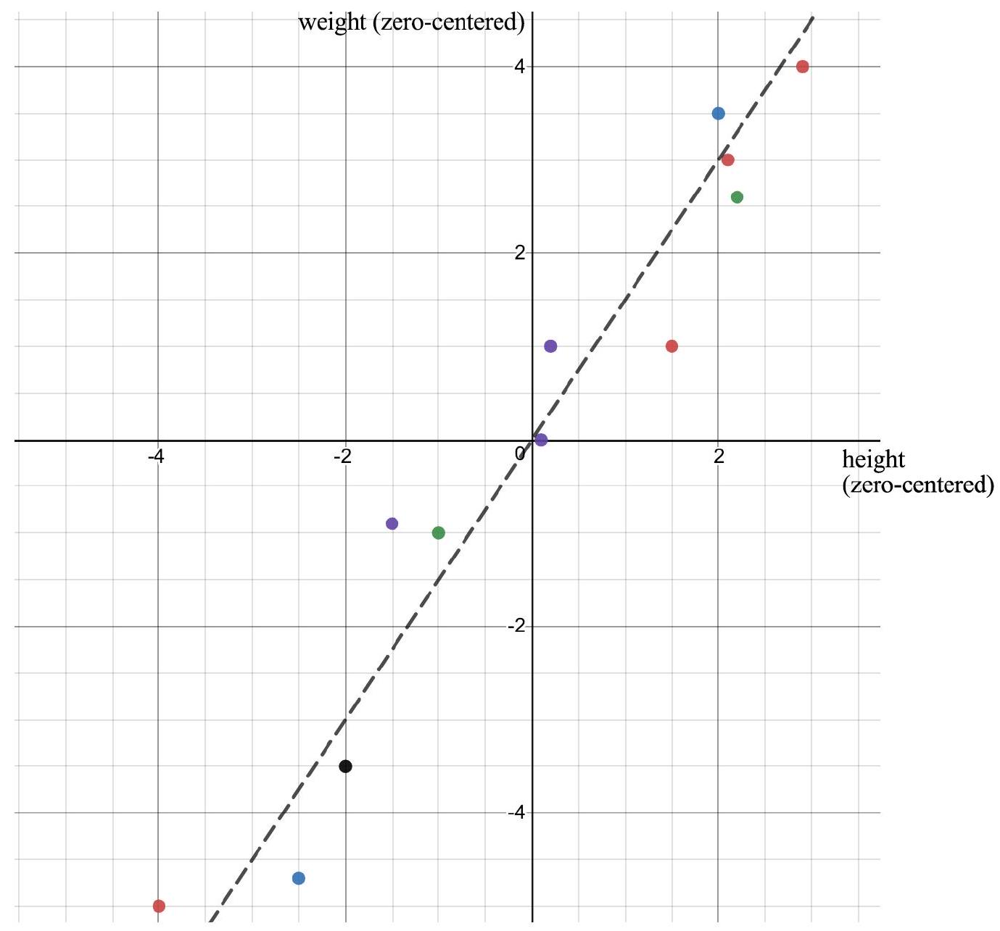

# Intuition about SVD

<!-- @idea: svd_from_diagonalization_intuition | SVD intuition from diagonalization -->
<!-- @uses: diagonalization, eigenvalue, eigenvector, singular_value_decomposition, svd -->
## Thinking again about matrix diagonalization

::: aside
Many parts of this inspired by [this blog post](https://jonathan-hui.medium.com/machine-learning-singular-value-decomposition-svd-principal-component-analysis-pca-1d45e885e491)
:::

::: notes
If $A$ is a (non-defective) $n \times n$ square matrix, 

- then we can write it as $A = PDP^{T}$ where $D$ is a diagonal matrix and $P$ is an orthogonal matrix of eigenvectors.
- We can find the product of $A$ with a vector $\mathbf{x}$ where $\mathbf{x}$ is a column vector of length $n$. This product will also be a column vector of length $n$.
- What's the intuition behind the diagonalization?

- The matrix $P^{T}$ is a change of basis matrix. It takes a vector $\mathbf{x}$ expressed in the standard basis and expresses it in terms of the basis of eigenvectors of $A$. 
  - This works because $P$ is orthogonal.

- The matrix $D$ is a scaling matrix. It scales the eigenvectors by the corresponding eigenvalues. (If $A$ is not full rank, then $D$ will have some zeros on the diagonal.)

- The matrix $P$ is the inverse of $P^{T}$ (because $P$ is orthogonal). It just takes the scaled eigenvectors and expresses them in terms of the standard basis.
  
- This all works because $P$ is orthogonal and there's a correspondence between the rows of $P^{T}$ and the columns of $P$.


  - This inverse projection is what we want because the columns of $P$ are *eigenvectors* of $A$. 
  - We can see this most easily by imagining that $\mathbf{x}$ is a multiple of one of the eigenvectors.
  - $P\mathbf{x}$ will give the coordinates of $\mathbf{x}$ in the basis of eigenvectors. For instance, if $P\mathbf{x}=\begin{bmatrix} 1 \\0\\ \vdots \\ 0\end{bmatrix}$, we know that $\mathbf{x}$ equals the first eigenvector.
    - After multiplication by the diagonal matrix, we'll just have $\begin{bmatrix} \lambda_{1} \\0\\ \vdots \\ 0\end{bmatrix}$.
  - Then $P^{T}$ will take this back to a multiple of the first eigenvector, back in the standard basis.
  - That's what we want *because* we are supposing that $\mathbf{x}$ is a multiple of the first eigenvector.
  - The same logic will hold when $\mathbf{x}$ is weighted sum of the eigenvectors.
    - Because $P$ is orthonormal, $P\mathbf{x}$ will give the weights of the eigenvectors in the basis of eigenvectors.
  -  $P^{T}$ will take it back to the weighted sum of the eigenvectors in the standard basis, with the new weights being determined by the original weights and the eigenvalues.
-  This will all works when $U$ and $V$ are orthogonal and there's a correspondence between the rows of $V^{T}$ and the columns of $U$.
  
  

When we have some zeros on the diagonal, multiplying by $D$ is a *projection* of $\mathbf{x}$ onto the row space of $A$. We are removing the components of $\mathbf{x}$ that are in the null space of $A$.
:::

## The same logic, applied to a general matrix

::: notes
If $A$ is a  <span style="color:red">$m \times n$</span> square matrix, 

- then we can write it as <span style="color:red">$A = U\Sigma V^{T}$</span> where $\Sigma$ is a diagonal matrix and $P$ is an orthogonal matrix of eigenvectors.
- We can find the product of $A$ with a vector $\mathbf{x}$ where $\mathbf{x}$ is a column vector of length $n$. This product will now be a column vector of length <span style="color:red">$m$</span>.
- The matrix $V^{T}$ is a change of basis matrix. It takes a vector $\mathbf{x}$ expressed in the standard basis and expresses it in terms of the basis of <span style="color:red">*right singular vectors*</span> of $A$.

- The matrix <span style="color:red">$\Sigma$</span> is a scaling matrix. It scales the singular vectors by the corresponding <span style="color:red">singular values</span>. (If <span style="color:red">$A$ is not square or $A$ is not full rank</span>, then $\Sigma$ will have some zeros on the diagonal.)

- The matrix $U$ <span style="color:red">is *not* generally</span> the inverse of $V^{T}$. It takes the scaled singular vectors and expresses them in terms of the standard basis <span style="color:red">of $\mathbb{R}^m$</span>.

   -  Specifically, the first column of $U$ must be the correct vector to express the first row of $V^{T}$ in $\mathbbb{R}^m$
- 
   -  that is, we need the first column of $U$ to be $A\mathbf{v}_1$ (divided by the scaling factor).
   - This is because $\Sigma V^{T}\mathbf{v}_1=\sigma_1\begin{bmatrix} 1 \\0\\ \vdots \\ 0\end{bmatrix}$, so that $U\Sigma V^{T}\mathbf{v}_1=\sigma_1 U \begin{bmatrix} 1 \\0\\ \vdots \\ 0\end{bmatrix}=\sigma_1\mathbf{u_1}$.
   - So we'd better have $\mathbf{u_1}=A\mathbf{v}_1/\sigma_1$.
 :::

 ## SVD

 ::: notes
- Assume $m \geq n$ (the case $m<n$ is similar).
- Let $B=A^{T} A$ and let $\lambda_{1} \geq \lambda_{2} \geq \cdots \geq \lambda_{n}$ be the eigenvalues of $B$.
- Find the basis of eigenvectors of $B$: $B \mathbf{v}_{k}=\sigma_{k}^{2} \mathbf{v}_{k}, k=1,2, \ldots, n$
- Let $V=\left[\mathbf{v}_{1}, \mathbf{v}_{2}, \ldots, \mathbf{v}_{n}\right]$. Then $V$ is an orthogonal $n \times n$ matrix.
-  We may assume for some index $r$ that $\sigma_{r+1}, \sigma_{r+2}, \ldots, \sigma_{n}$ are zero, while $\sigma_{r} \neq 0$.
-  Next set $\mathbf{u}_{j}=\frac{1}{\sigma_{j}} A \mathbf{v}_{j}, j=1,2, \ldots, r$. 
-  In other words, $\mathbf{u}_{j}$ is the vector that you get when you transform $\mathbf{v}_{j}$ by $A$ and then normalize it by the singular value $\sigma_{j}$.
-  These are orthonormal vectors in $\mathbb{R}^{m}$ since

$$
\mathbf{u}_{j}^{T} \mathbf{u}_{k}=\frac{1}{\sigma_{j} \sigma_{k}} \mathbf{v}_{j}^{T} A^{T} A \mathbf{v}_{k}=\frac{1}{\sigma_{j} \sigma_{k}} \mathbf{v}_{j}^{T} B \mathbf{v}_{k}=\frac{\sigma_{k}^{2}}{\sigma_{j} \sigma_{k}} \mathbf{v}_{j}^{T} \mathbf{v}_{k}= \begin{cases}0, & \text { if } j \neq k \\ 1, & \text { if } j=k\end{cases}
$$

- Now expand this set to an orthonormal basis $\mathbf{u}_{1}, \mathbf{u}_{2}, \ldots, \mathbf{u}_{m}$ of $\mathbb{R}^{m}$. This is possible by Theorem 4.7 in Section 4.3. Set $U=\left[\mathbf{u}_{1}, \mathbf{u}_{2}, \ldots, \mathbf{u}_{m}\right]$. This matrix is orthogonal. We calculate that if $k>r$, then $\mathbf{u}_{j}^{T} A \mathbf{v}_{k}=0$ since $A \mathbf{v}_{k}=\mathbf{0}$, and if $k<r$, then

$$
\mathbf{u}_{j}^{T} A \mathbf{v}_{k}=\sigma_{k} \mathbf{u}_{j}^{T} \mathbf{u}_{k}=\left\{\begin{array}{l}
0, \text { if } j \neq k, \\
\sigma_{k}, \text { if } j=k
\end{array}\right.
$$


$U^{T} A V=\left[\mathbf{u}_{j}^{T} A \mathbf{v}_{k}\right]=\Sigma$, which is the desired SVD.

And because $U$ and $V$ are orthonormal, their inverses are their transposes, so $A=U \Sigma V^{T}$.

Note also that we can find $U$ as the eigenvectors of $A A^{T}$ and $V$ as the eigenvectors of $A^{T} A$.

:::

## Recap


$$
A=U S V^{T}
$$

where

$$
\begin{array}{lccccc}
 & & & U & V 
& S \\
& & &\left(\begin{array}{ccc}
\mid & & \mid \\
\mathbf{u}_{1} & \cdots & \mathbf{u}_{m} \\
\mid & & \mid
\end{array}\right) &\left(\begin{array}{ccc}
\mid & & \mid \\
\mathbf{v}_{1} & \cdots & \mathbf{v}_{n} \\
\mid & & \mid
\end{array}\right) &\left(\begin{array}{cccccc}
\sigma_1 & & & & & \\
& \sigma_2 & & & & \\
& & \ddots & & & \\
& & &  \sigma_r & & \\
& & & & \ddots & \\
& & & & & 0
\end{array}\right)\\
\text{eigenvectors of} & & & A A^{T}  & A^{T} A \\
\end{array}
$$


## Example


$$
A=\left(\begin{array}{ccc}
3 & 2 & 2 \\
2 & 3 & -2
\end{array}\right)
$$

. . .

$$
A A^{T}=\left(\begin{array}{cc}
17 & 8 \\
8 & 17
\end{array}\right), \quad A^{T} A=\left(\begin{array}{ccc}
13 & 12 & 2 \\
12 & 13 & -2 \\
2 & -2 & 8
\end{array}\right)
$$

##


$$
\begin{array}{cc}
A A^{T}=\left(\begin{array}{cc}
17 & 8 \\
8 & 17
\end{array}\right) & A^{T} A=\left(\begin{array}{ccc}
13 & 12 & 2 \\
12 & 13 & -2 \\
2 & -2 & 8
\end{array}\right) \\
\begin{array}{c}
\text { eigenvalues: } \lambda_{1}=25, \lambda_{2}=9 \\
\text { eigenvectors }
\end{array} & \begin{array}{c}
\text { eigenvalues: } \lambda_{1}=25, \lambda_{2}=9, \lambda_{3}=0 \\
\text { eigenvectors }
\end{array} \\
u_{1}=\binom{1 / \sqrt{2}}{1 / \sqrt{2}} \quad u_{2}=\binom{1 / \sqrt{2}}{-1 / \sqrt{2}} & v_{1}=\left(\begin{array}{c}
1 / \sqrt{2} \\
1 / \sqrt{2} \\
0
\end{array}\right) \quad v_{2}=\left(\begin{array}{c}
1 / \sqrt{18} \\
-1 / \sqrt{18} \\
4 / \sqrt{18}
\end{array}\right) \quad v_{3}=\left(\begin{array}{c}
2 / 3 \\
-2 / 3 \\
-1 / 3
\end{array}\right)
\end{array}
$$

##

SVD decomposition of $A$:
$$
A=U S V^{T}=\left(\begin{array}{cc}
1 / \sqrt{2} & 1 / \sqrt{2} \\
1 / \sqrt{2} & -1 / \sqrt{2}
\end{array}\right)\left(\begin{array}{ccc}
5 & 0 & 0 \\
0 & 3 & 0
\end{array}\right)\left(\begin{array}{rrr}
1 / \sqrt{2} & 1 / \sqrt{2} & 0 \\
1 / \sqrt{18} & -1 / \sqrt{18} & 4 / \sqrt{18} \\
2 / 3 & -2 / 3 & -1 / 3
\end{array}\right)
$$

## Reformulating SVD
::: notes
Since matrix $V$ is orthogonal, $V^{-1} V$ equals $I$. We can rewrite the SVD equation as:

$$
\begin{aligned}
& A=U S V^{T} \\
& A V=U S
\end{aligned}
$$

This equation establishes an important relationship between $u_{i}$ and $v_{i}$.

Recall

$$
A B=\left[\begin{array}{llll}
A b_{1} & A b_{2} & \ldots & A b_{n}
\end{array}\right]
$$

Apply $A V=U S$,




:::

##

::: notes
$$
\begin{aligned}
& =\left(\begin{array}{c}
u_{11} \\
\vdots \\
u_{1 m}
\end{array}\right) \sigma_{1} \\
& A v_{1}=\sigma_{1} u_{1}
\end{aligned}
$$

This can be generalized as

$$
A v_{i}=\sigma_{i} u_{i}
$$

Recall,



and

$$
\left(\begin{array}{ccc}
\begin{array}{c}
\mid \\
u_{1} \\
\mid
\end{array} & \ldots &
\begin{array}{c}
\mid \\
u_{n} \\
\mid
\end{array}
\end{array}\right)\left(\begin{array}{c}
-v_{l}- \\
\vdots \\
-v_{n}-
\end{array}\right)=\left(\begin{array}{c}
\mid \\
u_{1} \\
\mid
\end{array}\right)\left(-v_{l} \textrm{---}\right)+\ldots+\left(\begin{array}{c}
\mid \\
u_{n} \\
\mid
\end{array}\right)\left(-v_{n} \textrm{---}\right)
$$

The SVD decomposition can be recognized as a series of outer products of $u_{i}$ and $v_{i}$.

$$
A=\sigma_{l} u_{l} v_{l}^{T}+\ldots+\sigma_{r} u_{r} v_{r}^{T}
$$
:::


## SVD as a sum of rank-one matrices

$$
A=\sigma_{l} u_{l} v_{l}^{T}+\ldots+\sigma_{r} u_{r} v_{r}^{T}
$$

## Back to our example

$$
A=\left(\begin{array}{ccc}
3 & 2 & 2 \\
2 & 3 & -2
\end{array}\right)
$$

. . .

Can decompose as




. . .

$A=\left(\begin{array}{ccc}3 & 2 & 2 \\ 2 & 3 & -2\end{array}\right)$

##

# Uses of SVD

<!-- @idea: pseudoinverse_and_least_squares | Moore–Penrose pseudoinverse -->
<!-- @uses: least_squares, least_squares_and_projection, singular_value_decomposition, svd -->
## Moore–Penrose pseudoinverse

Suppose we want to solve a linear system

$$
A x = b.
$$

If $A$ is invertible, the solution is

$$
x = A^{-1} b.
$$

. . .

But many matrices are **not invertible**:

* $A$ may not be square,
* or it may have linearly dependent columns.

In this case, an exact solution may not exist. Instead, we look for the vector $x$ that minimizes the **least–squares error**

$$
|Ax-b|_2.
$$

##

Among all least–squares solutions, we choose the one with smallest norm.

This motivates the **Moore–Penrose pseudoinverse** $A^+$, defined so that

$$
x = A^+ b
$$

is the minimum-norm least–squares solution.

---

## Using the SVD

Take the singular value decomposition

$$
A = U \Sigma V^T,
$$

where

* $U$ and $V$ are orthogonal matrices,
* $\Sigma$ is diagonal (possibly rectangular):

$$
\Sigma =
\begin{bmatrix}
\sigma_1 &&&\\
& \ddots &&\\
&& \sigma_r &&\\
&&& 0
\end{bmatrix},
\qquad
\sigma_1 \ge \cdots \ge \sigma_r >0.
$$

---

## Normal equations

Least squares solutions satisfy the Normal equations

$$
A^T A x = A^T b.
$$

Substitute the SVD:

$$
(V \Sigma^T U^T)(U \Sigma V^T)x
= V \Sigma^T U^T b.
$$

Since $U^TU=I$,

$$
V \Sigma^T \Sigma V^T x
= V \Sigma^T U^T b.
$$

Multiply on the left by $V^T$:

$$
\Sigma^T \Sigma  V^T x
= \Sigma^T U^T b.
$$

---

## Solve componentwise

$$
\Sigma^T \Sigma  V^T x
= \Sigma^T U^T b.
$$

We can write this componentwise as

$$
\Sigma^T \Sigma 
\begin{bmatrix}
\mathbf{v}_1^T \mathbf{x} \\
\mathbf{v}_2^T \mathbf{x} \\
\vdots \\
\mathbf{v}_n^T \mathbf{x}
\end{bmatrix}=
\Sigma^T 
\begin{bmatrix}
\mathbf{u}_1^T \mathbf{b} \\
\mathbf{u}_2^T \mathbf{b} \\
\vdots \\
\mathbf{u}_n^T \mathbf{b}
\end{bmatrix}.
$$

## 

Since both $\Sigma^T$ and $\Sigma^T\Sigma$ are diagonal, they just multiply each element by the corresponding singular value (or square):


$$
\Sigma^T \Sigma V^T \mathbf{x} = \Sigma^T U^T \mathbf{b}
$$

becomes

$$
\begin{bmatrix}
\sigma_1^2 \mathbf{v}_1^T \mathbf{x} \\
\sigma_2^2 \mathbf{v}_2^T \mathbf{x} \\
\vdots \\
\sigma_n^2 \mathbf{v}_n^T \mathbf{x} \\
\end{bmatrix}
=
\begin{bmatrix}
\sigma_1\mathbf{u}_1^T \mathbf{b} \\
\sigma_2\mathbf{u}_2^T \mathbf{b} \\
\vdots \\
\sigma_n\mathbf{u}_n^T \mathbf{b}
\end{bmatrix}.
$$

In other words, we get a separate equation for each singular value $\sigma_i$:

$$
\sigma_i^2 \mathbf{v}_i^T \mathbf{x} = \sigma_i (\mathbf{u}_i^T \mathbf{b}).
$$

---

### Case 1: $\sigma_i \neq 0$

$$
\sigma_i^2 \mathbf{v}_i^T \mathbf{x} = \sigma_i (\mathbf{u}_i^T \mathbf{b}).
$$


We can divide by $\sigma_i^2$:

$$
\mathbf{v}_i^T \mathbf{x} = \frac{1}{\sigma_i} \mathbf{u}_i^T \mathbf{b}.
$$

---

### Case 2: $\sigma_i = 0$

$$
\sigma_i^2 \mathbf{v}_i^T \mathbf{x} = \sigma_i (\mathbf{u}_i^T \mathbf{b}).
$$

The equation becomes

$$
0 = 0,
$$

which imposes no constraint on $y_i$.

To obtain the **minimum-norm solution**, we choose $\mathbf{x}$ to be orthogonal to $\mathbf{v}_i$, so that:

$$
\mathbf{v}_i^T \mathbf{x} = 0.
$$

---

## Defining $\Sigma^+$

These two cases can be summarized by defining the **pseudoinverse of $\Sigma$**

$$
\Sigma^+ =
\begin{bmatrix}
1/\sigma_1 &&&\\
& \ddots &&\\
&& 1/\sigma_r &\\
&&& 0
\end{bmatrix}.
$$

That's just replacing every non-zero singular value with its reciprocal.

Then the  equation becomes

$$
V^T \mathbf{x} = \Sigma^+ U^T \mathbf{b}.
$$


## The Moore–Penrose pseudoinverse

$$
V^T \mathbf{x} = \Sigma^+ U^T \mathbf{b}.
$$

Finally, we can multiply both sides on the left by $V$ to get

$$
\mathbf{x} = V \Sigma^+ U^T \mathbf{b}
$$

The quantity $V \Sigma^+ U^T$ is acting like an inverse here -- it is called the **Moore–Penrose pseudoinverse** of $A$.

For any vector $b$,

$$
\mathbf{x} = A^+ \mathbf{b}
$$

is the minimum-norm solution to the least-squares problem.

---

## Interpretation


$$
\mathbf{x} = V \Sigma^+ U^T \mathbf{b}
$$

The SVD reveals exactly what the pseudoinverse does:


* Each singular direction acts independently.
* Directions with $\sigma_i>0$ can be inverted.
* Directions with $\sigma_i=0$ contain information lost by $A$ and cannot be recovered.

The pseudoinverse therefore

**undoes the action of $A$ wherever inversion is possible but ignores directions where information has been destroyed.**


:::

## Example

::: notes
$$
\begin{aligned}
& A=\left[\begin{array}{ll}
1 & 1 \\
1 & 1
\end{array}\right] \text { (singular, inverse does not exist) } \\
& A=U \Sigma V^{T}=\frac{1}{\sqrt{2}}\left[\begin{array}{rr}
1 & 1 \\
1 & -1
\end{array}\right]\left[\begin{array}{rr}
2 & 0 \\
0 & 0
\end{array}\right] \frac{1}{\sqrt{2}}\left[\begin{array}{rr}
1 & 1 \\
1 & -1
\end{array}\right] \\
& A^{+}=V \Sigma^{+} U^{T}=\frac{1}{\sqrt{2}}\left[\begin{array}{rr}
1 & 1 \\
1 & -1
\end{array}\right]\left[\begin{array}{cc}
1 / 2 & 0 \\
0 & 0
\end{array}\right] \frac{1}{\sqrt{2}}\left[\begin{array}{rr}
1 & 1 \\
1 & -1
\end{array}\right]=\frac{1}{4}\left[\begin{array}{ll}
1 & 1 \\
1 & 1
\end{array}\right]
\end{aligned}
$$

:::

# Matrices as data

<!-- @idea: data_matrices_and_covariance | Matrices as data, covariance, U/V interpretation -->
<!-- @uses: least_squares, singular_value_decomposition, svd -->
## Example: Height and weight

$A^T=\left[\begin{array}{rrrrrrrrrrrr}2.9 & -1.5 & 0.1 & -1.0 & 2.1 & -4.0 & -2.0 & 2.2 & 0.2 & 2.0 & 1.5 & -2.5 \\ 4.0 & -0.9 & 0.0 & -1.0 & 3.0 & -5.0 & -3.5 & 2.6 & 1.0 & 3.5 & 1.0 & -4.7\end{array}\right]$

. . .




## Why does $A^T A$ appear? (Data interpretation)

Up to now, matrices like $A^T A$ have appeared naturally during the construction of the SVD.

But suppose now that $A$ is a **data matrix**.

> **What does $A^T A$ actually represent?**

---

### Step 1 — Interpret $A$ as data

Think of

* rows = observations (people)
* columns = variables (height, weight, etc.)

Each row is one data point in $\mathbb{R}^p$.

---

### Step 2 — Center the data

Subtract the mean of each column so every variable has mean $0$.

We now assume:

$$
A \text{ is zero-centered.}
$$

This assumption is the key bridge between linear algebra and statistics.

---

### Step 3 — Examine one entry of $A^T A$

The $(i,j)$ entry is

$$
(A^T A)*{ij} = \sum*{k=1}^{n} A_{k i}A_{k j}.
$$

This computation:

* multiplies variable $i$ and variable $j$ together,
* then adds across all observations.

That is exactly how we measure **co-variation** between variables.

---

### Step 4 — The covariance matrix appears

For zero-centered data,

$$
\Sigma = \frac{1}{n-1}A^T A
$$

is the **sample covariance matrix**.

So the matrix that appeared in the SVD derivation is not mysterious at all:

> **$A^T A$ measures how the variables vary together.**

---

---

### What do off-diagonal entries mean?

Look at a covariance matrix

$$
\Sigma=
\begin{bmatrix}
\sigma_1^2 & c_{12} & \cdots 
c_{12} & \sigma_2^2 & \cdots 
\vdots & \vdots & \ddots
\end{bmatrix}.
$$

* The **diagonal entries** record how much each variable varies on its own.
* The **off-diagonal entries** measure how two variables move together.

### Heights and weights example

Let’s look at the (zero-centered) heights/weights dataset we’ve been using.

```{python}
import numpy as np
import pandas as pd
import matplotlib.pyplot as plt

# Data from "Example: Height and weight" ($A^T$): rows = height, weight; already zero-centered
heights = np.array([2.9, -1.5, 0.1, -1.0, 2.1, -4.0, -2.0, 2.2, 0.2, 2.0, 1.5, -2.5])   # inches
weights = np.array([4.0, -0.9, 0.0, -1.0, 3.0, -5.0, -3.5, 2.6, 1.0, 3.5, 1.0, -4.7])  # pounds

# Stack into an (n x 2) data matrix: columns = [height, weight]
X = np.column_stack([heights, weights])

# Center columns
Xc = X - X.mean(axis=0, keepdims=True)

# Sample covariance (divide by n-1)
Sigma = (Xc.T @ Xc) / (Xc.shape[0] - 1)

Sigma_df = pd.DataFrame(Sigma, index=["height", "weight"], columns=["height", "weight"])
Sigma_df.round(2)
```

The off-diagonal entry $\Sigma_{12}=$ `{python} round(Sigma[0,1], 2)` is the **covariance between height and weight**.

* The positive value of the off-diagonal entry means that (in this dataset) **when height increases, weight tends to increase too**.

- Knowin the height of an individual lets us make a guess about their weight.

---

### But what if we rotated the axes?

A tilted data cloud suggests we are using a coordinate system that is not aligned with the natural shape of the data.

Let’s rotate to new axes:

```{python}
# Eigen-decomposition of the covariance matrix (Sigma is symmetric)
vals, vecs = np.linalg.eigh(Sigma)

# Sort eigenvalues descending (so first axis = biggest variance direction)
order = np.argsort(vals)[::-1]
vals = vals[order]
vecs = vecs[:, order]

# Rotate the centered data into the eigenvector basis
Y = Xc @ vecs

# Plot data in rotated (principal-axis) coordinates; axes are now PC1 and PC2
fig, ax = plt.subplots()
ax.scatter(Y[:, 0], Y[:, 1])
ax.set_xlabel("PC1 'heightweight'")
ax.set_ylabel("PC2 'skinnyness'")
ax.axhline(0)
ax.axvline(0)
ax.set_aspect('equal', adjustable='datalim')
plt.show()
```

In the rotated coordinate system, **moving along one new axis does not force movement along the other** (the axes line up with the ellipse).

---

### The covariance matrix in the rotated coordinates

Now compute the covariance matrix of the rotated data $Y$.

```{python}
Sigma_rot = (Y.T @ Y) / (Y.shape[0] - 1)
Sigma_rot_df = pd.DataFrame(Sigma_rot, index=["axis 1", "axis 2"], columns=["axis 1", "axis 2"])
Sigma_rot_df
```

This covariance matrix is **diagonal** (up to tiny numerical rounding), which means:

* along these rotated axes, the two coordinates are uncorrelated,
* the variation in the data separates cleanly into two independent directions.


##


$A^T=\left[\begin{array}{rrrrrrrrrrrr}2.9 & -1.5 & 0.1 & -1.0 & 2.1 & -4.0 & -2.0 & 2.2 & 0.2 & 2.0 & 1.5 & -2.5 \\ 4.0 & -0.9 & 0.0 & -1.0 & 3.0 & -5.0 & -3.5 & 2.6 & 1.0 & 3.5 & 1.0 & -4.7\end{array}\right]$

. . .


## Plotting


The columns of the V matrix:
```{python}
import numpy as np
import matplotlib.pyplot as plt
data = np.array([[2.9, 4.0], [-1.5, -0.9], [0.1, 0.0], [-1.0, -1.0], [2.1, 3.0], [-4.0, -5.0], [-2.0, -3.5], [2.2, 2.6], [0.2, 1.0], [2.0, 3.5], [1.5, 1.0], [-2.5, -4.7]])
Ud,Sd,Vd=np.linalg.svd(data)
print(Vd)
plt.clf()

plt.scatter(data[:,0],data[:,1])
plt.quiver(0,0,Vd.T[0,0]*Sd[0]/5,Vd.T[1,0]*Sd[0]/5,angles='xy',scale_units='xy',scale=1, color = 'red')
plt.quiver(0,0,Vd.T[0,1],Vd.T[1,1],angles='xy',scale_units='xy',scale=1, color = 'blue')
plt.axis('equal')
plt.show()
```

Walk through why these vectors are actually the eigenvectors of the covariance matrix.

::: notes
Look at the covariance matrix:
$$
\text { Sample covariance } S^{2}=\frac{A^{T} A}{(\mathrm{n}-1)}=\frac{1}{11}\left[\begin{array}{rr}
53.46 & 73.42 \\
73.42 & 107.16
\end{array}\right]
$$

Calculate the covariance matrix times the eigenvector, by hand. See why it comes out the same, because it captures the results of the covariance matrix.
:::

##

The components of the data matrix
```{python}
#plt.scatter(data[:,0],data[:,1])
plt.clf()
component1 = np.outer(Ud[:,0],Sd[0]*Vd[0])
component2 = np.outer(Ud[:,1],Sd[1]*Vd[1])
plt.scatter(component1[:,0],component1[:,1])
plt.scatter(component2[:,0],component2[:,1])
combined = component1 + component2
plt.scatter(combined[:,0],combined[:,1])
plt.axis('equal')
# add a legend
plt.legend(["component 1", "component 2", "combined"])
plt.show()
```


## The columns of the U matrix

```{python}
plt.scatter(Ud.T[0]*Sd[0],Ud.T[1]*Sd[1])
plt.quiver(0,0,0,1,angles='xy',scale_units='xy',scale=1)
plt.quiver(0,0,1,0,angles='xy',scale_units='xy',scale=1)
plt.axis('equal')
# give x label "column u1" and y label "column u2"
plt.xlabel("column u1")
plt.ylabel("column u2")

plt.show()
```

