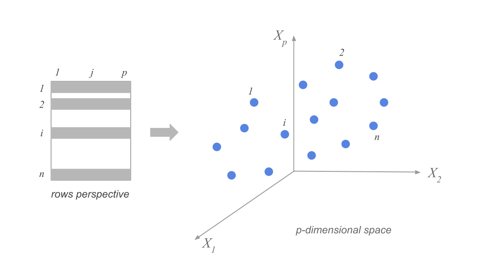
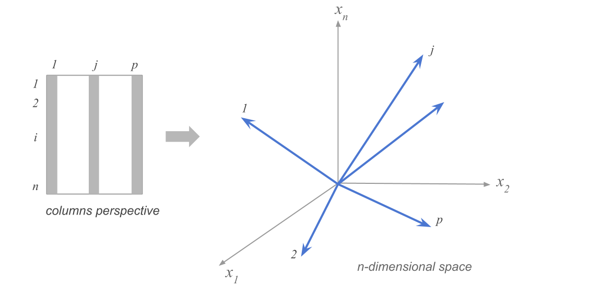
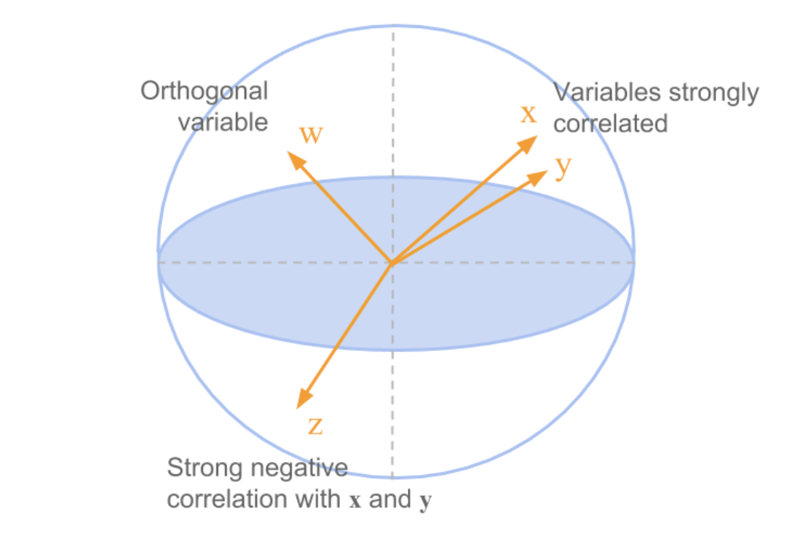
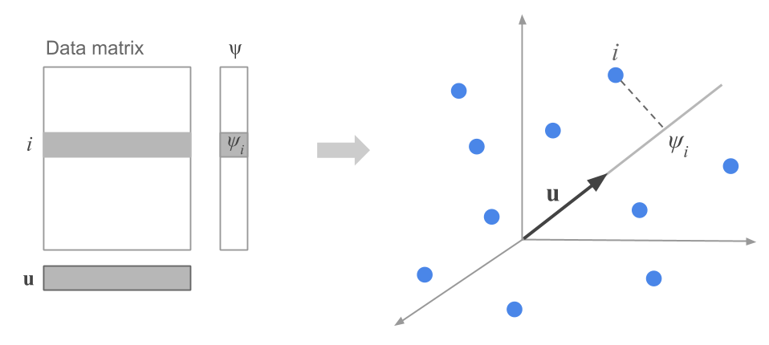

# Bridge

## Bridging from SVD to PCA

In the previous lecture, we used the SVD to understand the *geometry* of a dataset.

We thought about data as a cloud of points and asked:

* which directions mix together,
* which directions remain pure,
* and how the covariance matrix reveals the natural coordinate system of the data.

The singular vectors gave us something powerful:

> a set of directions where variation in the data becomes decoupled.


---

## A different question

Instead of asking

**What directions describe the intrinsic geometry of the data?**


Suppose we ask now:

**If I want to look at this high‑dimensional cloud, which direction should I look from?**

. . .

In high dimensions we cannot see the cloud directly. The only thing we can do is **project** it onto lower‑dimensional spaces.

. . .

Choosing a direction $\mathbf{u}$ means:

* project each data point onto that direction,
* look at the shadow the data casts there.

So now directions become **viewpoints**.

---

## Good and bad viewpoints

Some viewing directions are uninformative:

* all projected points pile together,
* the structure of the data disappears.

Other directions reveal structure:

* points spread out,
* patterns become visible.

. . .

The natural goal becomes::

**Choose viewing directions where the projected data spreads out as much as possible.**


---

## This point of view is called PCA

Principal Component Analysis asks:

> Which viewing direction makes the data appear maximally spread out?

. . .

We measure this spread using **variance** of the projected points.

. . .

Let's use some different notation for a minute.

##
Suppose our centered data matrix is $X$, with each row representing an observation and each column representing a variable. 


If we project onto a unit direction $\mathbf{u}$, we get one coordinate per observation, which we can stack into a vector $\mathbf{\psi}$.

$$
\mathbf{\psi} = X \mathbf{u}
$$

##

$$
\mathbf{\psi} = X \mathbf{u}
$$

What is the variance of the projected data?

. . .

Since the data has been centered, the variance is given by 

$$
\frac{1}{n} \sum_{i=1}^n \psi_i^2 = \frac{1}{n} \mathbf{\psi}^T \mathbf{\psi}
$$

. . .

We can rewrite this in terms of the original data matrix as 

$$
\frac{1}{n} \mathbf{\psi}^T \mathbf{\psi} = \frac{1}{n} \mathbf{u}^T X^T X \mathbf{u}
$$

. . .

We recognize that $X^T X$ is the covariance matrix of the data.

##

So the variance of the projected data is given by 

$$
\mathbf{u}^T C \mathbf{u},
$$

where $C = \frac{1}{n} X^T X$ is the covariance matrix of the $X$.

. . .

Remember, we want to find the direction $\mathbf{u}$ that maximizes the variance of the projected data. 


So we want the direction $\mathbf{u}$ that maximizes $\mathbf{u}^T C \mathbf{u}$.

---

## Connection

We already solved this problem — just without calling it PCA.

The direction that maximizes $\mathbf{u}^T C \mathbf{u}$ is the eigenvector of $C$ with the largest eigenvalue.

And of course, the **eigenvectors of the covariance matrix** are the same as the **singular vectors of the centered data matrix**.

Now we reinterpret them:

* before: they were intrinsic geometric directions of the data cloud,
* now: they are the *best viewing directions* for seeing structure.


> PCA is simply the viewing interpretation of what SVD already discovered.

---

## Conceptual summary

SVD told us how the data naturally wants to be coordinated.

PCA asks how we should look at the data to understand it.

They are two perspectives on the same object:

* **SVD** — discover the natural axes of variation.
* **PCA** — view the data along those axes.


> It is the *same geometry*, seen through the lens of projection and visualization.


<!-- MODULE M1 -->
# High-dimensional data: variance and projection

<!-- @idea: high_dimensional_data_and_projection | Variance, projection onto fewer dimensions -->
<!-- @uses: projection -->
Data as points in $\mathbb{R}^p$, row vs column views, and choosing directions to visualize.

## How spread out is the data along a particular direction?

Suppose we have $n$ data points in $p$ dimensions. We can represent the data as a matrix $X$ of size $n \times p$. The data points are represented as rows in the matrix, and we have subtracted the mean along each dimension from the data.

## Visualizing the high-dimensional data


```{python}
# load in data from the cities91.csv file
import pandas as pd
import numpy as np
import matplotlib.pyplot as plt
cities = pd.read_csv('cities91.csv')
cities.head()
```

::: aside
Dataset taken from [here](https://pca4ds.github.io/data-and-goals.html)
:::
## Focusing on 12 variables

We might choose to focus on only 12 (!) of the 41 variables in the dataset, corresponding to the average wages of workers in 12 specific occupations in each city.

```{python}
# select only second and then last 12 columns
cities_small = cities.iloc[:, [1] + list(range(29, 41))]
cities_small.head()
```

How can we think about the data in this 12-dimensional space?

## Clouds of row-points



::: notes
distances between points represent similarity between cities...
:::

## Clouds of column-points



::: notes
each point represents one feature, plotted in one dimension for each city

distances between points represent similarity between *features*, such as (in this case) salaries in specific occupations
:::

## Projection onto fewer dimensions

To visualize data, we need to project it onto 2d (or 3d) subspaces. But which ones?

These are all equivalent:

-   maximize variance of projected data

-   minimize squared distances between data points and their projections

-   keep distances between points as similar as possible in original vs projected space

## Example in the space of column points



## Example

```{python}
# define the first column of the data as name labels, so that sklearn doesn't use them in the fit
cities_small = cities.iloc[:, [1] + list(range(29, 41))]
# remove rows with NaN values

cities_small.set_index('city', inplace=True)
#names = cities_small['city']
#cities_small = cities_small.drop('city', axis=1)
# standardize the data
cities_small = cities_small.dropna()
cities_small = (cities_small - cities_small.mean(axis=0)) 
cities_small = cities_small.dropna()

# find the first two principal components of the data
from sklearn.decomposition import PCA
pca = PCA(n_components=2)
pca.fit(cities_small)
cities_small_pca = pca.transform(cities_small)
# plot the data in the new space, labeling each point with the city name
plt.scatter(cities_small_pca[:, 0], cities_small_pca[:, 1])
for i, city in enumerate(cities_small.index):
  plt.text(cities_small_pca[i, 0], cities_small_pca[i, 1], str(city))
plt.xlabel('First principal component')
plt.ylabel('Second principal component')
plt.show()
```

## What you should be able to do

- Interpret data as clouds of row-points and column-points.
- State the goal of projection (maximize variance, minimize reconstruction error, or preserve distances).

. . .

<!-- /MODULE M1 -->

<!-- MODULE M2 -->
# The first principal component

Goal: find the direction of maximum variance; definition and link to eigendecomposition.

## Goal

We'd like to know in which directions in $\mathbb{R}^p$ the data has the highest variance.

::: notes

. . .

First: understand how much the data is spread out along a particular direction, given by a unit vector $\mathbf{u}$.

. . .

Remember, for each point $\mathbf{x}_i$ in the data, we can project it onto the direction $\mathbf{u}$ by computing $\psi_i = \mathbf{x}_i \cdot \mathbf{u}$.



. . .

We then define the vector of all the projected points as $\mathbf{\psi} = X \mathbf{u}$.

. . .

What is the variance of the projected data? Since the data has been centered, the variance is given by $\frac{1}{n} \sum_{i=1}^n v_i^2 = \frac{1}{n} \mathbf{v}^T \mathbf{v}$.

. . .

We can rewrite this in terms of the original data matrix as $\frac{1}{n} \mathbf{v}^T \mathbf{v} = \frac{1}{n} \mathbf{u}^T X^T X \mathbf{u}$.

We recognize that $X^T X$ is the covariance matrix of the data.

. . .

So the variance of the projected data is given by $\mathbf{u}^T C \mathbf{u}$, where $C = \frac{1}{n} X^T X$ is the covariance matrix of the data.

:::
## Direction of maximum variance

To find the direction of maximum variance, we need to find the unit vector $\mathbf{u}$ that maximizes $\mathbf{u}^T C \mathbf{u}$.

. . .

::: notes
We start by finding the eigendecomposition of the covariance matrix $C$: $C = V \Lambda V^T$.

$V$ is a matrix whose columns are the eigenvectors of $C$, and $\Lambda$ is a diagonal matrix whose diagonal elements are the eigenvalues of $C$.

(Note that these are simply the right singular vectors and singular values of the data matrix $X$.)

Then we can express $\mathbf{u}$ in terms of the eigenvectors of $C$: $\mathbf{u} = \sum_{i=1}^p a_i \mathbf{v}_i$, where $\mathbf{v}_i$ are the eigenvectors of $C$. Because $\mathbf{u}$ is a unit vector, the coefficients $a_i$ must sum to 1.

Now we have that $C \mathbf{u} = \sum_{i=1}^p C \mathbf{v}_i a_i =  \sum_{i=1}^p a_i \mathbf{v}_i$, where $\lambda_i$ are the eigenvalues of $C$.

So then $\mathbf{u}^T C \mathbf{u} = \sum_{i,j=1}^p a_i a_j \mathbf{v}_j\mathbf{v}_j = \sum_{i,j=1}^p a_i a_j \delta_{i,j}\|\mathbf{v}_i\|  \lambda_i = \sum_{i=1}^p a_i^2 \lambda_i$.
:::

## Which direction gives the maximum variance?

::: notes
To find the direction that gives the maximum variance, we need to find the set of coefficients $a_i$ that maximize $\sum_{i=1}^p a_i^2 \lambda_i$ subject to the constraint that $\sum_{i=1}^p a_i = 1$. This will have its maximum value when $a_i = 1$ for the eigenvector corresponding to the largest eigenvalue, and $a_i = 0$ for all other eigenvectors.

So the direction of maximum variance is given by the eigenvector corresponding to the largest eigenvalue of the covariance matrix. This is the first singular vector of the data matrix, and it is also called the first principal component.
:::

::: pause
:::

. . .

<!-- @idea: first_principal_component_definition | First PC: eigenvector for largest eigenvalue, first right singular vector -->
<!-- @uses: eigenvalue, eigenvector, pca, principal_component, right_singular_vector, singular_value -->
::: definition
The first principal component of a data matrix $X$ is the eigenvector corresponding to the largest eigenvalue of the covariance matrix of the data.

In terms of the singular value decomposition of $X$, the first principal component is the first right singular vector of $X$: 

$\mathbf{v_1}$.
:::

The variance of the data along each principal component is given by the corresponding eigenvalue, or the square of the corresponding singular value.

. . .

<!-- /MODULE M2 -->

<!-- MODULE M3 -->
# Shopping baskets: exploring high-dimensional data

<!-- @idea: shopping_baskets_exploration | Shopping baskets, exploration before PCA -->
<!-- @uses: pca, principal_component -->
Load data, visualize in a few dimensions, and look at correlations before PCA.

## Motivation

- High-dimensional data (e.g. many items per observation) is hard to visualize.
- Shopping baskets: 2000 trips, 42 food items — we want to see structure before using PCA.
- Strategy: load data → look at 2D/3D views → inspect correlation matrices.

## Method

- Load the dataset (rows = foods, columns = baskets, or transposed).
- Visualize in a few dimensions: scatter plots for two foods, 3D bar charts for counts.
- Summarize associations: correlation matrix and heatmap.

## Example: Load and inspect the data

```{python}
# load the data with pandas
import pandas as pd
url = 'my_basket.csv'
food = pd.read_csv(url).T
# name the index 'name'
food.index.names = ['name']
food.head()
```

- 2000 observations × 42 variables (number of times each food was purchased per trip).
- Goal: visualize in a few dimensions of the original space.

. . .

```{python}
# make a scatterplot of the first two columns in the original dataset
plt.scatter(food.iloc[0,:], food.iloc[1,:])
plt.xlabel(f'Number of {food.index[0]} in basket')
plt.ylabel(f'Number of {food.index[1]} in basket')
plt.xlim(-.5, 4.5)
plt.ylim(-0.5, 4.5)
plt.title('Baskets of food')
plt.show()
```

::: notes
But there's a problem here. We know from looking at this that there is at least one of each of these combinations where there's a dot, but how many?
:::

## 3D view of two-food counts

```{python}
def plot_food_scatter(food, x_col, y_col, ax2=None):
  if ax2 is None:
    no_ax_in = True
    fig = plt.figure(figsize=(10,5))
    ax2 = fig.add_subplot(111, projection='3d')
  else:
    no_ax_in = False

  yval = np.zeros([10,10])
  for i in range(4):
    for j in range(5):
      yval[i,j] = sum((food.iloc[x_col, :] == i) & (food.iloc[y_col, :] == j))

  xpos, ypos = np.meshgrid(range(4), range(5), indexing='ij')
  xpos = xpos.flatten()
  ypos = ypos.flatten()
  zpos = np.zeros_like(xpos)
  dz = yval[0:4, 0:5].flatten()
  dx = dy = 0.5
  ax2.bar3d(xpos, ypos, zpos, dx, dy, dz, shade=True)
  plt.xlabel(f'# of {food.index[x_col]}')
  plt.ylabel(f'# of {food.index[y_col]}')
  ax2.set_xticks([])
  ax2.set_yticks([])

  if no_ax_in:
    plt.show()
```

```{python}
plot_food_scatter(food, 0, 1)
```

## Many pairs of foods

We can look at many combinations.

. . .

```{python}
fig = plt.figure(figsize=(12,12))
for i in range(3):
  for j in range(3):
    ax = fig.add_subplot(3,3,3*i+j+1,projection='3d')
    plot_food_scatter(food, i, j, ax)
plt.tight_layout()
plt.show()
```

## Correlations between foods

Maybe we can learn more from the correlations?

. . .

```{python}
# heatmap of correlations between columns in the original dataset
plt.imshow(food.T.corr(), cmap='coolwarm', interpolation='none')
plt.xticks(range(42), food.index, rotation=90)
plt.yticks(range(42), food.index)
plt.colorbar()
plt.title('Correlations between foods')
plt.show()
```

## Correlation heatmap (10 foods)

```{python}
food_small = food.iloc[0:10]
plt.imshow(food_small.T.corr(), cmap='coolwarm', interpolation='none', vmin=-0.05, vmax=0.4)
plt.xticks(range(10), food_small.index, rotation=90)
plt.yticks(range(10), food_small.index)
plt.colorbar()
plt.title('Correlations between foods')
plt.show()
```

. . .

- Some patterns are visible, but the full picture is still hard to see.
- Next step: standardize and fit PCA to find directions of maximum variance.

## Next: PCA

Now perform PCA on the data.

```{python}
#| output: false
from sklearn.decomposition import PCA
from sklearn.preprocessing import StandardScaler
```

```{python}
#| echo: true
# standardize the data
scaler = StandardScaler()
food_scaled = scaler.fit_transform(food)
pca = PCA(n_components=4)
pca.fit(food_scaled);
print(f'Explained variance %: {pca.explained_variance_ratio_*100}')
```

. . .

<!-- /MODULE M3 -->

```{python}
import plotly.express as px
import plotly.io as pio
```

<!-- MODULE M4 -->
# Interpreting Principal Components

<!-- @idea: interpreting_principal_components | Loadings vs scores, interpreting PCs -->
<!-- @uses: pca, principal_component -->
PCA gives us new dimensions — but what do they mean? We visualize loadings and scores.

## Motivation

- PCA reduces dimensions and explains variance.
- We want to understand what each principal component captures.
- Two key objects: **loadings** (variables) and **scores** (observations).

## Method: Loadings vs scores

- **Loadings** (`components_`): each variable's contribution to each PC. Scatter variables in PC space to see which cluster together.
- **Scores** (`transform`): each observation's position in PC space.
- **Bar plots**: order observations by PC value to see who is high or low on each dimension.

## Example: Loadings (variables in PC space)

```{python}
plt.scatter(pca.components_[0], pca.components_[1])
plt.xlabel('First principal component')
plt.ylabel('Second principal component')
plt.title('Variable loadings on PC1 vs PC2')
plt.show()
```

::: pause
:::

::: notes
First of all, clearly the data is artificial. It's way too neat! (This came from a machine learning textbook.)

What this is saying is that there seem to be roughly three groups of people who buy food in a similar way, and only differ in the *amount*.
:::

## Example: Loadings (PC3 vs PC4)

```{python}
plt.scatter(pca.components_[2], pca.components_[3])
plt.xlabel('Third principal component')
plt.ylabel('Fourth principal component')
plt.title('Variable loadings on PC3 vs PC4')
plt.show()
```

## Example: Scores (individuals in PC space)

```{python}
food_pca = pd.DataFrame(pca.transform(food_scaled))
food_pca.columns=["Principal Component 1","Principal Component 2","Principal Component 3","Principal Component 4"]
food_pca.index = food.index
```

```{python}
fig = px.scatter(food_pca, x="Principal Component 1", y="Principal Component 2" ,template="simple_white", text=food.index)
fig.update_traces(textposition='top center')
fig.show()
```

## Example: Bar plots by PC value

```{python}
# plot just the first principal component
# sort by the first principal component
def plot_by_pci(i):
  food_sorted = food_pca.sort_values(by=f'Principal Component {i}')
  fig=px.bar(food_sorted, x=f'Principal Component {i}', text=food_sorted.index, orientation='h',color=f'Principal Component {np.mod(i+2,2)+1}', template='simple_white')
  fig.update_layout(yaxis={'visible': False, 'showticklabels': False}, xaxis={'visible': True, 'showticklabels': True})
  fig.show()
```

```{python}
plot_by_pci(1)
```

. . .

```{python}
plot_by_pci(2)
```


<!-- /MODULE M4 -->

<!-- MODULE M5 -->
# Some real-world data

Applying PCA to genome data to explore population structure.

::: aside
From [here](https://github.com/sakshamg94/PCA-genome-data/blob/master/PCA_genomes.ipynb)
:::

## Motivation

- Genome data from multiple populations
- Goal: explore whether genetic variation correlates with population structure
- Binarize variants and project to principal components

## Method — Data pipeline

1. **Read and preprocess:** extract population/gender, compute mode per trait (most frequent value)
2. **Binarize:** 0 if individual has mode for that trait, 1 otherwise (mutation away from mode)
3. **Fit PCA, transform, append metadata** for visualization

```{python}
#| echo: true
def readAndProcessData():
    """
        Function to read the raw text file into a dataframe and keeping the population, gender separate from the genetic data
        
        We also calculate the population mode for each attribute or trait (columns)
        Note that mode is just the most frequently occurring trait
        
        return: dataframe (df), modal traits (modes), population and gender for each individual row
    """
    
    df = pd.read_csv('p4dataset2020.txt', header=None, delim_whitespace=True)
    gender = df[1]
    population = df[2]
    print(np.unique(population))
    
    df.drop(df.columns[[0, 1, 2]],axis=1,inplace=True)
    modes = np.array(df.mode().values[0,:])
    return df, modes, population, gender
    
```

```{python}
df, modes, population, gender = readAndProcessData()
```

## Examples — Worked pipeline

```{python}
df.head()
```

. . .

```{python}
def convertDfToMatrix(df, mode):
    """
        Create a binary matrix (binarized) representing mutations away from mode
        Each row is for an individual, and each column is a trait
        
        binarized_{i,j}= 0 if the $i^{th}$ individual has column 
        $j$’s mode nucleobase for his or her $j^{th}$ nucleobase, 
        and binarized_{i,j}= 1 otherwise
    """
    
    raw_np = df.to_numpy()
    binarized = np.where(raw_np!=mode, 1, 0)
    return binarized
```

##

```{python}
X = pd.DataFrame(convertDfToMatrix(df, modes))
X.head()
```

##

```{python}
#| echo: true
pca = PCA(n_components=6)
pca.fit(X);
#Data points projected along the principal components

```

```{python}
projected = pca.transform(X)
projected = pd.DataFrame(projected)
projected.columns=map(lambda x: f'PC{x+1}', range(6))


# append the population
projected['population'] = population
projected['gender'] = gender
projected.head()
```


##

```{python}
fig = px.scatter(projected, x='PC3', y='PC4', template='simple_white')
fig.show()
```

##

```{python}
fig = px.scatter(projected, x='PC3', y='PC4', template='simple_white',color='gender')
fig.show()
```


. . .

<!-- /MODULE M5 -->

##

<!--  -->
