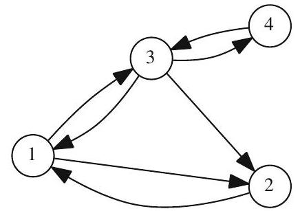
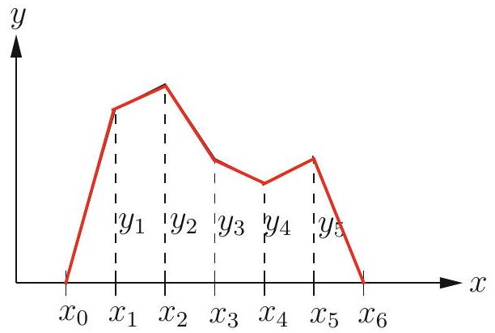

## A resource for review

The glossary from the end of Strand:
[glossary.pdf](glossary.pdf)

# Intuitions about RRE form

<!-- @idea: rref_free_bound_and_consistency | RREF, free vs bound variables, consistency -->
<!-- @uses: augmented_matrix, basic_column, consistent_system, elimination_and_rref, free_and_bound_variables, homogeneous_system, linear_system, linear_systems_core, nullity, rank, rank_and_nullity, reduced_row_echelon_form -->
## Systems with non-unique solutions

Solve for the variables $x, y$, and $z$ in the system

$$
\begin{aligned}
z & =2 \\
x+y+z & =2 \\
2 x+2 y+4 z & =8
\end{aligned}
$$

. . .

Make an augmented matrix:

$$
\left[\begin{array}{llll}
0 & 0 & 1 & 2 \\
1 & 1 & 1 & 2 \\
2 & 2 & 4 & 8
\end{array}\right]
$$

::: notes
Note that the first column corresponds to x, the second to y, and the third to z.
:::

. . .

$$
\left[\begin{array}{llll}
0 & 0 & 1 & 2 \\
1 & 1 & 1 & 2 \\
2 & 2 & 4 & 8
\end{array}\right] \stackrel{E_{12}}{\longrightarrow}\left[\begin{array}{llll}
1 & 1 & 1 & 2 \\
0 & 0 & 1 & 2 \\
2 & 2 & 4 & 8
\end{array}\right] \xrightarrow[E_{31}(-2)]{\longrightarrow}\left[\begin{array}{rlll}
1 & 1 & 1 & 2 \\
0 & 0 & 2 & 4 \\
0 & 0 & 1 & 2
\end{array}\right]
$$


::: notes
Now we are stuck! The first row we are going to use to solve for x. Neither the second or third row tell us anything about y...
:::


##

We keep on going...
$$
\begin{aligned}
& {\left[\begin{array}{rrrr}
1 & 1 & 1 & 2 \\
0 & 0 & 2 & 4 \\
0 & 0 & 1 & 2
\end{array}\right] \xrightarrow[E_{2}(1 / 2)]{\longrightarrow}\left[\begin{array}{rrrr}
1 & 1 & 1 & 2 \\
0 & 0 & 1 & 2 \\
0 & 0 & 1 & 2
\end{array}\right]} \\
& \overrightarrow{E_{32}(-1)}\left[\begin{array}{rrrr}
1 & 1 & 1 & 2 \\
0 & 0 & 1 & 2 \\
0 & 0 & 0 & 0
\end{array}\right] \xrightarrow[E_{12}(-1)]{\longrightarrow}\left[\begin{array}{rrrr}
1 & 1 & 0 & 0 \\
0 & 0 & 1 & 2 \\
0 & 0 & 0 & 0
\end{array}\right] .
\end{aligned}
$$

##

We have ended up with this matrix:

$$
\left[\begin{array}{rrrr}
1 & 1 & 0 & 0 \\
0 & 0 & 1 & 2 \\
0 & 0 & 0 & 0
\end{array}\right]
$$

. . .

How can we use this to solve for $z$? What about $x$?

. . .

But there's no information on $y$! It can be anything!!

. . .

$$
\begin{aligned}
& x=-y \\
& z=2 \\
& y \text { is free. }
\end{aligned}
$$

<!-- @introduces: free_and_bound_variables -->
## Free versus bound variables

We define a **free variable** as one that isn't constrained by the equations. We can assign it any value we want, and the system will still have a solution.

. . .

A **bound variable** is one that is constrained by the equations. 

## Free versus bound variables in augmented matrices

Suppose we have another augmented matrix, which after GJ elimination has become:

$$
\left[\begin{array}{rrrrr}
x & y & z & w & \mathrm{rhs} \\
1 & 2 & 0 & -1 & 2 \\
0 & 0 & 1 & 3 & 0 \\
0 & 0 & 0 & 0 & 0
\end{array}\right] .
$$

. . .

The solutions are:
$$
\begin{aligned}
x+2 y-w & =2 \\
z+3 w & =0 .
\end{aligned}
$$

How can we tell from looking at the matrix which variables are free vs bound?

. . .

Columns which contain *pivots* correspond to bound variables. The others correspond to free variables. 

<!-- @introduces: basic_column -->
(Columns with pivots are called "basic" columns.)


## Practicing on a bigger matrix

$$
E_A=\left(\begin{array}{cccccccc}1 & * & 0 & 0 & * & * & 0 & * \\ 0 & 0 & 1 & 0 & * & * & 0 & * \\ 0 & 0 & 0 & 1 & * & * & 0 & * \\ 0 & 0 & 0 & 0 & 0 & 0 & 1 & * \\ 0 & 0 & 0 & 0 & 0 & 0 & 0 & 0 \\ 0 & 0 & 0 & 0 & 0 & 0 & 0 & 0\end{array}\right)
$$

Which are the basic columns (the ones with pivots, corresponding to bound variables)?

Which are the non-basic columns (the ones without pivots, corresponding to free variables)?

## Summing 

$$
E_A=\left(\begin{array}{cccccccc}1 & * & 0 & 0 & 8 & * & 0 & * \\ 0 & 0 & 1 & 0 & 4 & * & 0 & * \\ 0 & 0 & 0 & 1 & 3 & * & 0 & * \\ 0 & 0 & 0 & 0 & 0 & 0 & 1 & * \\ 0 & 0 & 0 & 0 & 0 & 0 & 0 & 0 \\ 0 & 0 & 0 & 0 & 0 & 0 & 0 & 0\end{array}\right)
$$

Notice how the non-basic column 5 here can be formed as a weighted sum of the basic columns to the left (columns 1, 3, and 4).

. . .

This is always true! Every non-basic column can be formed as a weighted sum of the basic columns to the left.

. . .

(And it turns out that it is true as well before we even find the RREF form of a matrix. If a column will be a basic column in RREF, it must be a linear combination of the basic columns to the left.)


## Systems with no solutions

Some systems of equations have no solutions. For example, consider the following system:


$$
\begin{array}{r}
x+y=1 \\
2 x+y=2 \\
3 x+2 y=5 .
\end{array}
$$

. . .

$$
\left[\begin{array}{lll}
1 & 1 & 1 \\
2 & 1 & 2 \\
3 & 2 & 5
\end{array}\right] \xrightarrow[E_{21}(-2)]{E_{31}(-3)}\left[\begin{array}{lrl}
1 & 1 & 1 \\
0 & -1 & 0 \\
0 & -1 & 2
\end{array}\right] \xrightarrow[E_{32}(-1)]{\longrightarrow}\left[\begin{array}{rrr}
1 & 1 & 1 \\
0 & -1 & 0 \\
0 & 0 & 2
\end{array}\right]
$$

::: notes
We didn't even finish the G-J elimination, but there's clearly a problem. We can't have 0 = 2.
Maybe not a surprise, since we have three equations with only two unknowns!
:::

. . .

We have arrived at an impossible equation: 0 = 2.

This means that the system has no solutions.

We say that the system is **inconsistent**.

<!-- @introduces: consistent_system -->
## Consistency

For an augmented matrix in RREF, if the only only nonzero entry in a row appears on the right-hand side, that means that the system has no solutions, and is therefore **inconsistent**.

. . .


$$\text { Row } i \longrightarrow\left(
\begin{array}{cccccc|c}
* & * & * & * & * & * & * \\
0 & 0 & 0 & * & * & * & * \\
0 & 0 & 0 & 0 & * & * & * \\
0 & 0 & 0 & 0 & 0 & 0 & \alpha \\
\bullet & \bullet & \bullet & \bullet & \bullet & \bullet & \bullet \\
\bullet & \bullet & \bullet & \bullet & \bullet & \bullet & \bullet
\end{array}
\right) \longleftarrow \alpha \neq 0 
$$ 


Here the $i^{\text {th }}$ equation of this system is

$$
0 x_{1}+0 x_{2}+\cdots+0 x_{n}=\alpha \implies 0 = \alpha .
$$

If $\alpha\ne 0$, this has no solution!

This is an **inconsistent** system.

## A row of all zeros is does not mean inconsistency

Suppose that instead of $\alpha$ on the right-hand side of row $i$, there is a 0:

$$\text { Row } i \longrightarrow\left(
\begin{array}{cccccc|c}
* & * & * & * & * & * & * \\
0 & 0 & 0 & * & * & * & * \\
0 & 0 & 0 & 0 & * & * & * \\
0 & 0 & 0 & 0 & 0 & 0 & 0 \\
\bullet & \bullet & \bullet & \bullet & \bullet & \bullet & \bullet \\
\bullet & \bullet & \bullet & \bullet & \bullet & \bullet & \bullet
\end{array}
\right) \longleftarrow \alpha \neq 0 
$$ 

. . .

This is perfectly fine! It does not mean that the system is inconsistent.

::: notes
Note that there is *not* inconsistency if there is a row of all zeros.
:::

## What Reduced Row Echelon Form tells us

Suppose a matrix $A_{m \times n}$ has a reduced row echelon form $E_{m \times n}$:
$$ E_A=\left(\begin{array}{cccccccc}1 & * & 0 & 0 & * & * & 0 & * \\ 0 & 0 & 1 & 0 & * & * & 0 & * \\ 0 & 0 & 0 & 1 & * & * & 0 & * \\ 0 & 0 & 0 & 0 & 0 & 0 & 1 & * \\ 0 & 0 & 0 & 0 & 0 & 0 & 0 & 0 \\ 0 & 0 & 0 & 0 & 0 & 0 & 0 & 0\end{array}\right)$$


::: notes
What can we learn from the RREF of a matrix? What does it tell us? It can tell us which variables are free vs bound, and therefore how *many* variables are bound. (This is the rank of the matrix!)
:::


<!-- @introduces: rank -->
## Rank

Suppose a matrix $A_{m \times n}$ has a reduced row echelon form $E_{m \times n}$:
$$ E_A=\left(\begin{array}{cccccccc}1 & * & 0 & 0 & * & * & 0 & * \\ 0 & 0 & 1 & 0 & * & * & 0 & * \\ 0 & 0 & 0 & 1 & * & * & 0 & * \\ 0 & 0 & 0 & 0 & 0 & 0 & 1 & * \\ 0 & 0 & 0 & 0 & 0 & 0 & 0 & 0 \\ 0 & 0 & 0 & 0 & 0 & 0 & 0 & 0\end{array}\right)$$


*rank($A$)* = \# of pivots = \# of nonzero rows in $E$ = \# *bound variables* in the system

<!-- @introduces: nullity -->
## Nullity

Suppose a matrix $A_{m \times n}$ has a reduced row echelon form $E_{m \times n}$:
$$ E_A=\left(\begin{array}{cccccccc}1 & * & 0 & 0 & * & * & 0 & * \\ 0 & 0 & 1 & 0 & * & * & 0 & * \\ 0 & 0 & 0 & 1 & * & * & 0 & * \\ 0 & 0 & 0 & 0 & 0 & 0 & 1 & * \\ 0 & 0 & 0 & 0 & 0 & 0 & 0 & 0 \\ 0 & 0 & 0 & 0 & 0 & 0 & 0 & 0\end{array}\right)$$

*nullity($A$)* = \# of non-pivot columns = \# *free variables* in the system

## Consistency


Equivalent ways of saying $A$ is consistent:

-   In row reducing $[\mathbf{A} \mid \mathbf{b}]$, a row of the following form never appears:
  
 . . .
$$
\left(\begin{array}{llll|l}
0 & 0 & \cdots & 0 & \alpha \tag{2.3.2}
\end{array}\right) \text {, where } \alpha \neq 0 \text {. }
$$

-   $\operatorname{rank}[\mathbf{A} \mid \mathbf{b}]=\operatorname{rank}(\mathbf{A})$, in which case either:
    - $\operatorname{rank}[\mathbf{A}=n$, and system has a unique solution or
    - $\operatorname{rank}[\mathbf{A}<n$, and system has infinite solutions

-    $\mathbf{b}$ is a nonbasic column in $[\mathbf{A} \mid \mathbf{b}]$.


-   $\mathbf{b}$ is a combination of the basic columns in $\mathbf{A}$.
  


::: aside
Meyers p. 51
:::

<!-- @introduces: homogeneous_system -->
## Homogeneous Systems

- The general linear system with $m \times n$ coefficient matrix $A$ and right-hand-side vector $\mathbf{b}$ is **homogeneous** if the entries of $\mathbf{b}$ are all zero. 

- Otherwise, the system is **inhomogeneous**.

- Homogeneous systems are always consistent!

- Can solve by setting all variables to zero. This is the **trivial solution**

- If rank of the matrix = n, there is *only* the trivial solution

# Example + tutorial: Pagerank

<!-- @idea: pagerank_tutorial | PageRank as matrix equation -->
<!-- @uses: distribution_vector, dynamical_and_markov, markov_chain, stationary_vector, stochastic_matrix, transition_matrix -->
## Pagerank

Goal: rank pages in terms of "importance". Suppose we have four pages:



::: callout
How can we rank these pages? Which one is most important?
:::

::: notes
First try: count number of backlinks. But that can be artifically inflated (just link to a page many times), and it doesn't care about importance of the linking page.
:::

##


First try: let's just **count the number of backlinks**, and make that the page's rank.

. . .

Any potential downsides to this?

. . .

This can easily be gamed just by making many links to a page!

::: notes
In the next try, we will taking into account the ranking of the pages who link to us.
:::

##


Second try: rank pages by how many incoming links they have *and how highly ranked they are*.


For page $i$ let $x_{i}$ be its score and $L_{i}$ be the set of all indices of pages linking to it.   Then 
$$
x_{i}=\sum_{x_{j} \in L_{i}} x_{j}
$$

. . .

Notice: you can't just look at the graph anymore and know what the rankings will be! The ranking for one page depends on the rankings of all the others.

. . .

But it's still easy to game this system, by setting up a set of interlinked pages and then making a ton of outgoing links to pages we want to promote.

::: notes
Now we will downweight pages that have many many outgoing links.
:::

##


Third try: downweight incoming links from pages that have many outgoing links.

. . .

For page $j$ let $n_{j}$ be its total number of outgoing links on that page. Then its score is

$$
x_{i}=\sum_{x_{j} \in L_{i}} \frac{x_{j}}{n_{j}}
$$

:::

## Working through PageRank: try 3


$$
x_{i}=\sum_{x_{j} \in L_{i}} \frac{x_{j}}{n_{j}}
$$

::: callout
Write down the system of equations this gives us. Then make it in an augmented matrix.
:::

::: notes
$$
\begin{aligned}
& x_{1}=\frac{x_{2}}{1}+\frac{x_{3}}{3} \\
& x_{2}=\frac{x_{1}}{2}+\frac{x_{3}}{3} \\
& x_{3}=\frac{x_{1}}{2}+\frac{x_{4}}{1} \\
& x_{4}=\frac{x_{3}}{3} .
\end{aligned}
$$

Augmented matrix:

```{python}
import sympy as sym
P = sym.Matrix([[1,-1,-1,0,0],[-1,1,-1,0,0],[-1,0,1,-1,0],[0,0,-1,1,0]])
P
```

:::


## Set up the environment. Import the sympy library.

```{python}
import sympy as sym
```

We make a matrix using the `sym.Matrix` function.

```{python}
T = sym.Matrix([[1,2,3],[2,1,3],[2,1,1]])
T
```

##

We can create symbolic variables, and put them into the matrix if we want...

```{python}
x1=sym.var('x1'); x2=sym.var('x2');x3=sym.var('x3');x4=sym.var('x4')
```

```{python}
x1
```

```{python}
T2 = sym.Matrix([[1,x2,3],[2,1,3],[2,x1,1]])
T2
```

##

If we input fractions, they are by default converted to floating point numbers:

```{python}
T3 = sym.Matrix([[1,x2,1/3],[2,1,3],[2,x1,1]])
T3
```

It's nicer to input fractions and keep them as fractions:

```{python}
T4 = sym.Matrix([[1,x2,sym.Rational(1,3)],[2,1,3],[2,x1,1]])
T4
```

##

We can substitute values in for variables:

```{python}
T4.subs(x1,5)
```


##

We can find reduced row echelon form:

```{python}
T4.rref()
```

This outputs the RREF and tells us which columns correspond to bound variables.

##

Lastly, we can do Gauss-Jordan elimination to solve a system of equations with a matrix and a right-hand-side:

```{python}
T4.gauss_jordan_solve(sym.Matrix([2,1,3]))
```

That's messy! It's exporting several things, but the one we want is the first.

```{python}
T4.gauss_jordan_solve(sym.Matrix([2,1,3]))[0]
```

## Now you try!

Create a matrix representing the system of equations for the "third try" in the PageRank problem:

$$
\begin{aligned}
& x_{1}=\frac{x_{2}}{1}+\frac{x_{3}}{3} \\
& x_{2}=\frac{x_{1}}{2}+\frac{x_{3}}{3} \\
& x_{3}=\frac{x_{1}}{2}+\frac{x_{4}}{1} \\
& x_{4}=\frac{x_{3}}{3} .
\end{aligned}
$$

```{python}
# your code here
```

##

Now find the RREF form of this matrix. What does that tell you about the system?

```{python}
# your code here
```

Next, use the `gauss_jordan_solve`. What's surprising (or not) about these results?

```{python}
# your code here
```

Substitute a specific value to get a particular solution...


## JupyterLab

https://tinyurl.com/stat24320notebook1

## Now what about the second try?

Remember this was our 'second try':
$$
x_{i}=\sum_{x_{j} \in L_{i}} x_{j}
$$

This was the system of equations.
$$
\begin{aligned}
& x_{1}=x_{2}+x_{3} \\
& x_{2}=x_{1}+x_{3} \\
& x_{3}=x_{1}+x_{4} \\
& x_{4}=x_{3} .
\end{aligned}
$$

What happens if we try to solve this? Try it in Python.

::: notes
What happens is that we get only the trivial solution, where all the ranks are zero. This makes sense because it is a homogeneous system with full rank.
:::

# Diffusion

<!-- @idea: diffusion_discretization | Discretizing continuous functions (diffusion) -->
<!-- @uses: linear_system -->
## Discretizing continuous functions


-   Rod with fixed temperatures $y_{left}$ and $y_{right}$ at each end, internal heat source given as $f(x), 0 \leq x \leq 1$

-   What's the temperature at each point along the length?

## 

<center> </center>


::: notes
-   equally spaced points, called nodes, $x_{0}=0, x_{1}, x_{2}, \ldots, x_{n+1}=1$, distance $h$ apart.
-   heat on the $i$ th segment $\approx$ temperature at its left node.
-   temperature is $y(x)$, $y_{i}=y\left(x_{i}\right)$.
-   
:::

. . .

Equations to balance the flow of heat from each node to its neighbors:

$$
-y_{i-1}+2 y_{i}-y_{i+1}=\frac{h^{2}}{K} f\left(x_{i}\right)
$$

---

Suppose:

- rod of material with $K=1$ on  x-axis, for $0 \leq x \leq 1$.
- known internal heat source $f(x)$
- left and right ends of the rod are held at $0{ }^{\circ} \mathrm{C}$ (degrees Celsius)
- $n=5$ nodes

. . .

What are the discretized steady-state equations?

. . .

::: {.notes}
- $x_{i}=i h$. 
- $y_{0}$ is given to be 0, dissapears
-  $y_{n+1}=y_{6}$ =0,Thus we have from equation (1.2) five equations in the unknowns $y_{i}, i=1,2, \ldots, 5$
:::

$$
\begin{array}{lllllr}
2 y_{1}&-y_{2}  & & & & =f(1 / 6) / 36 \\
-y_{1}&+2 y_{2}&-y_{3} & & & =f(2 / 6) / 36 \\
&-y_{2}&+2 y_{3}&-y_{4} & & =f(3 / 6) / 36 \\
&&-y_{3}&+2 y_{4}&-y_{5} & =f(4 / 6) / 36 \\
&&&-y_{4}&+2 y_{5} & =f(5 / 6) / 36
\end{array}
$$

::: {.notes}
This is already a pain to work with by hand!
:::

##

Build the matrix representing the system of equations:

```{python}
#| echo: true
N=6
M = sym.zeros(N)
for i in range(N):
  if (i>0):
      M[i-1,i]=-1
  M[i,i]=2
  if (i<N-1):
      M[i+1,i]=-1
M
```

##

$$
-y_{i-1}+2 y_{i}-y_{i+1}=\frac{h^{2}}{K} f\left(x_{i}\right)
$$

Decide on a function for f. Let's say $\frac{h^{2}}{K} f = x_i^2$.

Say that x is running from 0 to 1. Then we can have

```{python}
#| echo: true
import numpy as np
x=np.arange(0,1,1/N)
f=x**2
x=sym.Matrix(x)
f=sym.Matrix(f)
```

##


```{python}
#| echo: true
sol=M.gauss_jordan_solve(f)
sol[0]
```

## Now you
1. Implement this yourself in Python
2. Make a plot of the output (you'll want to use PyPlot)
3. Increase N and make more plots
4. This was assuming the temperature at the ends was 0. How can we change this?

# Reaction-Diffusion in Biology

<!-- @idea: reaction_diffusion_biology | Reaction–diffusion and Turing patterns -->
<!-- @uses: linear_system -->
## Turing pattern formation
https://colab.research.google.com/github/ijmbarr/turing-patterns/blob/master/turing-patterns.ipynb#scrollTo=GsEPBsz33E14
