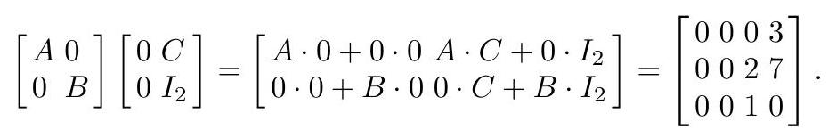

# Today: Rewriting Matrix Expressions

1. **Blocking**: Group entries to simplify multiplication
2. **Transpose**: Switch row/column viewpoints  
3. **Determinants**: Extract a single number that answers "invertible?"

. . .

::: {.callout-note}
## Running Example

We'll use the system $2x_1 - x_2 = 1$, $4x_1 + 4x_2 = 20$ throughout to see how each tool helps us understand and solve it.

Matrix: $A = \begin{bmatrix} 2 & -1 \\ 4 & 4 \end{bmatrix}$, $\mathbf{b} = \begin{bmatrix} 1 \\ 20 \end{bmatrix}$
:::

# Block multiplication

<!-- @idea: block_multiplication | Block matrices and multiplication -->
<!-- @uses: block_multiplication, matrix_arithmetic -->
<!-- @introduces: block_multiplication -->
## Block Multiplication

<!--

### Block Matrices

Another type of matrix that occurs frequently enough to be discussed is a block matrix. Actually, we already used the idea of blocks when we described the augmented matrix of the system $A \mathbf{x}=\mathbf{b}$ as the matrix $\tilde{A}=[A \mid \mathbf{b}]$. The blocks of $\tilde{A}$ in partitioned form $[A, \mathbf{b}]$ are $A$ and $\mathbf{b}$. There is no reason we couldn't partition by inserting more vertical lines or horizontal lines as well, and this partitioning leads to the blocks. The main point to bear in mind when using the block notation is that the blocks must be correctly Block Notation sized so that the resulting matrix makes sense. One virtue of the block form that results from partitioning is that for purposes of matrix addition or multiplication, we can treat the blocks rather like scalars, provided the addition or multiplication that results makes sense. We will use this idea from time to time without fanfare. One could go through a formal description of partitioning and proofs; we won't. Rather, we'll show how this idea can be used by example.

For another (important!) example of block arithmetic, examine Example 2.9 and the discussion following it. There we view a matrix as blocked into its respective columns, and a column vector as blocked into its rows, to obtain

$$
A \mathbf{x}=\left[\mathbf{a}_{1}, \mathbf{a}_{2}, \mathbf{a}_{3}\right]\left[\begin{array}{c}
x_{1} \\
x_{2} \\
x_{3}
\end{array}\right]=\mathbf{a}_{1} x_{1}+\mathbf{a}_{2} x_{2}+\mathbf{a}_{3} x_{3}
$$

-->

## Difficulty: Large multiplications are painful

Suppose we need to multiply these matrices...

$$
\left[\begin{array}{llll}
1 & 2 & 0 & 0 \\
3 & 4 & 0 & 0 \\
0 & 0 & 1 & 0
\end{array}\right]\left[\begin{array}{llll}
0 & 0 & 2 & 1 \\
0 & 0 & 1 & 1 \\
0 & 0 & 1 & 0 \\
0 & 0 & 0 & 1
\end{array}\right] .
$$

**pause**

::: notes
It's a pain, right?

Draw out the blocks on the left and right matrices.

$$
A=\left[\begin{array}{ll}
1 & 2 \\
3 & 4
\end{array}\right], \quad B=\left[\begin{array}{ll}
1 & 0
\end{array}\right], \quad C=\left[\begin{array}{ll}
2 & 1 \\
1 & 1
\end{array}\right], \quad I_{2}=\left[\begin{array}{ll}
1 & 0 \\
0 & 1
\end{array}\right]
$$

:::

## Concept: What is Block Multiplication?

The key idea: **Partition** so the block column-widths of the left matrix match the block row-heights of the right matrix.

Then you multiply *as if each block were an entry* (but using matrix multiplication inside -- you'll see what that means in a moment).

## Method: Block Multiplication

### Steps to perform block multiplication

1. **Partition** so the block column-widths of the left matrix match the block row-heights of the right matrix.
2. **Multiply block-rows by block-columns** (same pattern as ordinary matrix multiplication).

. . .

**Formula:** If
$$
M=\left[\begin{array}{cc}
A & B \\
C & D
\end{array}\right], \qquad
N=\left[\begin{array}{cc}
E & F \\
G & H
\end{array}\right],
$$
then
$$
MN=\left[\begin{array}{cc}
AE+BG & AF+BH \\
CE+DG & CF+DH
\end{array}\right].
$$

## Worked example: block-multiply the matrices from before

We started with the (painful) product

$$
\left[\begin{array}{cc|cc}
1 & 2 & 0 & 0 \\
3 & 4 & 0 & 0 \\
\hline
0 & 0 & 1 & 0
\end{array}\right]
\left[\begin{array}{cc|cc}
0 & 0 & 2 & 1 \\
0 & 0 & 1 & 1 \\
\hline
0 & 0 & 1 & 0 \\
0 & 0 & 0 & 1
\end{array}\right].
$$

The vertical/horizontal lines are the "rectangles" that tell us where the **blocks** are.

. . .

We can give these blocks labels:

$$
M=
\left[\begin{array}{c|c}
A & 0_{2\times 2}\\
\hline
0_{1\times 2} & B
\end{array}\right],
\qquad
N=
\left[\begin{array}{c|c}
0_{2\times 2} & C\\
\hline
0_{2\times 2} & I_2
\end{array}\right].
$$

### Name the blocks

$$
M=
\left[\begin{array}{c|c}
A & 0_{2\times 2}\\
\hline
0_{1\times 2} & B
\end{array}\right],
\qquad
N=
\left[\begin{array}{c|c}
0_{2\times 2} & C\\
\hline
0_{2\times 2} & I_2
\end{array}\right].
$$

where

$$
A=\left[\begin{array}{cc}
1 & 2 \\
3 & 4
\end{array}\right],\quad
B=\left[\begin{array}{cc}
1 & 0
\end{array}\right],\quad
C=\left[\begin{array}{cc}
2 & 1 \\
1 & 1
\end{array}\right],\quad
I_2=\left[\begin{array}{cc}
1 & 0 \\
0 & 1
\end{array}\right].
$$

##

### Multiply block-by-block (like "row times column")

$$
M=
\left[\begin{array}{c|c}
A & 0_{2\times 2}\\
\hline
0_{1\times 2} & B
\end{array}\right],
\qquad
N=
\left[\begin{array}{c|c}
0_{2\times 2} & C\\
\hline
0_{2\times 2} & I_2
\end{array}\right].
$$

Each block of \(MN\) is a block-row times a block-column:

$$
MN=
\left[\begin{array}{c|c}
A\cdot 0_{2\times 2} + 0_{2\times 2}\cdot 0_{2\times 2}
&
A\cdot C + 0_{2\times 2}\cdot I_2
\\
\hline
0_{1\times 2}\cdot 0_{2\times 2} + B\cdot 0_{2\times 2}
&
0_{1\times 2}\cdot C + B\cdot I_2
\end{array}\right].
$$

. . .

Now simplify using \(0\cdot(\cdot)=0\) and \(B I_2=B\):

$$
MN=
\left[\begin{array}{c|c}
0_{2\times 2} & AC\\
\hline
0_{1\times 2} & B
\end{array}\right].
$$

##

$$
MN=
\left[\begin{array}{c|c}
0_{2\times 2} & AC\\
\hline
0_{1\times 2} & B
\end{array}\right].
$$

Compute the only nontrivial block:

$$
AC=
\left[\begin{array}{cc}
1 & 2\\
3 & 4
\end{array}\right]
\left[\begin{array}{cc}
2 & 1\\
1 & 1
\end{array}\right]
=
\left[\begin{array}{cc}
4 & 3\\
10 & 7
\end{array}\right].
$$

So the full product is

$$
MN=
\left[\begin{array}{cc|cc}
0 & 0 & 4 & 3\\
0 & 0 & 10 & 7\\
\hline
0 & 0 & 1 & 0
\end{array}\right].
$$

**Key insight:** In our example, lots of blocks are **zeros** and one block is an **identity**, so most terms vanish or simplify immediately.

## Column Vectors as Blocks

The most important example of blocking: view a matrix as blocked into its columns.

$$
A \mathbf{x}=\left[\mathbf{a}_{1}, \mathbf{a}_{2}, \mathbf{a}_{3}\right]\left[\begin{array}{c}
x_{1} \\
x_{2} \\
x_{3}
\end{array}\right]=\mathbf{a}_{1} x_{1}+\mathbf{a}_{2} x_{2}+\mathbf{a}_{3} x_{3}
$$

This shows $A\mathbf{x}$ as a **linear combination of columns** — an important interpretation that connects matrix multiplication to the column space (we'll see this in Chapter 3, day 8).

##

Blocking isn't just a trick:

- **Expose real structure**: When matrices have zeros/identities/block-diagonal (or triangular) form, there are parts that **don’t interact**, so big products/solves break into smaller ones (many terms become \(0\)).
- **Algorithm notation**: many methods are “work on a submatrix, update the rest.” Blocks keep dimensions straight; this shows up in **QR** (and later eigenvalue iterations) as “top-left / bottom-right” reasoning.

## Skills: what you should be able to do

- Identify compatible block partitions
- Multiply block-rows by block-columns
- Recognize the 'columns-as-blocks' identity: $A\mathbf{x}=\sum x_i\mathbf{a}_i$

<!-- @introduces: transpose -->
# Transpose and Conjugate Transpose

<!-- @idea: transpose_and_symmetric | Transpose, conjugate transpose, symmetric/Hermitian -->
<!-- @uses: matrix_arithmetic, transpose -->
## Concept: Why Transpose Matters

The transpose operation unlocks fundamental tools:

- **Inner products**: $\mathbf{u}^T\mathbf{v}$ is the dot product—we'll see this is fundamental in least squares (Chapter 4, day 9-10)
- **Symmetric matrices**: The transpose operation lets us define symmetry in a matrix.
Symmetry appears everywhere—quadratic forms (which we'll see today), and many applications

## Transpose and Conjugate Transpose
<!--

Sometimes we prefer to work with a different form of a matrix that contains the same information as the matrix. Transposes are operations that allow us to do that. The idea is simple: Interchange rows and columns. It turns out that for complex matrices, there is an analogue that is not quite the same thing as transposing, though it yields the same result when applied to real matrices. This analogue is called the conjugate (or Hermitian) transpose. Here are the appropriate definitions.

#### Definition 2.15.
 Transpose and Conjugate Matrices Let $A=\left[a_{i j}\right]$ be an $m \times n$ matrix with (possibly) complex entries. Then the transpose of $A$ is the $n \times m$ matrix $A^{T}$ obtained by interchanging the rows and columns of $A$, so that the $(i, j)$ th entry of $A^{T}$ is $a_{j i}$. The conjugate of $A$ is the matrix $\bar{A}=\left[\overline{a_{i j}}\right]$. Finally, the conjugate (Hermitian) transpose of $A$ is the matrix $A^{*}=\bar{A}^{T}$.

Notice that in the case of a real matrix (that is, a matrix with real entries) $A$ there is no difference between transpose and conjugate transpose, since in this case $A=\bar{A}$. Consider these examples.

Example 2.33. Compute the transpose and conjugate transpose of the following matrices:
(a) $\left[\begin{array}{lll}1 & 0 & 2 \\ 0 & 1 & 1\end{array}\right]$,
(b) $\left[\begin{array}{ll}2 & 1 \\ 0 & 3\end{array}\right]$,
(c) $\left[\begin{array}{rr}1 & 1+\mathrm{i} \\ 0 & 2 \mathrm{i}\end{array}\right]$.

Solution. For matrix (a) we have

$$
\left[\begin{array}{lll}
1 & 0 & 2 \\
0 & 1 & 1
\end{array}\right]^{*}=\left[\begin{array}{lll}
1 & 0 & 2 \\
0 & 1 & 1
\end{array}\right]^{T}=\left[\begin{array}{ll}
1 & 0 \\
0 & 1 \\
2 & 1
\end{array}\right]
$$

Notice how the dimensions of a transpose get switched from the original.

For matrix (b) we have

$$
\left[\begin{array}{ll}
2 & 1 \\
0 & 3
\end{array}\right]^{*}=\left[\begin{array}{ll}
2 & 1 \\
0 & 3
\end{array}\right]^{T}=\left[\begin{array}{ll}
2 & 0 \\
1 & 3
\end{array}\right]
$$

and for matrix (c) we have

$$
\left[\begin{array}{rr}
1 & 1+\mathrm{i} \\
0 & 2 \mathrm{i}
\end{array}\right]^{*}=\left[\begin{array}{rr}
1 & 0 \\
1-\mathrm{i} & -2 \mathrm{i}
\end{array}\right], \quad\left[\begin{array}{rr}
1 & 1+\mathrm{i} \\
0 & 2 \mathrm{i}
\end{array}\right]^{T}=\left[\begin{array}{rr}
1 & 0 \\
1+\mathrm{i} & 2 \mathrm{i}
\end{array}\right]
$$

In this case, transpose and conjugate transpose are not the same.

Even when dealing with vectors alone, the transpose notation is handy. For example, there is a bit of terminology that comes from tensor analysis (a branch of higher linear algebra used in many fields including differential geometry, engineering mechanics, and relativity) that can be expressed very concisely with transposes:
-->

. . .

### Definition: Transpose and Conjugate Transpose
- Let $A=\left[a_{i j}\right]$ be an $m \times n$ matrix with (possibly) complex entries. 
- The **transpose** of $A$ is the $n \times m$ matrix $A^{T}$ obtained by interchanging the rows and columns of $A$
- The **conjugate** of $A$ is the matrix $\bar{A}=\left[\overline{a_{i j}}\right]$
- Finally, the **conjugate (Hermitian) transpose** of $A$ is the matrix $A^{*}=\bar{A}^{T}$.

. . .

::: {.callout-tip}
## Running Example

For our system with $A = \begin{bmatrix} 2 & -1 \\ 4 & 4 \end{bmatrix}$:

$$A^T = \begin{bmatrix} 2 & 4 \\ -1 & 4 \end{bmatrix}$$

Notice how rows become columns and vice versa.
:::

## Example 1

Find the transpose and conjugate transpose of:

$$
\left[\begin{array}{lll}1 & 0 & 2 \\ 0 & 1 & 1\end{array}\right]
$$

. . .

$$
\left[\begin{array}{lll}
1 & 0 & 2 \\
0 & 1 & 1
\end{array}\right]^{*}=\left[\begin{array}{lll}
1 & 0 & 2 \\
0 & 1 & 1
\end{array}\right]^{T}=\left[\begin{array}{ll}
1 & 0 \\
0 & 1 \\
2 & 1
\end{array}\right]
$$

. . .

Because the matrix is real, it has no complex entries, so the conjugate transpose is the same as the transpose.

## Example 2

Find the transpose and conjugate transpose of:

$$
\left[\begin{array}{rr}1 & 1+\mathrm{i} \\ 0 & 2 \mathrm{i}\end{array}\right]
$$

. . .

$$
\left[\begin{array}{rr}
1 & 1+\mathrm{i} \\
0 & 2 \mathrm{i}
\end{array}\right]^{T}=\left[\begin{array}{rr}
1 & 0 \\
1+\mathrm{i} & 2 \mathrm{i}
\end{array}\right], \quad \left[\begin{array}{rr}
1 & 1+\mathrm{i} \\
0 & 2 \mathrm{i}
\end{array}\right]^{*}=\left[\begin{array}{rr}
1 & 0 \\
1-\mathrm{i} & -2 \mathrm{i}
\end{array}\right]
$$

## Method: Transpose Laws

Let $A$ and $B$ be matrices of the appropriate sizes so that the following operations make sense, and $c$ a scalar.

The following laws hold:

- $(A+B)^{T}=A^{T}+B^{T}$ (distribute over addition)
- $(A B)^{T}=B^{T} A^{T}$ (reverse order!)
- $(c A)^{T}=c A^{T}$ (scalar comes out)
- $\left(A^{T}\right)^{T}=A$ (involution)

. . .

**Key warning:** Product order reverses: $(AB)^T = B^TA^T$, not $A^TB^T$!

## Symmetric and Hermitian Matrices

The matrix $A$ is said to be:

- **symmetric** if $A^{T}=A$
- **Hermitian** if $A^{*}=A$

## Examples of Symmetric, Hermitian, and Neither

Let's see what these look like in concrete $2 \times 2$ examples.

### 1. Symmetric (real entries, $A^T = A$):
$$
A = \begin{bmatrix} 2 & 3 \\ 3 & 5 \end{bmatrix}
$$
Here, $A^T = A$. Since the entries are real, $A$ is both symmetric and Hermitian.

### 2. Hermitian (complex entries, $A^* = A$, but not symmetric):
$$
B = \begin{bmatrix} 1 & 2+i \\ 2-i & 4 \end{bmatrix}
$$
Here, $B$ is not symmetric because $(2+i) \neq (2-i)$, but it *is* Hermitian because
$$
B^* = \overline{B}^T = \begin{bmatrix} 1 & 2-i \\ 2+i & 4 \end{bmatrix}^T = \begin{bmatrix} 1 & 2+i \\ 2-i & 4 \end{bmatrix} = B.
$$

### 3. Neither symmetric nor Hermitian:
$$
C = \begin{bmatrix} 0 & 1+i \\ 3 & 2 \end{bmatrix}
$$
Here, $C^T = \begin{bmatrix} 0 & 3 \\ 1+i & 2 \end{bmatrix} \neq C$ and $C^* = \begin{bmatrix} 0 & 3 \\ 1-i & 2 \end{bmatrix} \neq C$, so $C$ is neither symmetric nor Hermitian.

## Check: Symmetric vs Hermitian

Is this matrix symmetric? Hermitian?

$\left[\begin{array}{rr}1 & 1+\mathrm{i} \\ 1-\mathrm{i} & 2\end{array}\right]$

. . .

It's Hermitian, but not symmetric.

$$
\left[\begin{array}{rr}
1 & 1+\mathrm{i} \\
1-\mathrm{i} & 2
\end{array}\right]^{*}=\left[\begin{array}{rr}
1 & \overline{1+\mathrm{i}} \\
\overline{1-\mathrm{i}} & 2
\end{array}\right] = \left[\begin{array}{rr}
1 & 1-\mathrm{i} \\
1+\mathrm{i} & 2
\end{array}\right]
$$

and then

$$
\left[\begin{array}{rr}
1 & 1-\mathrm{i} \\
1+\mathrm{i} & 2
\end{array}\right]^{T}=\left[\begin{array}{rr}
1 & 1+\mathrm{i} \\
1-\mathrm{i} & 2
\end{array}\right]
$$

## Skills: what you should be able to do

- Compute transpose and conjugate transpose
- Apply $(AB)^T=B^TA^T$ fluently (watch the order!)
- Recognize symmetric vs Hermitian matrices

# Inner and outer products

<!-- @idea: inner_and_outer_products | Inner and outer products -->
<!-- @uses: matrix_arithmetic, transpose -->
<!--

#### Definition 2.16.
 Inner and Outer Products Let $\mathbf{u}$ and $\mathbf{v}$ be column vectors of the same size, say $n \times 1$. Then the inner product of $\mathbf{u}$ and $\mathbf{v}$ is the scalar quantity $\mathbf{u}^{T} \mathbf{v}$, and the outer product of $\mathbf{u}$ and $\mathbf{v}$ is the $n \times n$ matrix $\mathbf{u v}^{T}$.

Example 2.34. Compute the inner and outer products of the vectors

$$
\mathbf{u}=\left[\begin{array}{r}
2 \\
-1 \\
1
\end{array}\right] \text { and } \mathbf{v}=\left[\begin{array}{l}
3 \\
4 \\
1
\end{array}\right]
$$

Solution. Here we have the inner product

$$
\mathbf{u}^{T} \mathbf{v}=[2,-1,1]\left[\begin{array}{l}
3 \\
4 \\
1
\end{array}\right]=2 \cdot 3+(-1) 4+1 \cdot 1=3
$$

while the outer product is

$$
\mathbf{u v}^{T}=\left[\begin{array}{r}
2 \\
-1 \\
1
\end{array}\right][3,4,1]=\left[\begin{array}{rrr}
2 \cdot 3 & 2 \cdot 4 & 2 \cdot 1 \\
-1 \cdot 3 & -1 \cdot 4 & -1 \cdot 1 \\
1 \cdot 3 & 1 \cdot 4 & 1 \cdot 1
\end{array}\right]=\left[\begin{array}{rrr}
6 & 8 & 2 \\
-3 & -4 & -1 \\
3 & 4 & 1
\end{array}\right]
$$

Here are a few basic laws relating transposes to other matrix arithmetic that we have learned. These laws remain correct if transpose is replaced by conjugate transpose, with one exception: $(c A)^{*}=\bar{c} A^{*}$.
-->

## Concept: Inner product

::: definition

- Let $\mathbf{u}$ and $\mathbf{v}$ be column vectors of the same size, say $n \times 1$.

- Then the **inner product** of $\mathbf{u}$ and $\mathbf{v}$ is the scalar quantity $\mathbf{u}^{T} \mathbf{v}$

:::

. . .

::: example

Find the inner product of 
$$
\mathbf{u}=\left[\begin{array}{r}
2 \\
-1 \\
1
\end{array}\right] \text { and } \mathbf{v}=\left[\begin{array}{l}
3 \\
4 \\
1
\end{array}\right]
$$

:::: {.fragment}

$$
\mathbf{u}^{T} \mathbf{v}=[2,-1,1]\left[\begin{array}{l}
3 \\
4 \\
1
\end{array}\right]=2 \cdot 3+(-1) 4+1 \cdot 1=3
$$

::::

:::

## Concept: Outer product

::: definition
- The **outer product** of $\mathbf{u}$ and $\mathbf{v}$ is the $n \times n$ matrix $\mathbf{u v}^{T}$.
:::

. . .

::: example
Find the outer product of

$$
\mathbf{u}=\left[\begin{array}{r}
2 \\
-1 \\
1
\end{array}\right] \text { and } \mathbf{v}=\left[\begin{array}{l}
3 \\
4 \\
1
\end{array}\right]
$$

:::: {.fragment}

$$
\mathbf{u v}^{T}=\left[\begin{array}{r}
2 \\
-1 \\
1
\end{array}\right][3,4,1]=\left[\begin{array}{rrr}
2 \cdot 3 & 2 \cdot 4 & 2 \cdot 1 \\
-1 \cdot 3 & -1 \cdot 4 & -1 \cdot 1 \\
1 \cdot 3 & 1 \cdot 4 & 1 \cdot 1
\end{array}\right]=\left[\begin{array}{rrr}
6 & 8 & 2 \\
-3 & -4 & -1 \\
3 & 4 & 1
\end{array}\right]
$$

::::

:::

## Applications of Inner and Outer Products

**Inner product** ($\mathbf{u}^T\mathbf{v}$):
- Dot product: measures similarity/alignment between vectors
- Projections: fundamental in least squares (we'll see in Chapter 4, day 9-10)
- PCA: we'll see Principal Component Analysis in Chapter 5 (day 14)

**Outer product** ($\mathbf{u}\mathbf{v}^T$):
- Rank-1 matrices: building blocks for matrix factorizations
- Low-rank approximations: SVD and data compression (we'll see in Chapter 5, day 14)

## Example: Inner products in our running example

::: {.callout-tip}
## Running Example

The columns of our matrix $A$ are:
$$\mathbf{a}_1 = \begin{bmatrix} 2 \\ 4 \end{bmatrix}, \quad \mathbf{a}_2 = \begin{bmatrix} -1 \\ 4 \end{bmatrix}$$

Their inner product: $\mathbf{a}_1^T \mathbf{a}_2 = 2(-1) + 4(4) = 14$
:::

## From Products to Quadratic Forms

Inner and outer products show how matrix multiplication can produce either a scalar (inner) or a matrix (outer).

**Quadratic forms** are a major application: they package many terms into a single scalar expression using transposes.

# Concept: Quadratic Forms

<!-- @idea: quadratic_forms | Quadratic forms -->
<!-- @uses: transpose -->
A **quadratic form** is a homogeneous polynomial of degree 2 in $n$ variables. For example,

. . .

$$
Q(x, y, z)=x^{2}+2 y^{2}+z^{2}+2 x y+y z+3 x z .
$$

. . .

We can express this in matrix form!

$$
\begin{aligned}
x(x+2 y+3 z)+y(2 y+z)+z^{2} & =\left[\begin{array}{lll}
x & y & z
\end{array}\right]\left[\begin{array}{c}
x+2 y+3 z \\
2 y+z \\
z
\end{array}\right]
\end{aligned}
$$

. . .

$$
\begin{aligned}
=\left[\begin{array}{lll}
x & y & z
\end{array}\right]\left[\begin{array}{lll}
1 & 2 & 3 \\
0 & 2 & 1 \\
0 & 0 & 1
\end{array}\right]\left[\begin{array}{c}
x \\
y \\
z
\end{array}\right]=\mathbf{x}^{T} A \mathbf{x}
\end{aligned}
$$

## Example: Rewrite as $\mathbf{x}^T A \mathbf{x}$

### Physics example: kinetic energy

For a particle moving in the plane, the velocity vector is
$\mathbf{v}=\left[\begin{array}{c} v_x \\ v_y \end{array}\right]$.
With mass $m$, the kinetic energy is the quadratic polynomial

$$
T=\frac{1}{2}m\left(v_x^2+v_y^2\right).
$$

. . .

Write this as a quadratic form using the identity matrix:

$$
T = \frac{1}{2}\left(m v_x^2 + m v_y^2\right)
= \frac{1}{2}
\left[\begin{array}{cc}
v_x & v_y
\end{array}\right]
\left[\begin{array}{cc}
m & 0 \\
0 & m
\end{array}\right]
\left[\begin{array}{c}
v_x \\
v_y
\end{array}\right]
= \frac{1}{2}\,\mathbf{v}^{T}(m I_2)\mathbf{v}.
$$

## What does the quadratic form buy us?

- **One formula, any dimension**: $T=\frac{1}{2}\mathbf{v}^T(mI)\mathbf{v}$ works in 2D, 3D, or for longer vectors.

. . .

- **The matrix encodes the physics**: $mI$ means “same weight for movement in every direction.” More generally, $T=\frac{1}{2}\mathbf{v}^T M \mathbf{v}$ lets $M$ encode different weights/couplings.

. . .

- **Immediate properties**: if $M$ is symmetric positive definite, then $T\ge 0$ for all $\mathbf{v}$.

## Skills: what you should be able to do

- Compute $\mathbf{u}^T\mathbf{v}$ and interpret as dot product/similarity
- Compute $\mathbf{u}\mathbf{v}^T$ and recognize it as a rank-1 matrix
- Rewrite a quadratic polynomial as $\mathbf{x}^TA\mathbf{x}$

# Determinants

<!-- @idea: determinants_and_invertibility | Determinants, laws, invertibility -->
<!-- @uses: determinant, inverse_matrix, inverses_and_factorization -->
## Difficulty: Invertible or not?

We've seen that solving $A\mathbf{x} = \mathbf{b}$ requires checking if $A$ is invertible.

**Question**: Is there a single number that tells us whether $A$ is invertible?

**Answer**: Yes! The **determinant** of $A$.

## Concept: Why Determinants?

### Invertibility

- If $\det A \neq 0$, then $A$ is invertible
- If $\det A = 0$, then $A$ is singular (not invertible)

. . .

### Why determinants matter beyond invertibility

- **Eigenvalues**: Product of eigenvalues equals determinant (we'll see eigenvalues in Chapter 5, day 11)
- **Explicit formulas**: For 2×2 matrices, we have simple explicit formulas (inverse and Cramer's rule) that depend on the determinant

. . .

**Computational note**: Gaussian elimination is usually better for computation. For larger matrices, explicit formulas exist but are computationally inefficient. The 2×2 case is the exception where explicit formulas are practical.

. . .

::: {.callout-tip}
## Running Example

For our system with $A = \begin{bmatrix} 2 & -1 \\ 4 & 4 \end{bmatrix}$:

We'll compute $\det A = 12 \neq 0$, confirming that $A$ is invertible and our system has a unique solution.
:::

<!-- @introduces: determinant -->
## Definition of the determinant

The **determinant** of a square $n \times n$ matrix $A=\left[a_{i j}\right]$, $\operatorname{det} A$, is 
defined recursively:

If $n=1$ then $\operatorname{det} A=a_{11}$;

. . .

otherwise, 

- suppose we have determinants for all square matrices of size less than $n$
- Define $M_{i j}(A)$ as the determinant of the $(n-1) \times(n-1)$ matrix obtained from $A$ by deleting the $i$ th row and $j$ th column of $A$

. . .

then

$$
\begin{aligned}
\operatorname{det} A & =\sum_{k=1}^{n} a_{k 1}(-1)^{k+1} M_{k 1}(A) \\
& =a_{11} M_{11}(A)-a_{21} M_{21}(A)+\cdots+(-1)^{n+1} a_{n 1} M_{n 1}(A)
\end{aligned}
$$

## Laws of the determinant

Determinant of an upper-triangular matrix:
$$
\begin{aligned}
\operatorname{det} A & =\left|\begin{array}{cccc}
a_{11} & a_{12} & \cdots & a_{1 n} \\
0 & a_{22} & \cdots & a_{2 n} \\
\vdots & \vdots & & \vdots \\
0 & 0 & \cdots & a_{n n}
\end{array}\right|=a_{11}\left|\begin{array}{cccc}
a_{22} & a_{23} & \cdots & a_{2 n} \\
0 & a_{33} & \cdots & a_{3 n} \\
\vdots & \vdots & & \vdots \\
0 & 0 & \cdots & a_{n n}
\end{array}\right| \\
& =\cdots=a_{11} \cdot a_{22} \cdots a_{n n} .
\end{aligned}
$$

. . .

D1: If $A$ is an upper triangular matrix, then the determinant of $A$ is the product of all the diagonal elements of $A$.

## More Laws of Determinants

- D2: If $B$ is obtained from $A$ by multiplying one row of $A$ by the scalar $c$, then $\operatorname{det} B=c \cdot \operatorname{det} A$.

-  D3: If $B$ is obtained from $A$ by interchanging two rows of $A$, then $\operatorname{det} B=$ $-\operatorname{det} A$.
-  D4: If $B$ is obtained from $A$ by adding a multiple of one row of $A$ to another row of $A$, then $\operatorname{det} B=\operatorname{det} A$.

## Determinant Laws in terms of Elementary Matrices

- D2: $\operatorname{det}\left(E_{i}(c) A\right)=c \cdot \operatorname{det} A$ (remember that for $E_{i}(c)$ to be an elementary matrix, $c \neq 0$ ).
- D3: $\operatorname{det}\left(E_{i j} A\right)=-\operatorname{det} A$.
- D4: $\operatorname{det}\left(E_{i j}(s) A\right)=\operatorname{det} A$.

## Determinant of Row Echelon Form

Let R be the reduced row echelon form of A, obtained through multiplication by elementary matrices:

$$
R=E_{1} E_{2} \cdots E_{k} A .
$$

. . .

Determinant of both sides:

$$
\operatorname{det} R=\operatorname{det}\left(E_{1} E_{2} \cdots E_{k} A\right)= \pm(\text { nonzero constant }) \cdot \operatorname{det} A \text {. }
$$

. . .

Therefore, $\operatorname{det} A=0$ **precisely** when $\operatorname{det} R=0$.

. . .

- $R$ is upper triangular, so $\operatorname{det} R$ is the product of the diagonal entries of $R$.
- If $\operatorname{rank} A<n$, then there will be **zeros** in some of the diagonal entries, so $\operatorname{det} R=0$.
- If $\operatorname{rank} A=n$, the diagonal entries are all 1, so $\operatorname{det} R=1$.
  - A square matrix with rank $n$ is **invertible**

. . .

Therefore,

D5: The matrix $A$ is invertible if and only if $\operatorname{det} A \neq 0$.

## Two more Determinant Laws

D6: Given matrices $A, B$ of the same size,

$$
\operatorname{det} A B=\operatorname{det} A \operatorname{det} B \text {. }
$$

. . .

(but beware, $\operatorname{det} A+\operatorname{det} B \neq \operatorname{det}(A+B)$)

D7: For all square matrices $A$, $\operatorname{det} A^{T}=\operatorname{det} A$

## Method: Compute determinant in practice

### Steps to compute the determinant

1. Use elementary row operations to get the matrix into upper triangular form
2. Keep track of row operations to adjust for sign changes and scalar multiplications
3. Multiply the diagonal entries

. . .

### Key rules

- Row swap: multiply by $-1$
- Row scale by $c$: multiply by $c$
- Row replacement: no change
 

## Explicit Formulas for inverses and solving linear systems with 2×2 Matrices

**Method (2×2 toolkit):**

- To find inverses, use the 2×2 inverse formula: $A^{-1} = \frac{1}{ad-bc}\begin{bmatrix} d & -b \\ -c & a \end{bmatrix}$
- To solve linear systems, apply Cramer's rule for 2×2 systems

**2×2 Inverse Formula**: 
$$A^{-1} = \frac{1}{\det A}\begin{bmatrix} d & -b \\ -c & a \end{bmatrix} = \frac{1}{12}\begin{bmatrix} 4 & 1 \\ -4 & 2 \end{bmatrix} = \begin{bmatrix} \frac{1}{3} & \frac{1}{12} \\ -\frac{1}{3} & \frac{1}{6} \end{bmatrix}$$

This is a useful explicit formula for 2×2 matrices!
:::

. . .

::: {.callout-note}
## Why Only 2×2?

For larger matrices, explicit formulas exist (using cofactors and adjoints), but they are computationally inefficient compared to Gaussian elimination. The 2×2 case is the exception where the explicit formula is simple and practical.
:::

## Cramer's Rule (2×2)

For n×n systems, Cramer's rule gives us an explicit formula for the solution. But here we will only consider the 2×2 case.

Let $A$ be an invertible $2 \times 2$ matrix and $\mathbf{b}$ a $2 \times 1$ column vector.

Denote by $B_{1}$ the matrix obtained from $A$ by replacing the first column of $A$ by $\mathbf{b}$, and $B_{2}$ the matrix obtained by replacing the second column.

Then the linear system $A \mathbf{x}=\mathbf{b}$ has unique solution:
$$
x_1 = \frac{\det B_1}{\det A}, \quad x_2 = \frac{\det B_2}{\det A}
$$

## Example: Using Cramer's Rule

Solve the system:

$$
\begin{aligned}
2x_1 - x_2 &= 1 \\
4x_1 + 4x_2 &= 20
\end{aligned}
$$

. . .

The coefficient matrix and right-hand side are:

$$
A = \left[\begin{array}{rr}
2 & -1 \\
4 & 4
\end{array}\right], \quad \mathbf{b} = \left[\begin{array}{r}
1 \\
20
\end{array}\right]
$$

. . .

Compute $\det A = 2 \cdot 4 - (-1) \cdot 4 = 8 + 4 = 12$.

. . .

Now apply Cramer's rule:

$$
x_1 = \frac{\det B_1}{\det A} = \frac{\left|\begin{array}{rr}1 & -1 \\ 20 & 4\end{array}\right|}{12} = \frac{4 - (-20)}{12} = \frac{24}{12} = 2
$$

$$
x_2 = \frac{\det B_2}{\det A} = \frac{\left|\begin{array}{rr}2 & 1 \\ 4 & 20\end{array}\right|}{12} = \frac{40 - 4}{12} = \frac{36}{12} = 3
$$

. . .

**Check**: $2(2) - 3 = 1$ ✓ and $4(2) + 4(3) = 20$ ✓

## Summary of Laws of Determinants

Let $A, B$ be $n \times n$ matrices.

- D1: If $A$ is upper triangular, $\operatorname{det} A$ is the product of all the diagonal elements of $A$.

- D2: $\operatorname{det}\left(E_{i}(c) A\right)=c \cdot \operatorname{det} A$.

- D3: $\operatorname{det}\left(E_{i j} A\right)=-\operatorname{det} A$.

- D4: $\operatorname{det}\left(E_{i j}(s) A\right)=\operatorname{det} A$.

- D5: The matrix $A$ is invertible if and only if $\operatorname{det} A \neq 0$.

- D6: $\operatorname{det} A B=\operatorname{det} A \operatorname{det} B$.

- D7: $\operatorname{det} A^{T}=\operatorname{det} A$.

---

## Skills: what you should be able to do

- Decide invertibility using $\det A$ (invertible iff $\det A \neq 0$)
- Compute $\det A$ efficiently via elimination (tracking row swaps/scales)
- Use the 2×2 inverse formula when needed
- Solve a 2×2 system using Cramer's rule

