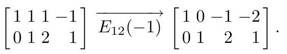
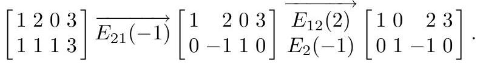

# Linear Independence

<!-- @idea: linear_independence_and_invertibility | Linear independence and connection to invertibility -->
<!-- @uses: independence_and_span, inverse_matrix, linear_independence -->
Why care about linear independence?

- Tells us whether vectors provide "new information" or redundantly describe the same directions.
- Connects to solving systems: linearly independent columns $\Rightarrow$ at most one solution to $A\mathbf{x}=\mathbf{b}$.

. . .

<!-- @introduces: linear_independence -->
## Linear Independence

::: definition

The vectors $\mathbf{v}_{1}, \mathbf{v}_{2}, \ldots, \mathbf{v}_{n}$ are **linearly dependent** if there exist scalars $c_{1}, c_{2}, \ldots, c_{n}$, not all zero, such that

$$
c_{1} \mathbf{v}_{1}+c_{2} \mathbf{v}_{2}+\cdots+c_{n} \mathbf{v}_{n}=\mathbf{0}
$$

Otherwise, the vectors are called **linearly independent**.
:::

::: notes
This doesn't mean that one of the vectors is a scalar multiple of another one.
:::

## Linear Independence in matrix form

Let's see if we can rewrite the condition for linear dependence in matrix form.

$$
c_{1} \mathbf{v}_{1}+c_{2} \mathbf{v}_{2}+\cdots+c_{n} \mathbf{v}_{n}=\mathbf{0}
$$

. . .

Define:

-  matrix $A=\left[\mathbf{v}_{1}, \mathbf{v}_{2}, \mathbf{v}_{3}\right]$
-  vector $\mathbf{c}=\left(c_{1}, c_{2}, c_{3}\right)$. 

. . .

Then:

$$
c_{1} \mathbf{v}_{1}+c_{2} \mathbf{v}_{2}+c_{3} \mathbf{v}_{3}=\left[\mathbf{v}_{1}, \mathbf{v}_{2}, \mathbf{v}_{3}\right]\left[\begin{array}{l}
c_{1} \\
c_{2} \\
c_{3}
\end{array}\right]=A \mathbf{c}
$$

. . .

Therefore, the vectors $\mathbf{v}_1, \mathbf{v}_2, \ldots, \mathbf{v}_n$ are **linearly dependent** if there exists a nontrivial (nonzero) solution to $[\mathbf{v}_1, \mathbf{v}_2, \ldots, \mathbf{v}_n] \mathbf{c}=\mathbf{0}$.

. . .

Alternatively, we can say that the *columns* of $A$ are linearly dependent if there exists a nontrivial solution to $A \mathbf{c}=\mathbf{0}$.

## The relationship between linear independence and invertibility

The *columns* of $A$ are **linearly dependent** if there exists a nontrivial solution to $A \mathbf{c}=\mathbf{0}$.

. . .

Conversely, the *columns* of $A$ are **linearly independent** if $\mathbf{c}=0$ is the only solution to $A \mathbf{c}=\mathbf{0}$.

. . .

If the matrix $A$ happens to be square, we can make a connection to invertibility.

Remember from the Day 5 lecture, one way of stating that a matrix is invertible (non-singular) is if $\mathbf{c}=0$ is the only solution to $A \mathbf{c}=\mathbf{0}$.

. . .

Therefore, for an $n \times n$ matrix $A$, the columns are **linearly independent** if and only if $A$ is invertible (non-singular).

## Checking for Linear Independence

Is this set of vectors linearly independent?

$$
 \left[\begin{array}{l}1 \\ 1 \\ 0\end{array}\right],\left[\begin{array}{l}0 \\ 1 \\ 1\end{array}\right],\left[\begin{array}{r}1 \\ -1 \\ -2\end{array}\right]
$$

. . .

Goal: find some set of scalars $c_{1}, c_{2}, c_{3}$, not all zero, such that $c_{1} \mathbf{v}_{1}+c_{2} \mathbf{v}_{2}+c_{3} \mathbf{v}_{3}=\mathbf{0}$.

. . .

How can we do this? We could just guess at some values for $c_1, c_2, c_3$ and see if they work...

 ##

 Indeed, we can see that $c_1 = -1, c_2 = 2, c_3 = 1$ works:

$$
\begin{gathered}
-1 \left[\begin{array}{l}1 \\ 1 \\ 0\end{array}\right]
+ 2 \left[\begin{array}{l}0 \\ 1 \\ 1\end{array}\right]
+ 1 \left[\begin{array}{r}1 \\ -1 \\ -2\end{array}\right] \\
=
\left[\begin{array}{l}
-1 \times 1 + 2 \times 0 + 1 \times 1 \\
-1 \times 1 + 2 \times 1 + 1 \times (-1) \\
-1 \times 0 + 2 \times 1 + 1 \times (-2)
\end{array}\right]
=
\left[\begin{array}{l}
-1 + 0 + 1 \\
-1 + 2 - 1 \\
0 + 2 - 2
\end{array}\right]
=
\left[\begin{array}{l}
0 \\
0 \\
0
\end{array}\right]
\end{gathered}
$$

So the vectors are linearly dependent.

. . .

How can we do this more systematically?

## Method: Checking for Linear Independence using Gaussian Elimination

$$
 v_1 = \left[\begin{array}{l}1 \\ 1 \\ 0\end{array}\right], v_2 = \left[\begin{array}{l}0 \\ 1 \\ 1\end{array}\right], v_3 = \left[\begin{array}{r}1 \\ -1 \\ -2\end{array}\right]
$$

To check linear independence using Gaussian Elimination, we first need to construct the matrix $A$ with the vectors as columns:

$$
A = \left[\mathbf{v}_1\ \mathbf{v}_2\ \mathbf{v}_3\right]
= \left[\begin{array}{rrr}
1 & 0 & 1 \\
1 & 1 & -1 \\
0 & 1 & -2
\end{array}\right]
$$

##

Now we need to find if there is a nontrivial solution to $A \mathbf{c}=\mathbf{0}$.

We can build the augmented matrix and find the reduced row echelon form. Here is the augmented matrix:

$$
\left[\begin{array}{rrr|r}
1 & 0 & 1 & 0 \\
1 & 1 & -1 & 0 \\
0 & 1 & -2 & 0
\end{array}\right]
$$

##

$$
\left[\begin{array}{rrr|r}
1 & 0 & 1 & 0 \\
1 & 1 & -1 & 0 \\
0 & 1 & -2 & 0
\end{array}\right]
$$

Our next step is to find the reduced row echelon form of the augmented matrix.

$$
\left[\begin{array}{rrr|r}
1 & 0 & 1 & 0 \\
1 & 1 & -1 & 0 \\
0 & 1 & -2 & 0
\end{array}\right] \xrightarrow[E_{21}(-1)]{\longrightarrow}\left[\begin{array}{rrr|r}
1 & 0 & 1 & 0 \\
0 & 1 & -2 & 0 \\
0 & 1 & -2 & 0
\end{array}\right] \xrightarrow[E_{32}(-1)]{\longrightarrow}\left[\begin{array}{rrr|r}
1 & 0 & 1 & 0 \\
0 & 1 & -2 & 0 \\
0 & 0 & 0 & 0
\end{array}\right],
$$

## Simplification when solving homogeneous systems

Actually, since the last column was all zeros, nothing happened to it during the row operations.

(Remember, when the right-hand side is all zeros, we call the system *homogeneous*.)

. . .

It would have been slightly simpler to just leave it off and find the reduced row echelon form of the matrix $A$:

. . .

$$
\left[\begin{array}{rrr}
1 & 0 & 1 \\
1 & 1 & -1 \\
0 & 1 & -2
\end{array}\right] \xrightarrow[E_{21}(-1)]{\longrightarrow}\left[\begin{array}{rrr}
1 & 0 & 1 \\
0 & 1 & -2 \\
0 & 1 & -2
\end{array}\right] \xrightarrow[E_{32}(-1)]{\longrightarrow}\left[\begin{array}{rrr}
1 & 0 & 1 \\
0 & 1 & -2 \\
0 & 0 & 0
\end{array}\right],
$$

##

Either way, we are left with the following system to solve for $\mathbf{c}$:

$$
\left[\begin{array}{rrr}
1 & 0 & 1 \\
0 & 1 & -2 \\
0 & 0 & 0
\end{array}\right]
\left[\begin{array}{c}
c_1 \\ c_2 \\ c_3
\end{array}\right]
=
\left[\begin{array}{c}
0 \\ 0 \\ 0
\end{array}\right]
$$

. . .

This corresponds to the system of equations:

$$
\begin{gathered}
c_1 + c_3 = 0 \\
c_2 - 2c_3 = 0 \\
0 = 0
\end{gathered}
$$

. . .

We see that $c_3$ is free, and then $c_1 = -c_3$ and $c_2 = 2c_3$.

. . .

Setting $c_3 = 1$, we get $c_1 = -1$ and $c_2 = 2$ -- our original guess!

. . .

But let's not forget to circle back to the original question: because we found a nontrivial solution to $A \mathbf{c}=\mathbf{0}$, the vectors are **linearly dependent**.

## Steps to check for linear independence using Gaussian Elimination

1. Set up matrix $A$ with the vectors as columns.
2. Build the augmented matrix $A | \mathbf{0}$.
3. Find the reduced row echelon form of the augmented matrix.
4. Check if there is a nontrivial solution to $A \mathbf{c}=\mathbf{0}$.

. . .

If there is a nontrivial solution, the vectors are linearly dependent. If there is no nontrivial solution, the vectors are linearly independent.

## The relationship between linear independence and determinants

A few slides back, we saw the columns of a square matrix $A$ are independent if and only if $A$ is invertible.

. . .

Last lecture, we also saw that the determinant of a square matrix $A$ is non-zero if and only if $A$ is invertible.

. . .

Putting these two together, we see that the columns of a square matrix $A$ are independent if and only if the determinant of $A$ is non-zero.

## Method: Checking for Linear Independence using Determinants

This leads to our second method for checking for linear independence:

1. Set up matrix $A$ with the vectors as columns.
2. Calculate the determinant of $A$.
3. Check if the determinant is non-zero.

. . .

If the determinant is non-zero, the vectors are linearly independent. If the determinant is zero, the vectors are linearly dependent.

## Example 2

Are the following vectors linearly independent?

$\left[\begin{array}{l}0 \\ 1 \\ 0\end{array}\right],\left[\begin{array}{l}1 \\ 1 \\ 0\end{array}\right],\left[\begin{array}{l}0 \\ 1 \\ 1\end{array}\right]$

. . .

Set up A = $\left[\begin{array}{lll}0 & 1 & 0 \\ 1 & 1 & 1 \\ 0 & 0 & 1\end{array}\right]$

. . .

What is the determinant of $A$? Let's work across the top row:

$$
\begin{gathered}
\operatorname{det}\left[\begin{array}{lll}
0 & 1 & 0 \\
1 & 1 & 1 \\
0 & 0 & 1
\end{array}\right]
= 0 \times \operatorname{det}\left[\begin{array}{ll}
1 & 1 \\
0 & 1
\end{array}\right]
- 1 \times \operatorname{det}\left[\begin{array}{ll}
1 & 1 \\
0 & 1
\end{array}\right] 
+ 0 \times \operatorname{det}\left[\begin{array}{ll}
1 & 1 \\
0 & 0
\end{array}\right] \\
= -1 \times \operatorname{det}\left[\begin{array}{ll}
1 & 0 \\
0 & 1
\end{array}\right]
= -1
\end{gathered}
$$

. . .

Determinant is non-zero, so $A$ is invertible (non-singular)

. . .

So the vectors are linearly **independent**.

## Comparing the methods: using Gaussian Elimination to check for linear independence

Let's try our first method with the same example:

$$
A = \left[\begin{array}{ccc}
0 & 1 & 0 \\
1 & 1 & 1 \\
0 & 0 & 1
\end{array}\right]
$$

We want to find if there is a nontrivial solution to $A \mathbf{c}=\mathbf{0}$.

. . .

Doing Gaussian Elimination on $A$, we get:
$$
\left[\begin{array}{ccc|c}
0 & 1 & 0 & 0 \\
1 & 1 & 1 & 0 \\
0 & 0 & 1 & 0
\end{array}\right] 
\xrightarrow{E_{12}}
\left[\begin{array}{ccc|c}
1 & 1 & 1 & 0 \\
0 & 1 & 0 & 0 \\
0 & 0 & 1 & 0
\end{array}\right]
\xrightarrow{E_{12}(-1)}
\left[\begin{array}{ccc|c}
1 & 0 & 1 & 0 \\
0 & 1 & 0 & 0 \\
0 & 0 & 1 & 0
\end{array}\right]
$$

##

Our RREF is:
$$
\left[\begin{array}{ccc|c}
1 & 0 & 1 & 0 \\
0 & 1 & 0 & 0 \\
0 & 0 & 1 & 0
\end{array}\right]
$$

. . .

Then we need to solve

$$
\left[\begin{array}{ccc}
1 & 0 & 1 \\
0 & 1 & 0 \\
0 & 0 & 1
\end{array}\right]
\left[\begin{array}{c}
c_1 \\ c_2 \\ c_3
\end{array}\right]
= \left[\begin{array}{c}
0 \\ 0 \\ 0
\end{array}\right]
$$

This corresponds to the system of equations:

$$
\begin{gathered}
c_1 + c_3 = 0 \\
c_2 = 0 \\
c_3 = 0
\end{gathered}
$$

. . .

We see that $c_3$ must be zero, and then $c_1 = -c_3 = 0$ and $c_2 = 0$.

. . .

The only solution is the trivial solution $\mathbf{c}=0$, so the vectors are linearly independent.

## Summary

- The vectors $v_1, v_2, \ldots, v_n$ are linearly independent if and only if the only solution to $[\mathbf{v}_1, \mathbf{v}_2, \ldots, \mathbf{v}_n] \mathbf{c}=\mathbf{0}$ is $\mathbf{c}=0$.
- If we define $A=[\mathbf{v}_1, \mathbf{v}_2, \ldots, \mathbf{v}_n]$, the vectors are linearly independent if and only if the only solution to $A \mathbf{c}=0$ is $\mathbf{c}=0$.
- We can check this by either using Gaussian Elimination or calculating the determinant of $A$.

## Skills: Linear Independence

- Describe linear independence in terms of solutions to $v_1 c_1 + v_2 c_2 + \ldots + v_n c_n = \mathbf{0}$.
- Construct a matrix $A$ with the vectors as columns and use Gaussian Elimination or determinants to check for linear independence.
- Interpret linear dependence in terms of solutions to $A\mathbf{c}=\mathbf{0}$.

# Vector Spaces

<!-- @idea: vector_spaces_and_basis | Vector spaces, R^n, axioms -->
<!-- @uses: basis, fundamental_subspaces, independence_and_span, span, subspace -->
##

We've been working with vectors that look like this:

$$
\mathbf{u} = \begin{bmatrix} 3 \\ -1 \end{bmatrix}, \qquad \mathbf{v} = \begin{bmatrix} 2 \\ 0 \\ 5 \end{bmatrix}
$$

These are examples of vectors in $\mathbb{R}^2$ and $\mathbb{R}^3$.

$\mathbb{R}^2$ is the set of all vectors of the form $\begin{bmatrix} x \\ y \end{bmatrix}$, where $x$ and $y$ are real numbers.

$\mathbb{R}^3$ is the set of all vectors of the form $\begin{bmatrix} x \\ y \\ z \end{bmatrix}$, where $x$, $y$, and $z$ are real numbers.

But what about this vector?

$$
\mathbf{w} = \begin{bmatrix} 1 + 2i \\ 2 - i \\ 3 \end{bmatrix}
$$

##

The elements of $\mathbf{w}$ are complex numbers, so $\mathbf{w}$ is not in $\mathbb{R}^3$. Instead, it is in $\mathbb{C}^3$, the set of all vectors of the form $\begin{bmatrix} x \\ y \\ z \end{bmatrix}$, where $x$, $y$, and $z$ are complex numbers.

$\mathbb{R}^2$, $\mathbb{R}^3$, and $\mathbb{C}^3$ are all examples of **vector spaces**. In this class, we will only be working with $\mathbb{R}^n$ and $\mathbb{C}^n$, but I want to take a moment to describe what a vector space is in general.

##

Vector spaces are sets of vectors that we can define however we like, combined with procedures for **vector addition** and **scalar multiplication**.

These sets and procedures together need to satisfy a few rules, so that we can do the usual mathematical operations that we care about.

**Closure rules:**

- The result of adding two vectors in the space should always be another vector in the space.
- The result of multiplying a vector in the space by a scalar should always be another vector in the space.

##

**Rules of addition:**

- Vector addition should be associative and commutative.
- There should be an additive identity vector (a "zero" vector)
- Every vector should have an additive inverse (its "negative")

##

**Rules of scalar multiplication:**

- Scalar multiplication should be distributive over vector addition (so $c(\mathbf{u}+\mathbf{v})=c\mathbf{u}+c\mathbf{v}$)
- There should be a multiplicative identity scalar (a "one")
- Every nonzero scalar should have a multiplicative inverse (its "reciprocal")

. . .

Put together, these rules are called the **axioms of a vector space**.

## Is $\mathbb{R}^2$ a vector space?

Let's check if $\mathbb{R}^2$ is a vector space.

. . .

**Closure under addition:**

Is the sum of any two vectors in $\mathbb{R}^2$ also a vector in $\mathbb{R}^2$?

We define addition in $\mathbb{R}^2$ as elementwise addition:

$$
\begin{bmatrix} x_1 \\ y_1 \end{bmatrix} + \begin{bmatrix} x_2 \\ y_2 \end{bmatrix} = \begin{bmatrix} x_1 + x_2 \\ y_1 + y_2 \end{bmatrix}
$$

If $x_1, x_2, y_1, y_2$ are all real numbers, then $x_1 + x_2$ and $y_1 + y_2$ are also real numbers. Therefore, the sum of any two vectors in $\mathbb{R}^2$ is also a vector in $\mathbb{R}^2$.

. . .

Therefore, $\mathbb{R}^2$ is closed under addition.

##

**Closure under scalar multiplication:**

Is the product of any scalar and any vector in $\mathbb{R}^2$ also a vector in $\mathbb{R}^2$?

We define scalar multiplication in $\mathbb{R}^2$ as elementwise multiplication by a scalar:

$$
c \begin{bmatrix} x \\ y \end{bmatrix} = \begin{bmatrix} c x \\ c y \end{bmatrix}
$$

If $c$ is a real number and $x, y$ are real numbers, then $c x$ and $c y$ are also real numbers. Therefore, the product of any scalar and any vector in $\mathbb{R}^2$ is also a vector in $\mathbb{R}^2$.

##

**The other axioms:**

We could go through and check the other axioms, but I'm not going to do that here.

## Skills: Vector Spaces

- Say what a vector space is (set of vectors plus definitions of addition and scalar multiplication, which satisfy the axioms of a vector space).
- Recognize $\mathbb{R}^n$, $\mathbb{C}^n$ as vector spaces

# Bases and Spanning Sets

<!-- @idea: spanning_sets_and_standard_basis | Spanning sets, basis, standard basis -->
<!-- @uses: basis, independence_and_span, span -->
<!-- @introduces: span -->
## Definition: Spanning Set

When we have a vector space, we can use scalar multiplication and addition to describe one vector in the space as a linear combination of other vectors in the space.

. . .

For instance, it might be that $\mathbf{w} = 2\mathbf{u_1} + 3\mathbf{u_2} + 4\mathbf{u_3}$, where $\mathbf{u_1}, \mathbf{u_2}, \mathbf{u_3}, \mathbf{w}$ are vectors in the space.

. . .

It can be useful to have a set of vectors $\{\mathbf{u}_1, \mathbf{u}_2, \ldots, \mathbf{u}_n\}$ that can be used to describe **any** vector in the space in this way!

. . .

A set of vectors like this is called a **spanning set** for the vector space.

. . .

Formally, a set of vectors $\{\mathbf{u}_1, \mathbf{u}_2, \ldots, \mathbf{u}_n\}$ is a spanning set for the vector space $V$ if for every vector $\mathbf{v} \in V$, there exist scalars $c_1, c_2, \ldots, c_n$ such that $\mathbf{v} = c_1\mathbf{u}_1 + c_2\mathbf{u}_2 + \ldots + c_n\mathbf{u}_n$.

## Example: Spanning Set for $\mathbb{R}^2$

Consider the set of vectors $\left\{\mathbf{u_1}=\left[\begin{array}{c} 1 \\ 0 \end{array}\right], \mathbf{u_2}=\left[\begin{array}{c} 0 \\ 1 \end{array}\right]\right\}$.

. . .

This set is a spanning set for $\mathbb{R}^2$ because any vector $\mathbf{v} = \begin{bmatrix} x \\ y \end{bmatrix}$ can be written as $\mathbf{v} = x\mathbf{u}_1 + y\mathbf{u}_2$.

. . .

For instance, the vector $\mathbf{v} = \begin{bmatrix} 3 \\ 4 \end{bmatrix}$ can be written as $\mathbf{v} = 3\mathbf{u}_1 + 4\mathbf{u}_2$.

##

But this is not the only spanning set for $\mathbb{R}^2$!

This is also a spanning set for $\mathbb{R}^2$:

$\left\{\mathbf{u_1}=\left[\begin{array}{c} 1 \\  2 \end{array}\right], \mathbf{u_2}=\left[\begin{array}{c} 0 \\  1 \end{array}\right]\right\}$

. . .

We can write $\mathbf{v} = \begin{bmatrix} 3 \\ 4 \end{bmatrix}$ as $\mathbf{v} = 3\mathbf{u}_1 + (-2)\mathbf{u}_2$.

##

And here is another spanning set for $\mathbb{R}^2$:

$\left\{\mathbf{u_1}=\left[\begin{array}{c} 1 \\  0 \end{array}\right], \mathbf{u_2}=\left[\begin{array}{c} 0 \\  1 \end{array}\right],\mathbf{u_3}=\left[\begin{array}{c} 1 \\  1 \end{array}\right]\right\}$

. . .

Now we have multiple ways to write $\mathbf{v} = \begin{bmatrix} 3 \\ 4 \end{bmatrix}$ as a linear combination of the vectors in the set:

$\mathbf{v} = \begin{bmatrix} 3 \\ 4 \end{bmatrix} = 3\mathbf{u}_1 + 4\mathbf{u}_2$ or $\mathbf{v} = 4\mathbf{u}_1 + (-2)\mathbf{u}_3 + 2\mathbf{u}_2$.

. . .

This isn't great... we have more vectors than we need in our spanning set!

<!-- @introduces: basis -->
## Definition: Basis

A **basis** for a vector space is a spanning set that doesn't have any redundant vectors.

More formally, a **basis** for the vector space $V$ is a *spanning* set of vectors $\mathbf{v}_{1}, \mathbf{v}_{2}, \ldots, \mathbf{v}_{n}$ that is a *linearly independent* set.

## Example: A spanning set that is not a basis

Let's look at our last spanning set from before:

$$
\left\{\mathbf{u_1}=\left[\begin{array}{c} 1 \\  0 \end{array}\right], \mathbf{u_2}=\left[\begin{array}{c} 0 \\  1 \end{array}\right],\mathbf{u_3}=\left[\begin{array}{c} 1 \\  1 \end{array}\right]\right\}
$$

. . .

We notice that vector $\mathbf{u}_3$ is a linear combination of $\mathbf{u}_1$ and $\mathbf{u}_2$:
$$
\mathbf{u}_3 = \mathbf{u}_1 + \mathbf{u}_2
$$

. . .

This means that our set $\left\{\mathbf{u_1}, \mathbf{u_2}, \mathbf{u_3}\right\}$ is linearly dependent, and therefore not a basis for $\mathbb{R}^2$.

## Standard Basis for $\mathbb{R}^n$

The **standard basis** for $\mathbb{R}^{n}$ is the set of vectors $\mathbf{e}_{1}, \mathbf{e}_{2}, \ldots, \mathbf{e}_{n}$ given by the columns of the $n \times n$ identity matrix:

$$
\mathbf{e}_1 = \begin{bmatrix} 1 \\ 0 \\ \vdots \\ 0 \end{bmatrix}, \quad \mathbf{e}_2 = \begin{bmatrix} 0 \\ 1 \\ \vdots \\ 0 \end{bmatrix}, \quad \ldots, \quad \mathbf{e}_n = \begin{bmatrix} 0 \\ \vdots \\ 0 \\ 1 \end{bmatrix}
$$

. . .

This set is a basis for $\mathbb{R}^n$ because it is a spanning set and is linearly independent.

## Showing that the Standard Basis is a Basis for the reals

- Let $\mathbf{v}=\left(c_{1}, c_{2}, \ldots, c_{n}\right)$ be any vector from $V$
- $c_{1}, c_{2}, \ldots, c_{n}$ are scalars (real or complex)

. . .

To show that the standard basis is a basis for $\mathbb{R}^n$, we need to show that it is a spanning set and is linearly independent.

**Spanning:** We need to show that we can write $\mathbf{v}$ as a linear combination of the standard basis vectors:

$$
\begin{aligned}
\mathbf{v} & =\left[\begin{array}{c}
c_{1} \\
c_{2} \\
\vdots \\
c_{n}
\end{array}\right]=c_{1}\left[\begin{array}{c}
1 \\
0 \\
\vdots \\
0
\end{array}\right]+c_{2}\left[\begin{array}{c}
0 \\
1 \\
\vdots \\
0
\end{array}\right]+\cdots+c_{n}\left[\begin{array}{c}
0 \\
\vdots \\
0 \\
1
\end{array}\right] \\
& =c_{1} \mathbf{e}_{1}+c_{2} \mathbf{e}_{2}+\cdots+c_{n} \mathbf{e}_{n} .
\end{aligned}
$$

**Linear Independence:** We need to show that the standard basis vectors are linearly independent. We can do this in either of the ways we've learned from today's lecture!

::: notes

Two points here:

1. you can make any vector in V out of a linear combination of the e's, so the e's span V.
2. the e's are linearly independent because if you have a linear combination of them that equals 0, then each coefficient must be 0.
3. Therefore, the e's are a basis of V.
:::

## Invertibility, Basis, and Linear Independence

 An $n \times n$ real matrix $A$ is invertible if and only if its columns are linearly independent

. . .

in which case they form a basis of $\mathbb{R}^{n}$

## Skills: Bases and Spanning Sets

You should be able to:

- Identify the standard basis for $\mathbb{R}^{n}$.
- Test if a set of vectors is a basis for a vector space.

# Column Space, Row Space, and Null Space

<!-- @idea: fundamental_subspaces | Column space, row space, null space -->
<!-- @uses: column_space, fundamental_subspaces, left_null_space, null_space, row_space, subspace -->
<!-- @introduces: subspace -->
## Definition: Subspace

A **subspace** of $\mathbb{R}^n$ is a subset that contains $\mathbf{0}$ and is closed under addition and scalar multiplication. Equivalently: $\mathbf{0} \in W$, and $\mathbf{u},\mathbf{v} \in W \Rightarrow \mathbf{u}+\mathbf{v} \in W$, and $\mathbf{u} \in W,\, c \in \mathbb{R} \Rightarrow c\mathbf{u} \in W$.

## The fundamental subspaces of a matrix

There are four subspaces that are associated with every matrix:

- Null space
- Column space
- Row space
- Left null space (we won't cover this in this class)

. . .

The null, column and row spaces characterize what a matrix "does."

- **Null space** $\mathcal{N}(A)$: which inputs get mapped to $\mathbf{0}$.
- **Column space** $\mathcal{C}(A)$: which outputs are reachable as $A\mathbf{x}$.
- **Row space** $\mathcal{R}(A)$: the span of the rows.

. . .

## Geometric picture (next lecture)

We will draw these subspaces in low dimensions so you can see them: $\mathcal{C}(A)$ and $\mathcal{N}(A)$ as a plane and a line in $\mathbb{R}^3$, and how that connects to solving $A\mathbf{x}=\mathbf{b}$ and to least squares.

<!-- @introduces: column_space -->
<!-- @introduces: row_space -->
## Column and Row Spaces

::: definition
The **column space** of the $m \times n$ matrix $A$ is the subspace $\mathcal{C}(A)$ of $\mathbb{R}^{m}$ spanned by the columns of $A$.
:::

. . .

::: definition
The **row space** of the $m \times n$ matrix $A$ is the subspace $\mathcal{R}(A)$ of $\mathbb{R}^{n}$ spanned by the transposes of the rows of $A$
:::

<!-- @introduces: null_space -->
## Null Space

::: definition
The **null space** of the $m \times n$ matrix $A$ is the subset $\mathcal{N}(A)$ of $\mathbb{R}^{n}$

$$
\mathcal{N}(A)=\left\{\mathbf{x} \in \mathbb{R}^{n} \mid A \mathbf{x}=\mathbf{0}\right\}
$$

:::

. . .

$\mathcal{N}(A)$ is just the solution set to  $A \mathbf{x}=\mathbf{0}$

. . .

For example, if $A$ is invertible, $A \mathbf{x}=\mathbf{0}$ has only the trivial solution $\mathbf{x}=\mathbf{0}$

. . .

so $\mathcal{N}(A)$ is just $\left\{\mathbf{0}\right\}$.

. . .

$A$ is invertible exactly if $\mathcal{N}(A)=\{\mathbf{0}\}$

## Kernel of an Operator

**Why "kernel" as well as "null space"?**

- **Null space (matrix language):** For a matrix $A$, the null space is the set of $\mathbf{x}$ with $A\mathbf{x}=\mathbf{0}$.
- **Kernel (map language):** For a linear map $T:V\to W$, the set of inputs that $T$ sends to the zero vector is called the **kernel** of $T$.
- **Connection:** For the matrix map $T(\mathbf{x})=A\mathbf{x}$, we have $\operatorname{ker}(T)=\mathcal{N}(A)$.

. . .

::: definition
The **kernel** of the linear operator $T : V \rightarrow W$ is the subspace of $V$ defined by

$$
\operatorname{ker}(T)=\{\mathbf{x} \in V \mid T(\mathbf{x})=\mathbf{0}\}
$$

i.e., all inputs that $T$ maps to the zero vector in $W$.
:::

. . .

For the matrix operator $T(\mathbf{x})=A\mathbf{x}$, we have $\operatorname{ker}(T)=\mathcal{N}(A)$. In this course we mainly use "null space"; "kernel" is the same concept when we refer to the map rather than the matrix.

## Method: Finding the null space

To find $\mathcal{N}(A)$ we need all $\mathbf{x}$ such that $A\mathbf{x}=\mathbf{0}$.

1. Form the homogeneous system and find the RREF of $A$ (or of $[A\mid\mathbf{0}]$; the extra column stays zero).
2. Identify free variables vs bound variables from the pivot columns.
3. Write the general solution $\mathbf{x}$ in terms of the free variables.
4. Express that general solution as a linear combination of vectors (one vector per free variable). Those vectors span $\mathcal{N}(A)$ and are linearly independent, so they form a **basis** for $\mathcal{N}(A)$.

. . .

## Example: Finding the null space

Find the null space of the matrix

$$
A=\left[\begin{array}{rrrr}
1 & 1 & 1 & -1 \\
0 & 1 & 2 & 1 
\end{array}\right]
$$

So we want all $\mathbf{x}$ with $A\mathbf{x}=\mathbf{0}$, i.e. the system
$$
\begin{aligned}
x_{1}+x_{2}+x_{3}-x_{4} & =0 \\
x_{2}+2 x_{3}+x_{4} & =0
\end{aligned}
$$

. . .

**Step 1:** Find the RREF of $A$.

. . .

. . .

**Step 2:** From RREF, pivots are in columns 1 and 2, so $x_3$ and $x_4$ are free; $x_1$ and $x_2$ are bound. Solve for the bound variables in terms of the free ones:

$$
\begin{aligned}
& x_{1}=x_{3}+2 x_{4} \\
& x_{2}=-2 x_{3}-x_{4} .
\end{aligned}
$$

## Example: Finding the null space (continued)

From the previous slide we had $x_1=x_3+2x_4$, $x_2=-2x_3-x_4$ (free: $x_3$, $x_4$).

. . .

**Step 3:** Write the general solution $\mathbf{x}$ as a linear combination of two vectors (one per free variable):

$$
\left[\begin{array}{c}
x_{1} \\
x_{2} \\
x_{3} \\
x_{4}
\end{array}\right]=\left[\begin{array}{c}
x_{3}+2 x_{4} \\
-2 x_{3}-x_{4} \\
x_{3} \\
x_{4}
\end{array}\right]=x_{3}\left[\begin{array}{r}
1 \\
-2 \\
1 \\
0
\end{array}\right]+x_{4}\left[\begin{array}{r}
2 \\
-1 \\
0 \\
1
\end{array}\right] .
$$

. . .

**Step 4:** Every solution is a linear combination of those two vectors, and they are linearly independent. So

$$
\mathcal{N}(A)=\operatorname{span}\left\{\left[\begin{array}{r}
1 \\
-2 \\
1 \\
0
\end{array}\right],\left[\begin{array}{r}
2 \\
-1 \\
0 \\
1
\end{array}\right]\right\} \subseteq \mathbb{R}^{4}
$$

and these two vectors form a **basis** for $\mathcal{N}(A)$.

## Using the null space to find a basis for the column space

**Why does null space help?**

- The columns of $A$ span $\mathcal{C}(A)$, but they may be linearly dependent (redundant).
- To get a basis, we want to drop columns that are linear combinations of the others.
- The null space tells us those dependencies: every solution $\mathbf{x}$ to $A\mathbf{x}=\mathbf{0}$ gives $x_1\mathbf{a}_1+\cdots+x_n\mathbf{a}_n=\mathbf{0}$.
- If $x_j\neq 0$, then $\mathbf{a}_j$ is a combination of the other columns—so we can remove it from a spanning set.

. . .

## Method: column space basis from null space

1. Find the null space (general solution to $A\mathbf{x}=\mathbf{0}$).
2. From that general solution, plug in simple choices (one free variable $=1$, rest $=0$) to get specific relations among the columns.
3. Each relation shows one column is redundant.
4. The columns that are *not* redundant (the pivot columns) form a basis for $\mathcal{C}(A)$.

. . .

## Example: Basis for column space from null space

Same matrix as before:

$$
A=\left[\begin{array}{rrrr}
1 & 1 & 1 & -1 \\
0 & 1 & 2 & 1 
\end{array}\right]=\left[\mathbf{a}_{1}, \mathbf{a}_{2}, \mathbf{a}_{3}, \mathbf{a}_{4}\right]
$$

We already found that the general solution to $A\mathbf{x}=\mathbf{0}$ is
$\mathbf{x}=\left(x_{3}+2 x_{4},\,-2 x_{3}-x_{4},\, x_{3},\, x_{4}\right)$, so any solution satisfies
$\mathbf{0}=x_{1} \mathbf{a}_{1}+x_{2} \mathbf{a}_{2}+x_{3} \mathbf{a}_{3}+x_{4} \mathbf{a}_{4}$.

. . .

**Get dependency relations:** Set one free variable to 1 and the others to 0.

- $x_3=1$, $x_4=0$ $\Rightarrow$ $x_1=1$, $x_2=-2$ $\Rightarrow$ $\mathbf{0}=\mathbf{a}_{1}-2\mathbf{a}_{2}+\mathbf{a}_{3}$, so $\mathbf{a}_{3}=\mathbf{a}_{1}+2\mathbf{a}_{2}$ (column 3 is redundant).

- $x_3=0$, $x_4=1$ $\Rightarrow$ $x_1=2$, $x_2=-1$ $\Rightarrow$ $\mathbf{0}=2\mathbf{a}_{1}-\mathbf{a}_{2}+\mathbf{a}_{4}$, so $\mathbf{a}_{4}=-2\mathbf{a}_{1}+\mathbf{a}_{2}$ (column 4 is redundant).

## Example: Basis for column space (conclusion)

We had $\mathbf{a}_3=\mathbf{a}_1+2\mathbf{a}_2$ and $\mathbf{a}_4=-2\mathbf{a}_1+\mathbf{a}_2$, so columns 3 and 4 are redundant. Columns 1 and 2 (pivot columns) are linearly independent.

. . .

So a basis for $\mathcal{C}(A)$ is $\{\mathbf{a}_1,\mathbf{a}_2\}$:

$$
\mathcal{C}(A)=\operatorname{span}\left\{\mathbf{a}_{1}, \mathbf{a}_{2}\right\}=\operatorname{span}\left\{\left[\begin{array}{l}1 \\ 0\end{array}\right],\left[\begin{array}{l}1 \\ 1\end{array}\right]\right\}
$$

## Skills: Fundamental Subspaces

You should be able to:

- Find a basis for the null space of a matrix.
- Find a basis for the column space using the pivot-column / null-space method.
- Determine if a matrix is invertible from its null space ($\mathcal{N}(A)=\{\mathbf{0}\}$).

# Applications

Applications of null space and column space: finding equilibria, checking consistency, and describing solution sets.

. . .

<!-- @idea: applications_markov_and_consistency | Markov steady state, consistency, solution geometry -->
<!-- @uses: consistent_system, dynamical_and_markov, markov_chain, stationary_vector, transition_matrix -->
## Markov chain steady state (finding equilibrium)

**Motivation:**

- In a Markov chain, a probability vector $\mathbf{x}^{(k)}$ updates by $\mathbf{x}^{(k+1)}=A\mathbf{x}^{(k)}$ for a fixed transition matrix $A$.
- A **steady state** (equilibrium) is a vector $\mathbf{x}$ that does not change under the update: $\mathbf{x}=A\mathbf{x}$.
- We can find it using the **null space** of $I-A$.

. . .

**Setup:** Suppose the chain has a stable transition matrix $A=\left[\begin{array}{ll}0.7 & 0.4 \\ 0.3 & 0.6\end{array}\right]$, so that
$$
\mathbf{x}^{(k+1)}=A \mathbf{x}^{(k)}.
$$
What is the steady-state vector $\mathbf{x}$? (The limit as $k \rightarrow \infty$ of $\mathbf{x}^{(k)}$.)

##

**Key step:** At equilibrium, $\mathbf{x}=A\mathbf{x}$. Rearranging:
$$
\mathbf{x}-A\mathbf{x}=\mathbf{0} \quad\Rightarrow\quad (I-A)\mathbf{x}=\mathbf{0}.
$$

. . .

So every steady-state vector must lie in **$\mathcal{N}(I-A)$**.

. . .

There may be more than one vector in $\mathcal{N}(I-A)$, but not all of them are valid probability distributions.

. . .

Our approach: find the null space; then pick the vector that is a valid probability distribution (nonnegative entries, sum 1).

## Markov chain: finding $\mathcal{N}(I-A)$

**Step 1:** Compute $I-A$ and row reduce:

$$
I-A=\left[\begin{array}{rr}
0.3 & -0.4 \\
-0.3 & 0.4
\end{array}\right] \xrightarrow{\mathrm{RREF}}\left[\begin{array}{rr}
1 & -4/3 \\
0 & 0
\end{array}\right].
$$

. . .

Solution set: $x_{1}=(4/3)x_{2}$. So $\mathcal{N}(I-A)$ is spanned by $\mathbf{v}=(4/3, 1)$ (or equivalently $(4,3)$).

## Markov chain: normalizing to a probability vector

$\mathcal{N}(I-A)$ is spanned by $(4/3, 1)$. Steady-state vectors must have **nonnegative** entries that **sum to 1**.

. . .

**Step 2:** The only such multiple with sum 1 is
$$
\frac{1}{(4/3)+1}(4/3,\,1) = \frac{3}{7}(4/3,\,1) = (4/7,\,3/7) \approx (0.571,\,0.429).
$$
So the unique steady-state (probability) vector is $\mathbf{x}=(4/7,\,3/7)$.

## Consistency and Column Space: Back to Linear Systems

When is $A\mathbf{x}=\mathbf{b}$ consistent? That is, when does $A\mathbf{x}=\mathbf{b}$ have a solution?

. . .

We can find the answer by looking at the column space of $A$. 

. . .

::: theorem
The linear system $A \mathbf{x}=\mathbf{b}$ of $m$ equations in $n$ unknowns is consistent **if and only if** $\mathbf{b} \in \mathcal{C}(A)$.
:::

##

**In other words:**

- $A\mathbf{x}$ is a linear combination of the columns of $A$ (coefficients = entries of $\mathbf{x}$).
- So $A\mathbf{x}=\mathbf{b}$ has a solution exactly when $\mathbf{b}$ is such a combination—i.e. $\mathbf{b} \in \mathcal{C}(A)$.

## Method: testing if a vector is in a spanning set

**Goal:** Decide whether $\mathbf{b} \in \operatorname{span}\{\mathbf{v}_1,\ldots,\mathbf{v}_k\}$.

1. Form $A=[\mathbf{v}_1,\ldots,\mathbf{v}_k]$. Then $\mathbf{b} \in \mathcal{C}(A)$ iff $A\mathbf{x}=\mathbf{b}$ is consistent.

2. Form the augmented matrix $[A\mid\mathbf{b}]$ (or $[A\mid\mathbf{b}_1\mid\mathbf{b}_2\mid\cdots]$ to test several vectors at once) and row reduce.

3. Decide consistency from the RREF:

   - **Pivot in an augmented column** $\Rightarrow$ a row $[0\;\cdots\;0\mid 1]$ (i.e. $0=1$) $\Rightarrow$ inconsistent $\Rightarrow$ that vector $\notin \mathcal{C}(A)$.
   - **No pivot in that augmented column** $\Rightarrow$ consistent $\Rightarrow$ that vector $\in \mathcal{C}(A)$.

. . .

## Example: which vector is in the span?

- Let $V=\operatorname{span}\{\mathbf{v}_1,\mathbf{v}_2,\mathbf{v}_3\}$ where
  - $\mathbf{v}_1=(1,1,3,3)$
  - $\mathbf{v}_2=(0,2,2,4)$
  - $\mathbf{v}_3=(1,0,2,1)$
- Which of the vectors is in $V$?
  - $\mathbf{u}=(2,1,5,4)$
  - $\mathbf{w}=(1,0,0,0)$

. . .

Form $A=[\mathbf{v}_1,\mathbf{v}_2,\mathbf{v}_3]$ and $[A\mid\mathbf{u}\mid\mathbf{w}]$, then row reduce:

. . .

$$
[A \mid \mathbf{u} \mid \mathbf{w}]=\left[\begin{array}{lllll}
1 & 0 & 1 & 2 & 1 \\
1 & 2 & 0 & 1 & 0 \\
3 & 2 & 2 & 5 & 0 \\
3 & 4 & 1 & 4 & 0
\end{array}\right] \quad \Longrightarrow \quad \mathrm{RREF}=\left[\begin{array}{rrrrr}
1 & 0 & 1 & 2 & 0 \\
0 & 1 & -\frac{1}{2} & -\frac{1}{2} & 0 \\
0 & 0 & 0 & 0 & 1 \\
0 & 0 & 0 & 0 & 0
\end{array}\right]
$$

. . .

Column 4 = $\mathbf{u}$, column 5 = $\mathbf{w}$. No pivot in column 4 $\Rightarrow$ $\mathbf{u} \in V$; pivot in column 5 $\Rightarrow$ $\mathbf{w} \notin V$.

##

**One representation of $\mathbf{u}$:**

- From the general solution to $A\mathbf{x}=\mathbf{u}$ (free variable $c_3$), we get

$$
\mathbf{u}=(2-c_3)\mathbf{v}_1+\frac{1}{2}(c_3-1)\mathbf{v}_2+c_3\mathbf{v}_3.
$$

- Example: if $c_3=0$, then $\mathbf{u}=2\mathbf{v}_1-\frac{1}{2}\mathbf{v}_2$.

## Form of general solution to a linear system

We know the solution set of $A\mathbf{x}=\mathbf{0}$ is the null space (a subspace through the origin). For $A\mathbf{x}=\mathbf{b}$ with $\mathbf{b}\neq\mathbf{0}$, the solution set is not a subspace—but once we find one particular solution, the rest of the solutions come from adding null-space vectors.

. . .

::: theorem

- Suppose the system $A \mathbf{x}=\mathbf{b}$ has a particular solution $\mathbf{x}_{*}$. 

- Then the general solution $\mathbf{x}$ to this system can be described by the equation

:::: {.fragment}
$$
\mathbf{x}=\mathbf{x}_{*}+\mathbf{z}
$$

where $\mathbf{z}$ runs over all elements of $\mathcal{N}(A)$.
::::

:::

## Form of general solution: geometry

So $\mathbf{x}=\mathbf{x}_*+\mathbf{z}$ with $\mathbf{z}\in\mathcal{N}(A)$.

. . .

Solution set is the set of all **translates** of the null space by the particular solution $\mathbf{x}_*$—a copy of the null space shifted away from the origin.

. . .

When the number of free variables is 1 or 2 (in 2D or 3D), the solution set is a **point**, a **line**, or a **plane**—not necessarily through the origin.

## Example

Describe the solution set of the system
$$
\begin{array}{r}
x+2 y=3 \\
x+y+z=3 .
\end{array}
$$
(Three unknowns; one free variable.)

. . .

. . .

**Parametric form:** From $x+2y=3$ we get $x=3-2y$. Substituting into $x+y+z=3$ gives $z=y$. So the general solution is
$$
x=3-2t,\quad y=t,\quad z=t \quad (t \in \mathbb{R}).
$$
The solution set is a **line** in $\mathbb{R}^3$ (one free variable): not through the origin (particular solution $(3,0,0)$ when $t=0$), in the direction of $\mathbf{z}=(-2,1,1) \in \mathcal{N}(A)$.

## Gas diffusion in a tube: matrices simplify physical systems

**Motivation:**

- Diffusion (e.g., gas in a tube) spreads concentration from each point to its neighbors.
- After discretizing space and time, the next value at site $i$ depends on the current values at $i-1$, $i$, and $i+1$.
- Stacking all sites into a vector turns the recurrence into a single **matrix update**: $\mathbf{y}_{t+1}=(I+dM)\mathbf{y}_t$.

. . .

**Model:** At each site $i$ and time $t$,
$$
y_{i,\,t+1}=y_{i,\,t}+d\left(y_{i-1,\,t}-2y_{i,\,t}+y_{i+1,\,t}\right),
$$
with $d=kD/h^2$. Stack all sites into $\mathbf{y}_t$; then $\mathbf{y}_{t+1}=(I+dM)\mathbf{y}_t$ for a simple banded matrix $M$.

## Gas diffusion: inverse problem

Forward evolution: $\mathbf{y}_{t+1}=(I+dM)\mathbf{y}_t$. Given **future** $\mathbf{y}_{t+1}$, infer **past** $\mathbf{y}_t$:

- **Exact:** $\mathbf{y}_t=(I+dM)^{-1}\mathbf{y}_{t+1}$ (invert the matrix).
- **Approximate:** $\mathbf{y}_t\approx \mathbf{y}_{t+1}-dM\mathbf{y}_{t+1}$ (replace $\mathbf{y}_t$ on the right by $\mathbf{y}_{t+1}$ and solve once).

. . .

**Why the approximation works:**

- For small $d$, Taylor series gives $(I+dM)^{-1}=I-dM+O(d^2)$.
- So $\mathbf{y}_t=(I+dM)^{-1}\mathbf{y}_{t+1}\\approx (I-dM)\mathbf{y}_{t+1}$, which matches the one-step approximation to first order in $d$.

## Null Space algorithm

Given an $m \times n$ matrix $A$.

1. Compute the reduced row echelon form $R$ of $A$.

2. Use $R$ to find the general solution to the homogeneous system $A \mathbf{x}=0$.

3. Write the general solution $\mathbf{x}=\left(x_{1}, x_{2}, \ldots, x_{n}\right)$ to the homogeneous system in the form

. . .

$$
\mathbf{x}=x_{i_{1}} \mathbf{w}_{1}+x_{i_{2}} \mathbf{w}_{2}+\cdots+x_{i_{n-r}} \mathbf{w}_{n-r}
$$

where $x_{i_{1}}, x_{i_{2}}, \ldots, x_{i_{n-r}}$ are the free variables.

. . .

4. List the vectors $\mathbf{w}_{1}, \mathbf{w}_{2}, \ldots, \mathbf{w}_{n-r}$. These form a basis of $\mathcal{N}(A)$.

## Skills: Applications

You should be able to:

- Find steady-state vectors of Markov chains using the null space of $I-A$.
- Determine if $A\mathbf{x}=\mathbf{b}$ is consistent using column space ($\mathbf{b}\in\mathcal{C}(A)$).
- Describe solution-set geometry (point, line, plane) using null space and particular solutions.

