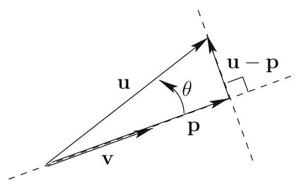

# Geometrical View of Column Space

<!-- @idea: column_space_geometry | Column space as line/plane, rank -->
<!-- @uses: column_space, fundamental_subspaces -->
## Why column space matters

- **Consistency of $A\mathbf{x}=\mathbf{b}$:** solvable exactly when $\mathbf{b} \in \mathcal{C}(A)$ (the "reachable" set).
- **Least squares:** Later today: when $\mathbf{b} \notin \mathcal{C}(A)$, we find the **closest point** in $\mathcal{C}(A)$ to $\mathbf{b}$ (projection onto the column space).
- Seeing $\mathcal{C}(A)$ as a line or plane makes this concrete.


## Example: a rank-1 matrix

$$
A = \begin{bmatrix} 1 & 2 & 0 \\ 1 & 2 & 0 \\ 0 & 0 & 0 \end{bmatrix}
$$

Columns are $\mathbf{a}_1 = (1,1,0)$, $\mathbf{a}_2 = 2\mathbf{a}_1$, $\mathbf{a}_3 = \mathbf{0}$.

. . .

The only vectors that we can form by taking linear combinations of the columns of $A$ are multiples of $\begin{bmatrix} 1 \\ 1 \\ 0 \end{bmatrix}$.

. . .

A *basis* for the column space is just this single vector: $\left\lbrace \begin{bmatrix} 1 \\ 1 \\ 0 \end{bmatrix} \right\rbrace$.

. . .

Because there is only one vector in the basis, the matrix has rank 1.

## Visualizing the column space of our rank-1 matrix

Here are some vectors that are in the column space of $A$:

$$
\begin{bmatrix} 1 \\ 1 \\ 0 \end{bmatrix}, \begin{bmatrix} 2 \\ 2 \\ 0 \end{bmatrix}, \begin{bmatrix} 3 \\ 3 \\ 0 \end{bmatrix}, \begin{bmatrix} 4 \\ 4 \\ 0 \end{bmatrix}, \begin{bmatrix} 5 \\ 5 \\ 0 \end{bmatrix}, \begin{bmatrix} -1 \\ -1 \\ 0 \end{bmatrix}, \begin{bmatrix} -2 \\ -2 \\ 0 \end{bmatrix}
$$

. . .

If we draw these vectors in $\mathbb{R}^3$, we see that they all lie on the same line. *This line is the column space of $A$*.

(draw it)

##

Remember, the column space tells us which vectors $\mathbf{b}$ can be written as $A\mathbf{x}$ for some $\mathbf{x}$. 

. . .

So if a vector $\mathbf{b}$ is not on this line, we know that there is no solution to $A\mathbf{x}=\mathbf{b}$.

. . .

(draw a b slightly off the line, and one very far off the line)

## Example: a rank-2 matrix

$$
A = \begin{bmatrix} 1 & 1 & 2 \\ 1 & 2 & 3 \\ 2 & 1 & 3 \end{bmatrix}
$$

. . .

The first two columns are independent, but the third is a linear combination of the first two. 

. . .

We can make a basis for the column space by taking the first two columns: $\left\lbrace \begin{bmatrix} 1 \\ 1 \\ 2 \end{bmatrix}, \begin{bmatrix} 1 \\ 2 \\ 1 \end{bmatrix} \right\rbrace$.

##

$$
\mathcal{C}(A) = \mathrm{span}\left\lbrace \begin{bmatrix} 1 \\ 1 \\ 2 \end{bmatrix}, \begin{bmatrix} 1 \\ 2 \\ 1 \end{bmatrix} \right\rbrace
$$

Here are some vectors that are in the column space of $A$:

$$
\begin{bmatrix}
1 \\ 1 \\ 2
\end{bmatrix}
= 1 \cdot \mathbf{a}_1 + 0 \cdot \mathbf{a}_2,
\qquad
\begin{bmatrix}
1 \\ 2 \\ 1
\end{bmatrix}
= 0 \cdot \mathbf{a}_1 + 1 \cdot \mathbf{a}_2,
$$

$$
\begin{bmatrix}
2 \\ 3 \\ 3
\end{bmatrix}
= 1 \cdot \mathbf{a}_1 + 1 \cdot \mathbf{a}_2,
\qquad
\begin{bmatrix}
3 \\ 3 \\ 6
\end{bmatrix}
= 3 \cdot \mathbf{a}_1 + 0 \cdot \mathbf{a}_2
$$

## Visualizing the column space of our rank-2 matrix

```{python}
import plotly.graph_objects as go
import numpy as np

# Column space basis and example vectors (all in C(A))
a1 = np.array([1, 1, 2])
a2 = np.array([1, 2, 1])
example_vectors = [
    np.array([1, 1, 2]),
    np.array([1, 2, 1]),
    np.array([2, 3, 3]),
    np.array([3, 3, 6]),
]

# Create figure (plane not shown, only vectors)
fig = go.Figure()

# Colors for each vector for contrast
colors = ['crimson', 'darkorange', 'seagreen', 'royalblue']
for v, c in zip(example_vectors, colors):
    fig.add_trace(go.Scatter3d(
        x=[0, v[0]], y=[0, v[1]], z=[0, v[2]],
        mode='lines+markers',
        line=dict(width=7, color=c),
        marker=dict(size=7, color=c),
        showlegend=False  # Hide legend
    ))

fig.update_layout(
    title=dict(text="Column space and example vectors", x=0.5),
    scene=dict(
        xaxis_title="x",
        yaxis_title="y",
        zaxis_title="z",
        aspectmode='data',
        camera=dict(eye=dict(x=1.4, y=1.4, z=1.1))
    ),
    margin=dict(l=0, r=0, b=0, t=30),
    height=420,
    template='plotly_white',
    showlegend=False  # Hide legend
)
fig.show()
```

##

```{python}
import plotly.graph_objects as go
import numpy as np

# Column space basis and example vectors (all in C(A))
a1 = np.array([1, 1, 2])
a2 = np.array([1, 2, 1])
example_vectors = [
    np.array([1, 1, 2]),
    np.array([1, 2, 1]),
    np.array([2, 3, 3]),
    np.array([3, 3, 6]),
]

# Create figure
fig = go.Figure()

# Add the filled plane span{a1, a2} through origin (large extent)
s = np.linspace(-3.75, 3.75, 24)
t = np.linspace(-3.75, 3.75, 24)
S, T = np.meshgrid(s, t)
X = S * a1[0] + T * a2[0]
Y = S * a1[1] + T * a2[1]
Z = S * a1[2] + T * a2[2]
fig.add_trace(go.Surface(
    x=X, y=Y, z=Z,
    colorscale=[[0, 'lightblue'], [1, 'lightblue']],
    opacity=0.45,
    showscale=False,
    name="Plane"
))

# Colors for each vector for contrast
colors = ['crimson', 'darkorange', 'seagreen', 'royalblue']
for v, c in zip(example_vectors, colors):
    fig.add_trace(go.Scatter3d(
        x=[0, v[0]], y=[0, v[1]], z=[0, v[2]],
        mode='lines+markers',
        line=dict(width=7, color=c),
        marker=dict(size=7, color=c),
        showlegend=False  # Hide legend
    ))

fig.update_layout(
    title=dict(text="Column space (plane filled) and example vectors", x=0.5),
    scene=dict(
        xaxis_title="x",
        yaxis_title="y",
        zaxis_title="z",
        aspectmode='data',
        camera=dict(eye=dict(x=0.9, y=0.9, z=0.7))
    ),
    margin=dict(l=0, r=0, b=0, t=30),
    height=420,
    template='plotly_white',
    showlegend=False
)
fig.show()
```

## General form of the column space in $\mathbb{R}^3$


In $\mathbb{R}^3$, the dimension of $\mathcal{C}(A)$ equals the **rank** $r$ of $A$:

- **Rank 1:** $\mathcal{C}(A)$ is a **line** (all columns are multiples of one vector).
- **Rank 2:** $\mathcal{C}(A)$ is a **plane** (span of two independent columns).
- **Rank 3:** $\mathcal{C}(A)$ is **all of $\mathbb{R}^3$**.

## General form of the column space in $\mathbb{R}^n$

In $\mathbb{R}^n$, the dimension of $\mathcal{C}(A)$ equals the **rank** $r$ of $A$:

- **Rank 1:** $\mathcal{C}(A)$ is a **line** (all columns are multiples of one vector).
- **Rank 2:** $\mathcal{C}(A)$ is a **plane** (span of two independent columns).
- **Rank n-1:** $\mathcal{C}(A)$ is a **hyperplane** (span of n-1 independent columns in $\mathbb{R}^n$).

## Input and output spaces

The pictures we have drawn of the column space represent the possible *outputs* $\mathbf{b}$ from the linear system $A\mathbf{x}=\mathbf{b}$.

. . .

In our example, all potential outputs $\mathbf{b}$ live in $\mathbb{R}^3$, but the only ones that are actually reachable are those that are on a line or a plane within $\mathbb{R}^3$. So the column space of $A$ is a special subspace of the output space.

. . .

Formally, we call the output space the **codomain** of $A$, and the column space of $A$ is a **subspace** of the codomain.

. . .

But there's another space that's important: the space of all the possible inputs $\mathbf{x}$ that can be fed into $A$. We call this the **domain** of $A$.

In our examples so far, because the vectors $\mathbf{x}$ are all in $\mathbb{R}^3$, the domain is also $\mathbb{R}^3$.

## Domain and codomain for a rectangular matrix

Let's consider a simple 2x3 matrix:

$$
F = \begin{bmatrix} 1 & 2 & 0 \\ 1 & 2 & 0 \end{bmatrix}
$$

. . .

For the system $F\mathbf{x}=\mathbf{b}$, the possible inputs $\mathbf{x}$ are all in $\mathbb{R}^3$, and the possible outputs $\mathbf{b}$ are all in $\mathbb{R}^2$.

. . .

For example, if we take $\mathbf{x} = \begin{bmatrix} 1 \\ 2 \\ 3 \end{bmatrix}$, then
$$
F\mathbf{x} = \begin{bmatrix} 1 & 2 & 0 \\ 1 & 2 & 0 \end{bmatrix} \begin{bmatrix} 1 \\ 2 \\ 3 \end{bmatrix} = \begin{bmatrix} 5 \\ 5 \end{bmatrix} = \mathbf{b}
$$

So $\mathbf{x}=\begin{bmatrix} 1 \\ 2 \\ 3 \end{bmatrix}$ is in the domain of $F$, and $\mathbf{b}=\begin{bmatrix} 5 \\ 5 \end{bmatrix}$ is in the codomain of $F$.

## Column space and null space are special subspaces

We know that $\mathbf{b}=\begin{bmatrix} 5 \\ 5 \end{bmatrix}$ is in the column space of $F$ because we constructed it from multiplying $F$ by $\mathbf{x}$.

. . .

There are other vectors, such as $\begin{bmatrix} 1 \\ -1 \end{bmatrix}$, that are in the codomain of $F$ but not in its column space.

. . .

The column space is a **subspace** of the codomain, and it tells us something about the matrix $F$.

##

Is there a similar special subset of the vectors in the *domain* that tells us something about the matrix $F$? There is!

. . .

Yes, it's the *null space* of $F$. The null space of $F$ is the set of all vectors $\mathbf{x}$ such that $F\mathbf{x}=\mathbf{0}$.

. . .

For example, the vector $\begin{bmatrix} 1 \\ -1 \\ 0 \end{bmatrix}$ is in the null space of $F$ because
$$
F\begin{bmatrix} 1 \\ -1 \\ 0 \end{bmatrix} = \begin{bmatrix} 1 & 2 & 0 \\ 1 & 2 & 0 \end{bmatrix} \begin{bmatrix} 1 \\ -1 \\ 0 \end{bmatrix} = \begin{bmatrix} 1 \cdot 1 + 2 \cdot (-1) + 0 \cdot 0 \\ 1 \cdot 1 + 2 \cdot (-1) + 0 \cdot 0 \end{bmatrix} = \begin{bmatrix} 0 \\ 0 \end{bmatrix} = \mathbf{0}
$$


## Visualizing the null space

If we know a basis for the null space, we can visualize it in the domain.

. . .

We haven't learned how to find these yet, but for our example matrix $F=\begin{bmatrix} 1 & 2 & 0 \\ 1 & 2 & 0 \end{bmatrix}$, I'll just tell you that the basis for the null space is $\left\lbrace \begin{bmatrix} -2 \\ 1 \\ 0 \end{bmatrix}, \begin{bmatrix} 0 \\ 0 \\ 1 \end{bmatrix} \right\rbrace$.

. . .

So the null space will form a plane in $\mathbb{R}^3$.

## Visualizing both the column space and the null space

But because the null space is a subspace of the **input space** (the domain) and the column space is a subspace of the **output space** (the codomain), we can't visualize them together in the same picture.

So we'll visualize them separately.

##

The column space $\mathcal{C}(F)$ is all vectors in $\mathbb{R}^2$ that are multiples of $\begin{bmatrix} 1 \\ 1 \end{bmatrix}$.

The null space $\mathcal{N}(F)$ is that spanned by the vectors $\begin{bmatrix} -2 \\ 1 \\ 0 \end{bmatrix}$ and $\begin{bmatrix} 0 \\ 0 \\ 1 \end{bmatrix}$.

```{python}
import numpy as np
import matplotlib.pyplot as plt

fig = plt.figure(figsize=(12, 5))

# First subplot: column space in 2D (a line in R^2)
ax1 = fig.add_subplot(1, 2, 1)
# Line through origin along [1, 1]
t = np.linspace(-3, 3, 100)
line = np.vstack((t, t))  # [t, t] for t in R

ax1.plot(line[0], line[1], color='royalblue', lw=2, label='Column space')
ax1.scatter([0], [0], color='black')  # origin
ax1.set_xlabel("$b_1$")
ax1.set_ylabel("$b_2$")
ax1.set_title(r"Column space in $\mathbb{R}^2$")
ax1.grid(True)
ax1.set_aspect('equal')
ax1.legend()

# Second subplot: null space in 3D (a plane in R^3)
from mpl_toolkits.mplot3d import Axes3D  # noqa: F401

ax2 = fig.add_subplot(1, 2, 2, projection='3d')

# The null space plane: spanned by [-2, 1, 0] and [0, 0, 1]
s = np.linspace(-2, 2, 20)
t = np.linspace(-2, 2, 20)
S, T = np.meshgrid(s, t)
X = -2*S
Y = S
Z = T
# Plane points: for each (s, t): s * [-2,1,0] + t * [0,0,1]
ax2.plot_surface(X, Y, Z, alpha=0.4, color='tomato', rstride=1, cstride=1, edgecolor='none')

# Draw the two basis vectors of the plane
ax2.quiver(0, 0, 0, -2, 1, 0, color='maroon', length=2.2, normalize=True, linewidth=2)
ax2.quiver(0, 0, 0, 0, 0, 1, color='darkred', length=2.2, normalize=True, linewidth=2)

ax2.set_xlabel("$x_1$")
ax2.set_ylabel("$x_2$")
ax2.set_zlabel("$x_3$")
ax2.set_title("Null space in $\mathbb{R}^3$")
ax2.view_init(elev=18, azim=121)

plt.tight_layout()
plt.show()
```

## Row space and left null space

The row space of a matrix $A$ is the subspace of $\mathbb{R}^m$ spanned by the rows of $A$. It is also the column space of $A^T$.

<!-- @introduces: left_null_space -->
The left null space of a matrix $A$ is just the null space of $A^T$.


## Skills: Fundamental Subspaces (Pictures)

- Interpret $\mathcal{C}(A)$ geometrically (line, plane, or hyperplane) from the rank of $A$.
- Distinguish between the domain (where $\mathbf{x}$ lives) and codomain (where $A\mathbf{x}$ lives) for a matrix.
- Identify the column space as a subspace of the codomain; the null space as a subspace of the domain.
- Given a basis for $\mathcal{N}(A)$, describe its shape (line, plane, etc.) in the input space.


# Planes, Hyperplanes, and Projections

<!-- @idea: planes_and_projections | Planes, hyperplanes, projection onto plane -->
<!-- @uses: column_space, least_squares_and_projection, projection -->
## The plane through the origin

Because the column space is so often a plane, let's build our intuition about planes.

::: notes
Give out toothpicks and cards and markers. Have students put a dot in the center of the card and say this is the origin. Imagine the card is an infinite plane. Now have them hold one end of their marker at the "origin"; the other end of the marker represents vector coordinates. Can they come up with a simple way of describing which points are on the plane?

Have them poke a toothpick through the card at the origin. (This toothpick represents the normal vector to the plane.) Now can they see a simple way of describing which points are on the plane?

Write that the vector describing the toothpick is called $\vec a$, and we'll assume it is of unit length. The plane is the set of all vectors $\vec x$ such that $\vec a\cdot \vec x = 0$. This is the equation of the plane.
:::

A plane through the origin is the set of all vectors $\vec x$ such that $\vec a \cdot \vec x = 0$, where the nonzero vector $\vec a$ is a **normal vector** to the plane (we often take $\vec a$ of unit length).

. . .

## Finding the normal vector when we know two vectors in the plane

::: notes
Notice that the normal vector is perpendicular to the plane. It's also going to be orthogonal to any vector in the plane, and to any two vectors that lie in the plane.
:::

For $\mathbb{R}^3$, we can find the normal vector by taking the cross product of two vectors in the plane.

Let $\mathbf{i}, \mathbf{j}$, and $\mathbf{k}$ represent the standard basis $\mathbf{e}_{1}, \mathbf{e}_{2}, \mathbf{e}_{3}$.

::: definition
$$
\mathbf{u} \times \mathbf{v}=\left(u_{2} v_{3}-u_{3} v_{2}\right) \mathbf{i}+\left(u_{3} v_{1}-u_{1} v_{3}\right) \mathbf{j}+\left(u_{1} v_{2}-u_{2} v_{1}\right) \mathbf{k}=\left|\begin{array}{ccc}
\mathbf{i} & \mathbf{j} & \mathbf{k} \\
u_{1} & u_{2} & u_{3} \\
v_{1} & v_{2} & v_{3}
\end{array}\right|
$$
:::

. . .

The cross product is orthogonal to both $\mathbf{u}$ and $\mathbf{v}$: $\mathbf{u} \cdot (\mathbf{u} \times \mathbf{v})=0$ and $\mathbf{v} \cdot (\mathbf{u} \times \mathbf{v})=0$.

. . .

We can use the cross product to find the normal vector to the plane by taking the cross product of two vectors in the plane.

## Finding the normal vector from the equation of the plane

If the plane is specified by $ax + by + cz = d$, then a normal vector is $\vec a = (a, b, c)$.

. . .

**Check (optional verification):**

1. Find three points on the plane: e.g. $(0, 0, d/c)$, $(0, d/b, 0)$, $(d/a, 0, 0)$ (when $a,b,c \neq 0$).
2. Form two displacement vectors in the plane, e.g. $\vec u = (0, d/b, -d/c)$ and $\vec v = (d/a, 0, -d/c)$.

. . .

## Verifying the normal from $ax+by+cz=d$

Take the cross product $\vec u \times \vec v$:

$$
\begin{aligned}
\vec u \times \vec v
&= \left|\begin{array}{ccc}
\mathbf{i} & \mathbf{j} & \mathbf{k} \\
0 & d/b & -d/c \\
d/a & 0 & -d/c
\end{array}\right| \\
&= -\frac{d^2}{bc} \mathbf{i} + \frac{d^2}{ac} \mathbf{j} - \frac{d^2}{ab} \mathbf{k}
= -\frac{d^2}{abc} \left( a \mathbf{i} - b \mathbf{j} + c \mathbf{k} \right)
\end{aligned}
$$

This is parallel to $\vec{a} = (a, b, c)$.

. . .

## Distances from the plane

::: notes
Have them hold the marker still with its end at the origin, but with the point not on the plane. Can they describe the distance to the plane?

Notice that it's the same as the scalar projection of the vector onto the normal vector: projection of $\vec x$ onto $\vec a$. That is, the distance is $|\vec a\cdot \vec x|$. (If the normal vector is not of unit length, the distance would have been $|\vec a\cdot \vec x|/||\vec a||$.)
:::

The distance from a point $\vec x$ to the plane $\vec a \cdot \vec x = 0$ is the scalar projection of $\vec x$ onto the normal:

- If $\vec a$ is unit length: distance $= |\vec a \cdot \vec x|$.
- If not: distance $= |\vec a \cdot \vec x| / \|\vec a\|$.

. . .

## Closest point on the plane (through the origin)

::: notes
Now have them figure out the displacement vector that points from $\vec x$ to the closest point on the plane.

It is in the same direction as $\vec a$, and its length is $|\vec a\cdot \vec x|/ ||\vec a||$. This is the projection of $\vec x$ onto the normal vector.
:::

The displacement from $\vec x$ to the closest point on the plane has length $|\vec a \cdot \vec x|/\|\vec a\|$ and direction along $\vec a$.

. . .

<!-- @introduces: projection -->
## Projection onto the plane (through the origin)

::: notes
Now have them find the location of the point on the plane that is closest to $\vec x$.

It is $\vec x - \vec a (\vec x \cdot \vec a)/||\vec a||^2$.

This is the projection of $\vec x$ onto the plane. We find it by subtracting the projection of $\vec x$ onto the normal vector from $\vec x$.
:::

The closest point on the plane to $\vec x$ is $\vec x - \vec a (\vec x \cdot \vec a)/\|\vec a\|^2$ — i.e., $\vec x$ minus the projection of $\vec x$ onto $\vec a$.


## A plane not at the origin

::: notes
Have them designate the origin as some other point, not on the card.

Can they come up with a simple way of describing what the displacement was?

They can describe the displacement of the plane with a scalar multiple of the normal vector. Call this $q \vec a$.
:::

A plane displaced from the origin can be described by a normal $\vec a$ and a scalar $q$: the plane is displaced by $q \vec a$ from the origin.

. . .

## Equation of the displaced plane

::: notes
Now how can they describe which points are on the plane?

The simplest way (for my brain at least) is to imagine taking a point on the plane and subtracting the displacement vector from it. Is the new point where the plane would be if the plane were at the origin?

So, take $\vec x$ and subtract $\vec a q$ from it. Would this point fall in a plane at the origin? That is, is $\vec a\cdot (\vec x - \vec a q) = 0$?

We can simplify this: $\vec a\cdot \vec x - \vec a\cdot \vec a q = 0$. So $\vec a\cdot \vec x = \vec a\cdot \vec a q$. So $\vec a\cdot \vec x = q$.

This is the equation of the plane.
:::

Points $\vec x$ on the plane satisfy $\vec a \cdot \vec x = q$ (with $\vec a$ unit length, $q$ is the signed distance of the plane from the origin).

. . .

## Hyperplane

::: definition
A **hyperplane** in $\mathbb{R}^{n}$ is the set of all $\mathbf{x} \in \mathbb{R}^{n}$ such that $\mathbf{a} \cdot \mathbf{x}=b$, where the nonzero vector $\mathbf{a} \in \mathbb{R}^{n}$ and scalar $b$ are given.
:::

. . .

::: theorem
Let $H$ be the hyperplane in $\mathbb{R}^{n}$ defined by $\mathbf{a} \cdot \mathbf{x}=b$ and let $\mathbf{x}_{*} \in H$. Then

(1) $\mathbf{a}^{\perp}=\{\mathbf{y} \in \mathbb{R}^{n} \mid \mathbf{a} \cdot \mathbf{y}=0\}$ is a subspace of $\mathbb{R}^{n}$ of dimension $n-1$.

(2) $H=\mathbf{x}_{*}+\mathbf{a}^{\perp}=\{\mathbf{x}_{*}+\mathbf{y} \mid \mathbf{y} \in \mathbf{a}^{\perp}\}$.
:::

. . .

## Example: plane through three points

Find an equation that defines the plane containing the three (noncollinear) points $P, Q$, and $R$ with coordinates $(1,0,2)$, $(2,1,0)$, and $(3,1,1)$, respectively.

. . .

$$
\begin{aligned}
\overrightarrow{P Q}&=(2,1,0)-(1,0,2)=(1,1,-2) \\
\overrightarrow{P R}&=(3,1,1)-(1,0,2)=(2,1,-1)
\end{aligned}
$$

. . .

$$
\mathbf{u} \times \mathbf{v}=\left|\begin{array}{ccc}
\mathbf{i} & \mathbf{j} & \mathbf{k} \\
1 & 1 & -2 \\
2 & 1 & -1
\end{array}\right|=\mathbf{i}-3 \mathbf{j}-\mathbf{k}
$$

. . .

The normal vector is $\mathbf{a}=(1,-3,-1)$.

. . .

The equation of the plane is $\mathbf{a} \cdot \mathbf{x}=b$. Using $P$: $b=\mathbf{a} \cdot \mathbf{P}=(1,-3,-1) \cdot (1,0,2)=1+0-2=-1$.

. . .

So the plane is $x - 3y - z = -1$.

## Projections to the displaced plane

::: notes
Now have them find the displacement vector that points from $\vec x$ to the closest point on the plane.

This will be the same as if we again subtract to get a plane that goes through the origin. So the displaced position is $\vec x - q \vec a$, and its distance from the plane that goes through the origin is $\vec a\cdot (\vec x - q \vec a)=\vec a\cdot \vec x - q$.

Multiplying by $\vec a$ we get $\vec a (\vec a\cdot \vec x - q)$.

Then, to find the closest point on the plane, we subtract this from $\vec x$: $\vec x - \vec a (\vec a\cdot \vec x - q)$.
:::

The closest point on the hyperplane $\vec a \cdot \vec x = q$ to a point $\vec x$ is $\vec x - \vec a (\vec a \cdot \vec x - q)$ (for unit $\vec a$).

. . .

## Summary: planes and projections

- Plane through the origin: $\vec a \cdot \vec x = 0$.
- Plane displaced: $\vec a \cdot \vec x = q$.
- Scalar projection of $\vec x$ onto $\vec a$: $\vec a \cdot \vec x / \|\vec a\|$.
- Vector projection of $\vec x$ onto $\vec a$: $\frac{\vec a}{\|\vec a\|} \frac{\vec a \cdot \vec x}{\|\vec a\|}$.
- Projection of $\vec x$ onto the plane $\vec a \cdot \vec x = q$: $\vec x - \vec a (\vec a \cdot \vec x - q)$.

. . .

## Projection formula for vectors

Let $\mathbf{u}$ and $\mathbf{v}$ be vectors, $\mathbf{v} \neq \mathbf{0}$.

$$
\mathbf{p}=\frac{\mathbf{v} \cdot \mathbf{u}}{\mathbf{v} \cdot \mathbf{v}} \mathbf{v} \quad \text{and} \quad \mathbf{q}=\mathbf{u}-\mathbf{p}
$$



. . .

Then $\mathbf{p}$ is **parallel** to $\mathbf{v}$, $\mathbf{q}$ is **orthogonal** to $\mathbf{v}$, and $\mathbf{u}=\mathbf{p}+\mathbf{q}$.

. . .

We write $\operatorname{proj}_{\mathbf{v}} \mathbf{u}=\frac{\mathbf{v} \cdot \mathbf{u}}{\mathbf{v} \cdot \mathbf{v}} \mathbf{v}$ and $\operatorname{orth}_{\mathbf{v}} \mathbf{u}=\mathbf{u}-\operatorname{proj}_{\mathbf{v}} \mathbf{u}$.

. . .

## Skills: Planes and Projections

- Write the equation of a plane (through the origin or displaced) using a normal vector.
- Find a normal to a plane from two vectors in the plane (cross product in $\mathbb{R}^3$) or from $ax+by+cz=d$.
- Compute distance from a point to a plane and the projection of a point onto a plane.
- Use $\operatorname{proj}_{\mathbf{v}} \mathbf{u}$ and $\operatorname{orth}_{\mathbf{v}} \mathbf{u}$.

. . .

# Least Squares

<!-- @idea: least_squares_and_normal_equations | Least squares, project b onto C(A), normal equations -->
<!-- @uses: least_squares, least_squares_and_projection, normal_equations, projection -->
<!-- @introduces: least_squares -->
## Least squares: project $\mathbf{b}$ onto $\mathcal{C}(A)$

When $A\mathbf{x}=\mathbf{b}$ is inconsistent, $\mathbf{b}$ is not in the column space. Least squares finds $\widehat{\mathbf{x}}$ so that $A\widehat{\mathbf{x}}$ is the **closest point** in $\mathcal{C}(A)$ to $\mathbf{b}$—i.e., the projection of $\mathbf{b}$ onto the plane $\mathcal{C}(A)$. The residual $\mathbf{b} - A\widehat{\mathbf{x}}$ is perpendicular to $\mathcal{C}(A)$.

. . .

```{python}
import plotly.graph_objects as go
import numpy as np

# C(A) = xy-plane; take b = (0, 0, 1) so projection = (0,0,0), residual = (0,0,1)
s = np.linspace(-1.2, 1.2, 15)
t = np.linspace(-1.2, 1.2, 15)
S, T = np.meshgrid(s, t)
fig = go.Figure()
fig.add_trace(go.Surface(x=S, y=T, z=np.zeros_like(S), colorscale=[[0,'lightblue'],[1,'lightblue']], opacity=0.6, showscale=False, name=r"$\mathcal{C}(A)$"))
# b
fig.add_trace(go.Scatter3d(x=[0], y=[0], z=[1], mode='markers+text', text=[r"$\mathbf{b}$"], textposition='top center',
                           marker=dict(size=10, color='red', symbol='diamond'), name=r"$\mathbf{b}$"))
# projection = origin
fig.add_trace(go.Scatter3d(x=[0], y=[0], z=[0], mode='markers+text', text=[r"$\widehat{\mathbf{b}}$"], textposition='bottom center',
                           marker=dict(size=10, color='green', symbol='square'), name=r"$\widehat{\mathbf{b}}$"))
# residual from (0,0,0) to (0,0,1)
fig.add_trace(go.Scatter3d(x=[0, 0], y=[0, 0], z=[0, 1], mode='lines', line=dict(color='purple', width=6, dash='dash'), name="residual"))
fig.update_layout(scene=dict(xaxis_title="x", yaxis_title="y", zaxis_title="z", aspectmode='data',
                              camera=dict(eye=dict(x=1.3, y=1.3, z=1.0))),
                  title=dict(text=r"Projection of b onto C(A): residual ⟂ plane", x=0.5),
                  margin=dict(l=0, r=0, b=0, t=50), template='plotly_white', height=420)
fig.show()
```

. . .

## Motivation: fitting a line to data

::: notes
Draw a scatter plot of some data. Draw a line that seems to fit the data well. Make a separate plot of the residuals vs x. Mention least squares.

Now draw a line that doesn't fit the data well. Make a separate plot of the residuals. Notice that now there is a relationship between the residuals and x — their correlation is not zero.

Idea of least squares: find the line such that the residuals are uncorrelated with x — so that the slope of the residuals vs x is zero. That is, we want the residuals to be orthogonal to the line.
:::

- We have data $(x_i, y_i)$ and want a line $y \approx mx$ (or $y \approx mx + b$).
- The system $\mathbf{y} = m \mathbf{x}$ is usually **inconsistent**.
- We choose $m$ so that the **residuals** $\mathbf{y} - m\mathbf{x}$ are as small as possible in a precise sense.

. . .

## From $\mathbb{R}^2$ to $\mathbb{R}^n$

::: notes
Have the students draw a scatter plot of some data in x and y, which are on a straight line. Ask them what this looks like if we plot the data in $\mathbb{R}^n$. What does $x$ look like now? What is its relation to $y$?

We can think of the data $x$ as a single point in $\mathbb{R}^n$, and the same for $y$. So if there is a linear relationship between $x$ and $y$, then $\mathbf{y}$ is a multiple of $\mathbf{x}$.
:::

- Think of the predictor values as a vector $\mathbf{x} \in \mathbb{R}^n$ and the response values as $\mathbf{y} \in \mathbb{R}^n$.
- A perfect linear relation means $\mathbf{y} = m \mathbf{x}$ for some scalar $m$.

. . .

## Imperfect data

::: notes
Now have them realize what happens if the data is not on a straight line.

$\mathbf{y}$ is still close to a multiple of $\mathbf{x}$, but not exactly. The difference is the vector of *residuals*. The squared norm of the residuals is the sum of squared individual residuals.
:::

When data are not on a line, $\mathbf{y} - m\mathbf{x} \neq \mathbf{0}$. The vector $\mathbf{y} - m\mathbf{x}$ is the **residual vector**; we minimize $\|\mathbf{y} - m\mathbf{x}\|^2$.

. . .

## Best choice of $m$

::: notes
For different values of $m$, the residuals will be different. We want the value of $m$ that makes the residuals as small as possible. Geometrically, when will this be? When the residuals are orthogonal to $\mathbf{x}$.

There is a line that contains all possible values for multiples of $\mathbf{x}$. The residuals will always be a sum of a component along this line and a component orthogonal to it. To make the residuals as small as possible, we want the parallel component to be zero — i.e., the residuals orthogonal to $\mathbf{x}$.
:::

The best $m$ minimizes $\|\mathbf{y} - m\mathbf{x}\|^2$. Geometrically, that happens when the residual $\mathbf{y} - m\mathbf{x}$ is **orthogonal** to $\mathbf{x}$.

. . .

<!-- @introduces: normal_equations -->
## Normal equation: one predictor

$m \mathbf{x} - \mathbf{y}$ should be orthogonal to $\mathbf{x}$, so $\mathbf{x} \cdot (m \mathbf{x} - \mathbf{y}) = 0$.

$$
\begin{aligned}
m \mathbf{x} \cdot \mathbf{x} - \mathbf{x} \cdot \mathbf{y} &= 0 \\
m \,\mathbf{x} \cdot \mathbf{x} &= \mathbf{x} \cdot \mathbf{y}
\end{aligned}
$$

. . .

**Matching to general matrix notation:** In the general problem $\mathbf{A}\mathbf{x} = \mathbf{b}$, the pieces correspond to:

| Regression | General | Role |
|:---:|:---:|:---|
| predictor $\mathbf{x}$ | $\mathbf{A}$ (known matrix/vector) | the data we observe |
| slope $m$ | $\mathbf{x}$ (unknown) | the parameter to solve for |
| response $\mathbf{y}$ | $\mathbf{b}$ (known vector) | the target we want to match |

. . .

Now translate the orthogonality condition step by step:

| Regression (dot products) | General (matrix notation) |
|:---:|:---:|
| $\mathbf{x} \cdot (m\mathbf{x} - \mathbf{y}) = 0$ | $\mathbf{A}^T(\mathbf{A}\mathbf{x} - \mathbf{b}) = \mathbf{0}$ |
| $m\,\mathbf{x} \cdot \mathbf{x} = \mathbf{x} \cdot \mathbf{y}$ | $\mathbf{A}^T \mathbf{A}\,\mathbf{x} = \mathbf{A}^T \mathbf{b}$ |

The $\mathbf{A}^T$ comes from "dot with the data": in the regression version we dot both sides with the predictor $\mathbf{x}$; in matrix notation, that becomes multiplying on the left by $\mathbf{A}^T$.

. . .

$$
\mathbf{A}^T \mathbf{A}\, \mathbf{x} = \mathbf{A}^T \mathbf{b}
$$

These are the **normal equations**.

. . .

## Single predictor: scalar case

When there is one predictor and one response, $\mathbf{x}$ (the unknown) is a scalar. Write the predictor vector as $\mathbf{a}$ and the response vector as $\mathbf{b}$. Then:

$$
\mathbf{a}^T \mathbf{a}\, x = \mathbf{a}^T \mathbf{b}
\quad \Rightarrow \quad
x = \frac{\mathbf{a} \cdot \mathbf{b}}{\mathbf{a} \cdot \mathbf{a}}
$$

This is the slope of the least-squares line (through the origin).

. . .

## Example: scale calibration

You have a scale that measures in unknown units. You have items of known weight approximately 2, 5, and 7 pounds. You measure the scale output and get $0.7$, $2.4$, and $3.2$. What is the conversion factor from the scale's units to pounds?

. . .

Set $\mathbf{a}= [2,\, 5,\, 7]^T$ and $\mathbf{b}= [0.7,\, 2.4,\, 3.2]^T$. We want $x$ such that $\mathbf{a} \cdot x = \mathbf{b}$ (componentwise); the system is inconsistent, so we use least squares.

. . .

$$
\mathbf{a}^T \mathbf{a}\, x = \mathbf{a}^T \mathbf{b}
\quad \Rightarrow \quad
x = \frac{2(0.7) + 5(2.4) + 7(3.2)}{2^2 + 5^2 + 7^2} \approx 0.459
$$

So to convert from scale units to pounds, multiply by $\approx 0.459$ (i.e., scale reading $\times 0.459 \approx$ pounds).

. . .

(Book may use the opposite convention: conversion from pounds to scale units.)

. . .

## Skills: Least Squares

- Set up the least-squares problem when $\mathbf{A}\mathbf{x}=\mathbf{b}$ is inconsistent: minimize $\|\mathbf{A}\mathbf{x}-\mathbf{b}\|^2$.
- Write and use the normal equations $\mathbf{A}^T \mathbf{A} \mathbf{x} = \mathbf{A}^T \mathbf{b}$.
- For a single predictor (vector $\mathbf{a}$, response $\mathbf{b}$), compute the best-fit scalar $x = (\mathbf{a} \cdot \mathbf{b})/(\mathbf{a} \cdot \mathbf{a})$.
